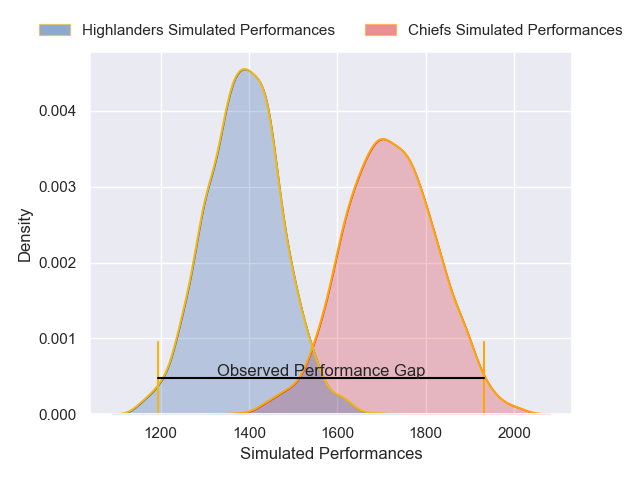
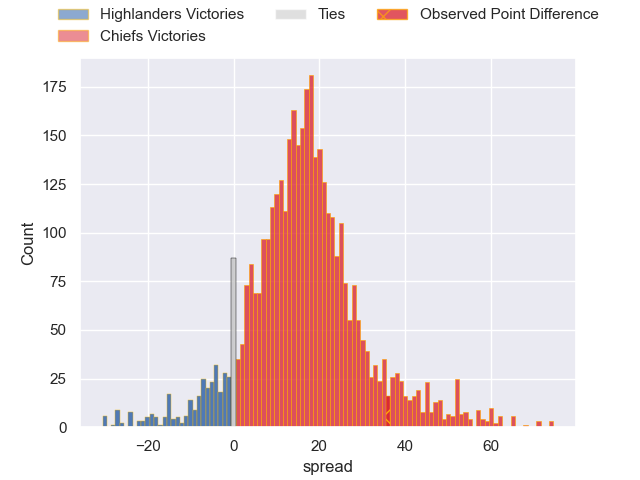
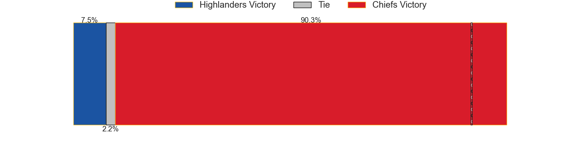
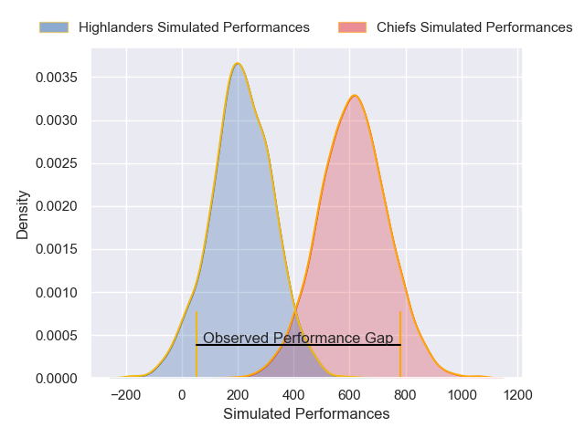
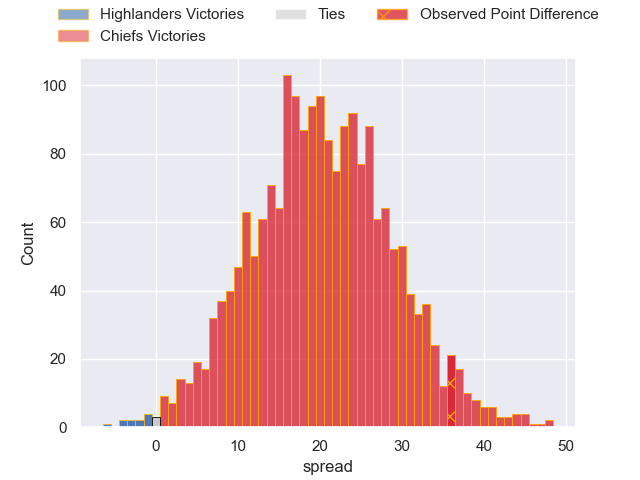
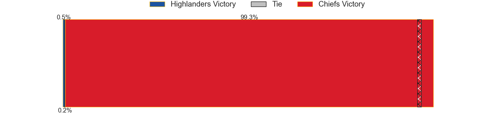

---  
layout: page  
title: Highlanders at Chiefs; 10-46  
date: 2025-04-19 18:00:00 -0500  
categories: "Super Rugby Pacific 2025" match review  
---
# Highlanders at Chiefs; 10-46

# Club Level Predictions

The first set of predictions treats a club as the smallest object, as the club develops its members, organizes a gameplan, and deploys its players as needed for each match. This club model has a prediction of 0.864, which translates to predicting Chiefs to win by 16.6.

Our Over/Under is 63.5 - and combined with the spread above, we have a predicted scoreline of 24 to 40

Each club has a rating and a rating deviation (similar to a Glicko rating), and expected performances can be generated. This allows for simulated matches and spreads like the ones below.
## Projected Performances - Club Model

## Projected Spreads - Club Model

## Projected Results - Club Model

# Player Level Predictions

Treating teams instead as an entity made up of the currently active players, I have ratings for each player in an altogether different system. These can be combined to form team ratings once teamsheets are announced, weighting starters a bit higher than the reserves. After the match is played, players can be weighted by their minutes on the field, allowing for an accurate measure of the team's composition. With these compiled team ratings, we can make predictions, measure inaccuracy, and update the individual player ratings.
## Prediction without Player Minutes: Chiefs by 26.0

Chiefs by 17.7 on a neutral pitch

## Projected Performances - Player Model

## Projected Spreads - Player Model

## Projected Results - Player Model

|   Away Minutes | Away Player                   |   Away Percentile |   Number |   Home Percentile | Home Player         |   Home Minutes |
|---------------:|:------------------------------|------------------:|---------:|------------------:|:--------------------|---------------:|
|             59 | Daniel Lienert-Brown          |             44.07 |        1 |             99.68 | Aidan Ross          |           80   |
|             66 | Henry Bell                    |             35.37 |        2 |             90.99 | Brodie McAlister    |           80   |
|             14 | Sefo Kautai                   |             20.1  |        3 |             92.66 | George Dyer         |           80   |
|             80 | Fabian Holland                |             82.27 |        4 |             93.93 | Naitoa Ah Kuoi      |           61   |
|             59 | Mitchell Dunshea              |             95.86 |        5 |             90.85 | Tupou Vaa'i         |           80   |
|             59 | Mitchell Dunshea              |             95.86 |        5 |             90.85 | Tupou Vaa'i         |           66   |
|             56 | Oliver Haig                   |             67.41 |        6 |             95.07 | Samipeni Finau      |           80   |
|             58 | Veveni Lasaqa                 |             19.74 |        7 |             88.45 | Jahrome Brown       |           80   |
|             40 | Hugh Renton                   |              7.16 |        8 |             93.66 | Luke Jacobson       |           58   |
|             80 | Folau Fakatava                |             80.74 |        9 |             68.07 | Xavier Roe          |           79   |
|             80 | Cameron Millar                |             71.66 |       10 |             95.75 | Damian McKenzie     |           18   |
|             54 | Jona Nareki                   |             86.18 |       11 |             52.24 | Leroy Carter        |           18   |
|             80 | Timoci Tavatavanawai          |             72.75 |       12 |             92    | Quinn Tupaea        |           40   |
|             17 | Thomas Umaga-Jensen           |             10.76 |       13 |             88.75 | Daniel Rona         |            0   |
|             19 | Taniela Filimone              |             14.59 |       14 |             93.33 | Emoni Narawa        |            1   |
|             31 | Jacob Ratumaitavuki-Kneepkens |             95.49 |       15 |             91.19 | Shaun Stevenson     |           14   |
|             40 | Soane Vikena                  |             90.14 |       16 |             96.6  | Samisoni Taukei'aho |           16   |
|             30 | Josh Bartlett                 |             50.2  |       17 |             57.38 | Jared Proffit       |           18   |
|              9 | Saula Ma'u                    |             40.44 |       18 |             19.94 | Reuben O'Neill      |           80   |
|              7 | TK Howden                     |              0.37 |       19 |             54.91 | Jimmy Tupou         |           21   |
|             15 | Will Stodart                  |            nan    |       20 |             56.52 | Kaylum Boshier      |           45.5 |
|             22 | Adam Lennox                   |             39.36 |       21 |             82.26 | Cortez Ratima       |           23   |
|             71 | Sam Gilbert                   |             40.37 |       22 |             82.79 | Josh Jacomb         |           26   |
|             40 | Jonah Lowe                    |            nan    |       23 |             92.79 | Anton Lienert-Brown |           32   |

