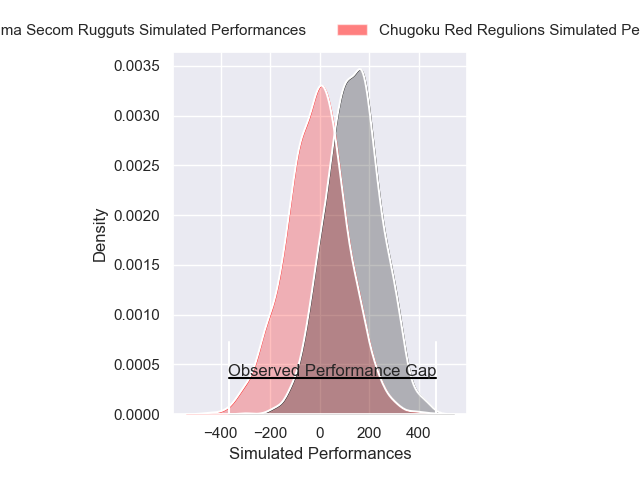
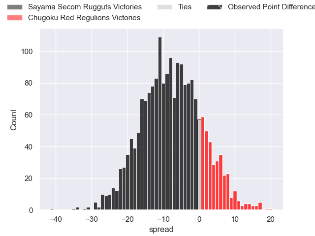
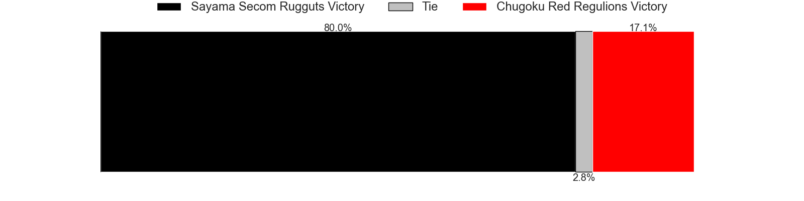

---  
layout: page  
title: Sayama Secom Rugguts at Chugoku Red Regulions; 47-6  
date: 2025-04-19 18:00:00 -0500  
categories: "Japan Rugby League One D3 24/25" match review  
---
# Sayama Secom Rugguts at Chugoku Red Regulions; 47-6

# Club Level Predictions

The first set of predictions treats a club as the smallest object, as the club develops its members, organizes a gameplan, and deploys its players as needed for each match. This club model has a prediction of 0.675, which translates to predicting Chugoku Red Regulions to win by 9.0.

Our Over/Under is 53.5 - and combined with the spread above, we have a predicted scoreline of 22 to 31

Each club has a rating and a rating deviation (similar to a Glicko rating), and expected performances can be generated. This allows for simulated matches and spreads like the ones below.
## Projected Performances - Club Model

## Projected Spreads - Club Model

## Projected Results - Club Model

# Player Level Predictions

Treating teams instead as an entity made up of the currently active players, I have ratings for each player in an altogether different system. These can be combined to form team ratings once teamsheets are announced, weighting starters a bit higher than the reserves. After the match is played, players can be weighted by their minutes on the field, allowing for an accurate measure of the team's composition. With these compiled team ratings, we can make predictions, measure inaccuracy, and update the individual player ratings.
## Prediction without Player Minutes: Sayama Secom Rugguts by 14.7

Sayama Secom Rugguts by 17.6 on a neutral pitch

## Projected Performances - Player Model

## Projected Spreads - Player Model

## Projected Results - Player Model

|   Away Minutes | Away Player      |   Away Percentile |   Number |   Home Percentile | Home Player          |   Home Minutes |
|---------------:|:-----------------|------------------:|---------:|------------------:|:---------------------|---------------:|
|           35   | Kentaro Ueno     |             64.86 |        1 |             12.71 | Kojiro Arito         |           30   |
|           80   | Tatsuki Tanina   |             73.43 |        2 |              2.31 | Kentaro Iwanaga      |           67   |
|           69   | Naoto Shirakawa  |             65.02 |        3 |             18.82 | Kento Miyata         |           69   |
|           30   | Cory Hill        |             99.06 |        4 |              0.09 | Taro Nishikawa       |           54   |
|            0   | Troy Callander   |             82.94 |        5 |             13.2  | Tomonari Aoki        |           46   |
|           76   | Ash Parker       |             11.57 |        6 |             38.11 | Ishiwatari Kengo     |           26   |
|           35   | Koki Iida        |             70.52 |        7 |              1.47 | Kohei Matsunaga      |           54   |
|           80   | Whetu Douglas    |             82.1  |        8 |             12.14 | Kota Moriyama        |           80   |
|           46   | Rikuya Takashima |             72.08 |        9 |              4.23 | Rintaro Kawashima    |           80   |
|           27.5 | Daniel Waite     |             26.04 |       10 |              5.37 | Hashizo Yoshida      |           45   |
|           80   | Musashi Matsuda  |             61.57 |       11 |              3.17 | Keigo Hatanaka       |           57   |
|           80   | Haruya Nakasu    |             63.08 |       12 |              8.75 | Shinya Hirayama      |           22.5 |
|           58   | Fisipuna Tuiaki  |             40.24 |       13 |             50.3  | Syougo Azuma         |           23   |
|           72   | Tatsuki Kanza    |             60.73 |       14 |             10.17 | Kentaro Fujii        |           69   |
|           77   | Chase Tiatia     |             90.69 |       15 |              1.42 | Masahiro Nakano      |           80   |
|           21   | Kento Mizutani   |            nan    |       16 |             51.01 | Sebastian Sialau     |           75   |
|           18   | Eito Tsutsumi    |            nan    |       17 |             55.37 | Haruki Miyata        |           80   |
|            0   | Yudai Ishii      |             47.57 |       18 |             10.65 | Shintaro Matsuda     |           66   |
|           14   | Toshiki Sato     |            nan    |       19 |             63.36 | Hayato Moriyama      |           80   |
|           11   | Makoto Kurata    |            nan    |       20 |             31.13 | Atsushi Mizofuchi    |           75   |
|            0   | Itsuki Fujii     |             43.83 |       21 |            nan    | Hirofumi Higashikawa |           67   |
|           18   | Shoki Morimoto   |            nan    |       22 |            nan    | Riku Iwai            |           62   |
|           56   | Shota Okuno      |            nan    |       23 |            nan    | Yuta Nishihama       |           62   |

