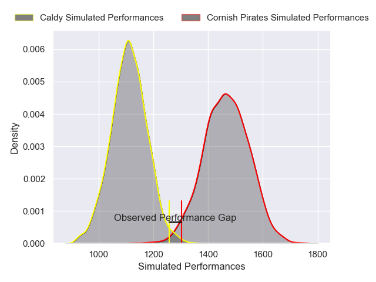
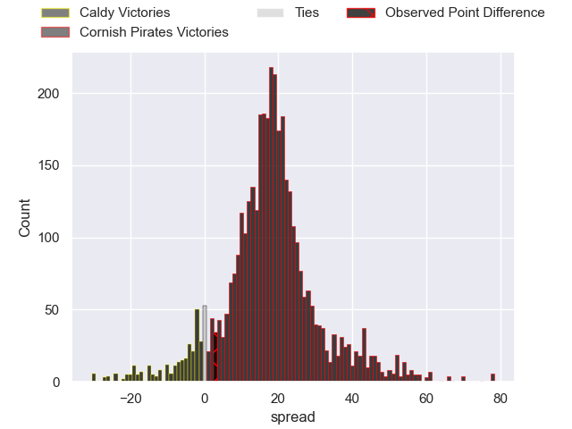
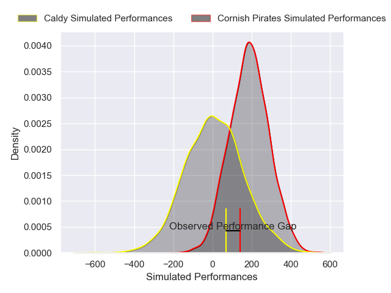
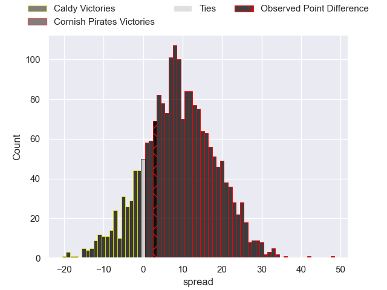

---  
layout: page  
title: Caldy at Cornish Pirates; 24-27  
date: 2025-04-19 18:00:00 -0500  
categories: "RFU Championship 24/25" match review  
---
# Caldy at Cornish Pirates; 24-27

# Club Level Predictions

The first set of predictions treats a club as the smallest object, as the club develops its members, organizes a gameplan, and deploys its players as needed for each match. This club model has a prediction of 0.88, which translates to predicting Cornish Pirates to win by 17.6.

Our Over/Under is 57.5 - and combined with the spread above, we have a predicted scoreline of 20 to 37

Each club has a rating and a rating deviation (similar to a Glicko rating), and expected performances can be generated. This allows for simulated matches and spreads like the ones below.
## Projected Performances - Club Model

## Projected Spreads - Club Model

## Projected Results - Club Model

# Player Level Predictions

Treating teams instead as an entity made up of the currently active players, I have ratings for each player in an altogether different system. These can be combined to form team ratings once teamsheets are announced, weighting starters a bit higher than the reserves. After the match is played, players can be weighted by their minutes on the field, allowing for an accurate measure of the team's composition. With these compiled team ratings, we can make predictions, measure inaccuracy, and update the individual player ratings.
## Prediction without Player Minutes: Cornish Pirates by 10.8

Cornish Pirates by 6.2 on a neutral pitch

## Projected Performances - Player Model

## Projected Spreads - Player Model

## Projected Results - Player Model

|   Away Minutes | Away Player       |   Away Percentile |   Number |   Home Percentile | Home Player     |   Home Minutes |
|---------------:|:------------------|------------------:|---------:|------------------:|:----------------|---------------:|
|             80 | Nathan Rushton    |             17.65 |        1 |             21.41 | Billy Young     |             40 |
|             67 | Matt Gallagher    |             34.16 |        2 |             43.56 | Harry Hocking   |             13 |
|             55 | Monty Weatherby   |             62.67 |        3 |             25.33 | James French    |             40 |
|             80 | Freddie Stevenson |             24.69 |        4 |             17.72 | Michael Etete   |             31 |
|             67 | Joe Sproston      |              5.37 |        5 |             41.19 | Alfie Bell      |             17 |
|             34 | Callum Ridgway    |              7.81 |        6 |             47.84 | Matt Cannon     |             26 |
|             34 | Tristan Woodman   |             47.2  |        7 |             44.81 | Jack Forsythe   |             30 |
|              0 | Josiah Dickinson  |             13.37 |        8 |             52.06 | Alex Everett    |             30 |
|             76 | Dom Hanson        |             36.89 |        9 |             24.87 | Dan Hiscocks    |             80 |
|             80 | Lewis Barker      |              9.54 |       10 |             78.33 | Bruce Houston   |             30 |
|             80 | William Robinson  |              6.25 |       11 |             78.64 | Matthew McNab   |             13 |
|             67 | Michael Barlow    |             15.39 |       12 |             24.45 | Harry Yates     |             13 |
|             80 | Connor Wilkinson  |              6.34 |       13 |             53.22 | Chester Ribbons |             25 |
|             80 | Charlie Hyde      |             66.7  |       14 |             83.4  | Robin Wedlake   |             58 |
|             63 | Matt Kilcourse    |             11.74 |       15 |             60.73 | Arthur Relton   |             48 |
|             80 | Oliver Hearn      |              5.28 |       16 |             57.96 | Ollie Andrews   |             76 |
|             63 | Ryan Higginson    |            nan    |       17 |            nan    | Dylan Irvine    |             31 |
|             80 | Sam Olyott        |              7.16 |       18 |            nan    | Ben Woodmansey  |             32 |
|             80 | Jordan Jones      |             17.72 |       19 |             31.67 | Charlie Rice    |             80 |
|             54 | Matthew Rabbette  |            nan    |       20 |            nan    | Milo Hallam     |              7 |
|             67 | Sam Rogers        |             36.58 |       21 |             80.35 | Joe Elderkin    |             80 |
|             80 | Nick Royle        |             15.39 |       22 |             11.73 | Iwan Jenkins    |             55 |
|             74 | Jacob Mitchell    |             28.73 |       23 |             68.02 | Will Becconsall |             80 |

