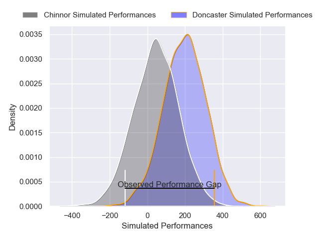
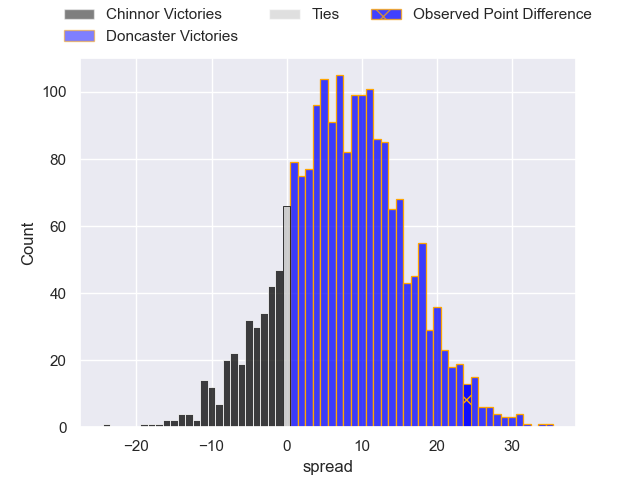
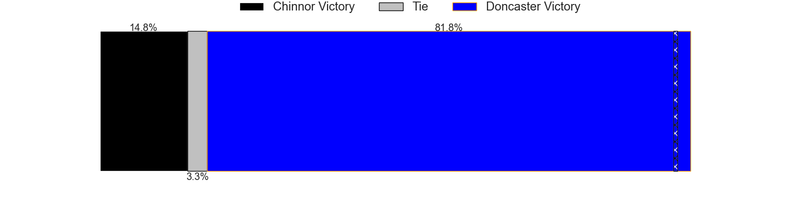

---  
layout: page  
title: Chinnor at Doncaster; 14-38  
date: 2025-04-19 18:00:00 -0500  
categories: "RFU Championship 24/25" match review  
---
# Chinnor at Doncaster; 14-38

# Club Level Predictions

The first set of predictions treats a club as the smallest object, as the club develops its members, organizes a gameplan, and deploys its players as needed for each match. This club model has a prediction of 0.792, which translates to predicting Doncaster to win by 12.3.

Our Over/Under is 46.5 - and combined with the spread above, we have a predicted scoreline of 17 to 29

Each club has a rating and a rating deviation (similar to a Glicko rating), and expected performances can be generated. This allows for simulated matches and spreads like the ones below.
## Projected Performances - Club Model

## Projected Spreads - Club Model

## Projected Results - Club Model

# Player Level Predictions

Treating teams instead as an entity made up of the currently active players, I have ratings for each player in an altogether different system. These can be combined to form team ratings once teamsheets are announced, weighting starters a bit higher than the reserves. After the match is played, players can be weighted by their minutes on the field, allowing for an accurate measure of the team's composition. With these compiled team ratings, we can make predictions, measure inaccuracy, and update the individual player ratings.
## Prediction without Player Minutes: Doncaster by 8.4

Doncaster by 3.6 on a neutral pitch

## Projected Performances - Player Model

## Projected Spreads - Player Model

## Projected Results - Player Model

|   Away Minutes | Away Player      |   Away Percentile |   Number |   Home Percentile | Home Player       |   Home Minutes |
|---------------:|:-----------------|------------------:|---------:|------------------:|:------------------|---------------:|
|             59 | Tumy Onasanya    |              6.21 |        1 |             18.4  | Conor Davidson    |           57   |
|             16 | Alun Walker      |             97.79 |        2 |             67.35 | George Roberts    |           80   |
|             42 | Rob Hardwick     |             61.1  |        3 |             97.01 | Logovi'i Mulipola |           16   |
|             79 | Jonny Green      |              3.66 |        4 |             77.55 | Ben Murphy        |           55   |
|             80 | George Shaw      |             41.91 |        5 |             20.91 | Jasper McGuire    |           22.5 |
|             69 | Harry Dugmore    |             17.5  |        6 |             56.42 | Archie Smeaton    |           47   |
|             80 | Max Clementson   |             29.8  |        7 |             60.71 | Rhys Tait         |           17   |
|             42 | Scott Hall       |              1.84 |        8 |             53.78 | Morgan Strong     |           24   |
|             30 | Callum Pascoe    |             53.21 |        9 |             55.74 | Alex Dolly        |           45   |
|             26 | Connor Slevin    |              8.7  |       10 |             96.36 | Russell Bennett   |           35   |
|             80 | Kieran Goss      |             30.41 |       11 |             21.83 | Aidan Cross       |           52   |
|             35 | James Bourton    |             52.02 |       12 |              2.27 | Connor Edwards    |           43   |
|             80 | Charlie Watson   |             25.47 |       13 |             19.74 | Zach Kerr         |           80   |
|             23 | Epi Rokodrava    |             39.85 |       14 |             93.14 | Semesa Rokoduguni |           61   |
|             28 | Nick Smith       |             58.61 |       15 |             99.18 | Telusa Veainu     |           43   |
|             28 | Chris Moore      |             59.35 |       16 |             25.85 | Fred Davies       |           45   |
|             32 | Keston Lines     |             30.02 |       17 |             72.24 | Andrew Turner     |           80   |
|             40 | Alfie North      |             64.74 |       18 |             98.55 | Lewis Thiede      |           42   |
|             62 | Cameron Doak     |            nan    |       19 |             20.75 | Benjamin Chapman  |           80   |
|             80 | Cameron Rafferty |             11.64 |       20 |              1.18 | Ollie Fox         |           16   |
|             56 | Willie Ryan      |             60.6  |       21 |             39.98 | Will Parry        |           30   |
|             35 | Luke Carter      |             86.32 |       22 |             67.68 | Obi Ene           |           80   |
|             56 | Grant Hughes     |             20.02 |       23 |              3.24 | Morgan Bunting    |           80   |

