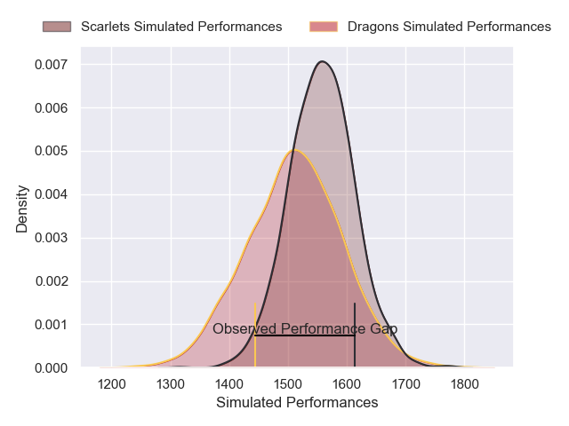
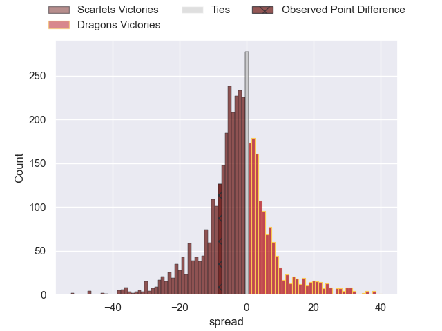
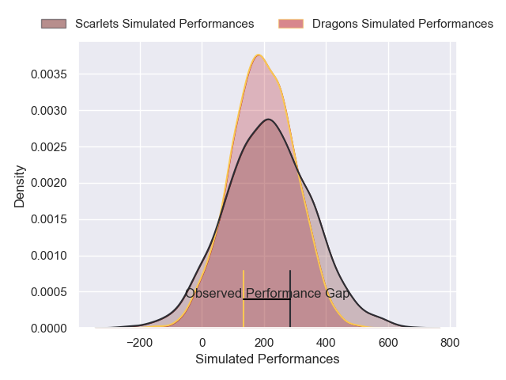
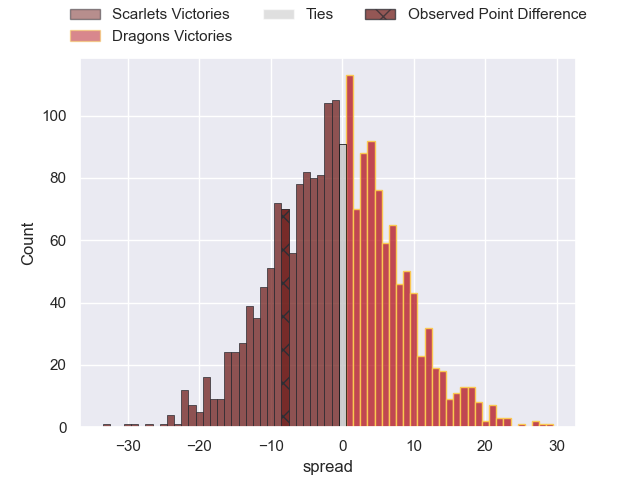

---  
layout: page  
title: Scarlets at Dragons; 31-23  
date: 2025-04-19 18:00:00 -0500  
categories: "United Rugby Championship 24/25" match review  
---
# Scarlets at Dragons; 31-23

# Club Level Predictions

The first set of predictions treats a club as the smallest object, as the club develops its members, organizes a gameplan, and deploys its players as needed for each match. This club model has a prediction of 0.429, which translates to predicting Scarlets to win by 2.5.

Our Over/Under is 54.5 - and combined with the spread above, we have a predicted scoreline of 29 to 26

Each club has a rating and a rating deviation (similar to a Glicko rating), and expected performances can be generated. This allows for simulated matches and spreads like the ones below.
## Projected Performances - Club Model

## Projected Spreads - Club Model

## Projected Results - Club Model

# Player Level Predictions

Treating teams instead as an entity made up of the currently active players, I have ratings for each player in an altogether different system. These can be combined to form team ratings once teamsheets are announced, weighting starters a bit higher than the reserves. After the match is played, players can be weighted by their minutes on the field, allowing for an accurate measure of the team's composition. With these compiled team ratings, we can make predictions, measure inaccuracy, and update the individual player ratings.
## Prediction without Player Minutes: Dragons by 0.2

Scarlets by 9.6 on a neutral pitch

## Projected Performances - Player Model

## Projected Spreads - Player Model

## Projected Results - Player Model

|   Away Minutes | Away Player          |   Away Percentile |   Number |   Home Percentile | Home Player              |   Home Minutes |
|---------------:|:---------------------|------------------:|---------:|------------------:|:-------------------------|---------------:|
|             59 | Alec Hepburn         |             86.2  |        1 |             26.15 | Dylan Kelleher-Griffiths |             46 |
|             57 | Marnus van der Merwe |             95.07 |        2 |             82.82 | Elliot Dee               |             24 |
|             13 | Henry Thomas         |             93.7  |        3 |             29.7  | Paula Latu               |             18 |
|             46 | Alex Craig           |             58.77 |        4 |              8.29 | Ben Carter               |             80 |
|             55 | Sam Lousi            |             84.1  |        5 |             29.96 | Ryan Woodman             |             33 |
|             80 | Vaea Fifita          |             96.46 |        6 |              1.96 | Shane Lewis-Hughes       |             26 |
|             80 | Josh MacLeod         |             87.24 |        7 |             10.99 | Taine Basham             |             80 |
|             58 | Taine Plumtree       |             93.87 |        8 |             24.13 | Aaron Wainwright         |             33 |
|             80 | Gareth Davies        |             35.81 |        9 |             89.53 | Rhodri Williams          |             80 |
|             80 | Ioan Lloyd           |              9.92 |       10 |              6.48 | Angus O'Brien            |             60 |
|             80 | Ellis Mee            |             48.52 |       11 |              0.95 | Jared Rosser             |             80 |
|             51 | Eddie James          |             60.32 |       12 |             91.31 | Scott Williams           |             31 |
|             75 | Macs Page            |             43.14 |       13 |             66.63 | Aneurin Owen             |             31 |
|             64 | Tom Rogers           |             36.61 |       14 |             76.74 | Ashton Hewitt            |             59 |
|             40 | Blair Murray         |             33.61 |       15 |             42.21 | Ewan Rosser              |             50 |
|             55 | Ryan Elias           |             94.39 |       16 |              9.86 | Brodie Coghlan           |             33 |
|             80 | Sam O'Connor         |            nan    |       17 |              5.17 | Rhodri Jones             |             32 |
|             46 | Sam Wainwright       |             15.01 |       18 |              6.46 | Chris Coleman            |             16 |
|             59 | Jac Price            |              2.99 |       19 |             26.11 | Barny Langton            |             40 |
|             80 | Jarrod Taylor        |             41.25 |       20 |             68.72 | Dan Lydiate              |             19 |
|             34 | Archie Hughes        |             29.39 |       21 |              8.45 | Dane Blacker             |             61 |
|             20 | Joe Roberts          |             53.1  |       22 |             25.1  | Will Reed                |             50 |
|             80 | Ioan Nicholas        |             11.07 |       23 |             31.49 | Joe Westwood             |             62 |

