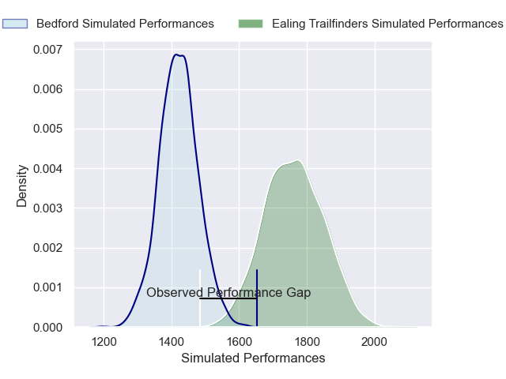
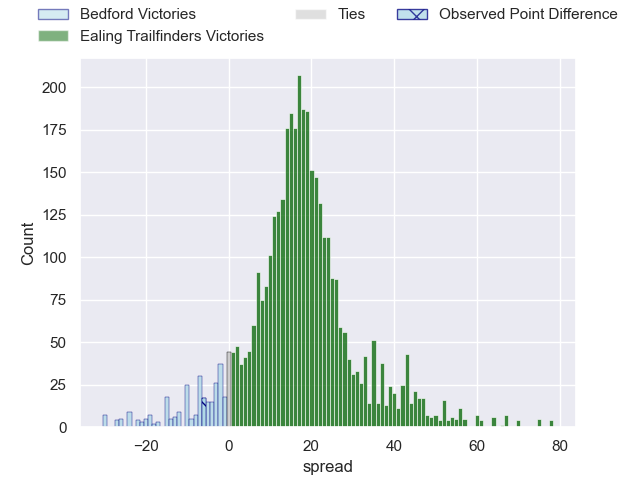
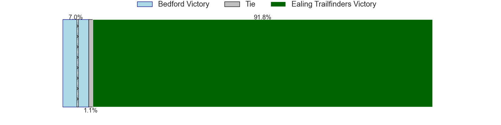
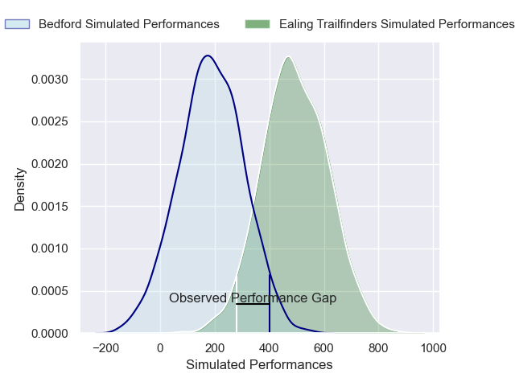
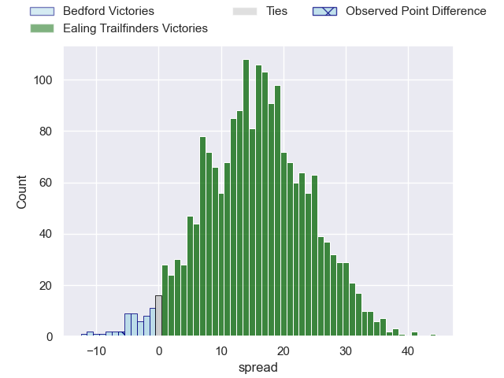
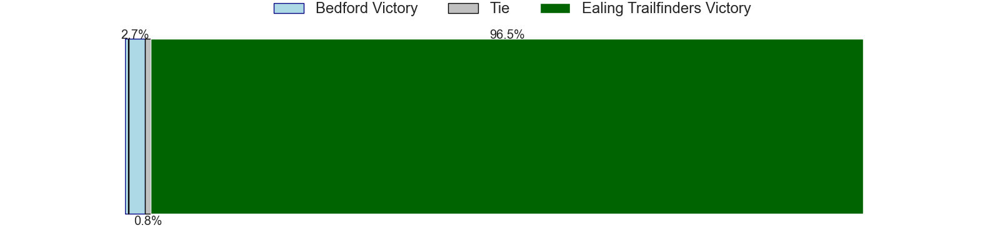

---  
layout: page  
title: Bedford at Ealing Trailfinders; 30-24  
date: 2025-04-19 18:00:00 -0500  
categories: "RFU Championship 24/25" match review  
---
# Bedford at Ealing Trailfinders; 30-24

# Club Level Predictions

The first set of predictions treats a club as the smallest object, as the club develops its members, organizes a gameplan, and deploys its players as needed for each match. This club model has a prediction of 0.872, which translates to predicting Ealing Trailfinders to win by 17.0.

Our Over/Under is 80.5 - and combined with the spread above, we have a predicted scoreline of 32 to 49

Each club has a rating and a rating deviation (similar to a Glicko rating), and expected performances can be generated. This allows for simulated matches and spreads like the ones below.
## Projected Performances - Club Model

## Projected Spreads - Club Model

## Projected Results - Club Model

# Player Level Predictions

Treating teams instead as an entity made up of the currently active players, I have ratings for each player in an altogether different system. These can be combined to form team ratings once teamsheets are announced, weighting starters a bit higher than the reserves. After the match is played, players can be weighted by their minutes on the field, allowing for an accurate measure of the team's composition. With these compiled team ratings, we can make predictions, measure inaccuracy, and update the individual player ratings.
## Prediction without Player Minutes: Ealing Trailfinders by 14.6

Ealing Trailfinders by 10.3 on a neutral pitch

## Projected Performances - Player Model

## Projected Spreads - Player Model

## Projected Results - Player Model

|   Away Minutes | Away Player          |   Away Percentile |   Number |   Home Percentile | Home Player         |   Home Minutes |
|---------------:|:---------------------|------------------:|---------:|------------------:|:--------------------|---------------:|
|             80 | Joey Conway          |             86.28 |        1 |             86.92 | Lefty Zigiriadis    |             80 |
|             80 | Tommy Herman         |             87.59 |        2 |             74.83 | Mike Willemse       |             80 |
|             80 | Oisin Heffernan      |             94.83 |        3 |             95.32 | Biyi Alo            |             80 |
|             80 | Luke Frost           |             45.57 |        4 |             14.07 | Danny Bridge        |             80 |
|             80 | Rory Ward            |             80.64 |        5 |             44.51 | Sean Lonsdale       |             40 |
|             80 | Fyn Brown            |             75.79 |        6 |             86.87 | Rob Farrar          |             71 |
|             80 | Joe Howard           |             31.84 |        7 |             81.47 | Jordy Reid          |             30 |
|             73 | Freddie Tuilagi      |             25.77 |        8 |             68.51 | Josh Taylor         |             15 |
|             80 | Alex Day             |             95.1  |        9 |             80.24 | Craig Hampson       |             51 |
|             41 | William Maisey       |             92.71 |       10 |             86.84 | Dan Jones           |             50 |
|             11 | Dean Adamson         |             92.28 |       11 |             98.95 | Tom Collins         |             80 |
|             65 | Michael Le Bourgeois |             78.58 |       12 |             94.67 | Jordan Holgate      |             80 |
|             19 | Lucas Titherington   |             79.57 |       13 |             80.75 | Reuben Bird-Tulloch |             60 |
|             19 | Alfie Garside        |             78.84 |       14 |             89.99 | Angus Kernohan      |             61 |
|             29 | Louis James          |             64.96 |       15 |             85.66 | Tobi Wilson         |             80 |
|             19 | Jamie Jack           |             32.2  |       16 |             31.4  | Elliott Chilvers    |             80 |
|             29 | James Fish           |             49.49 |       17 |            nan    | Scott Buckley       |             15 |
|             19 | Beltus Nonleh        |            nan    |       18 |             87.73 | Adam Nicol          |             20 |
|             37 | Ed Prowse            |             71    |       19 |             39.02 | Matas Jurevicius    |             13 |
|             37 | Archie Benson        |             33.05 |       20 |             73.93 | Siya Ningiza        |             65 |
|            nan | nan                  |            nan    |       21 |             97.98 | Craig Willis        |             32 |

