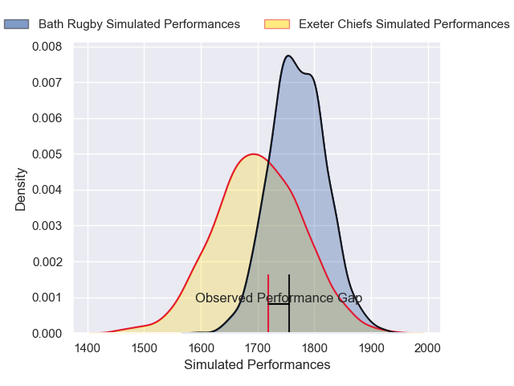
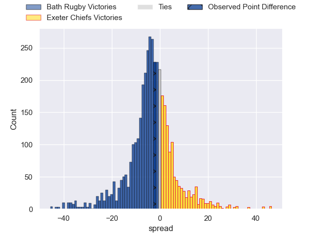
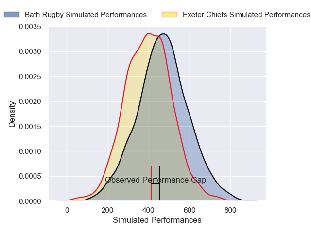
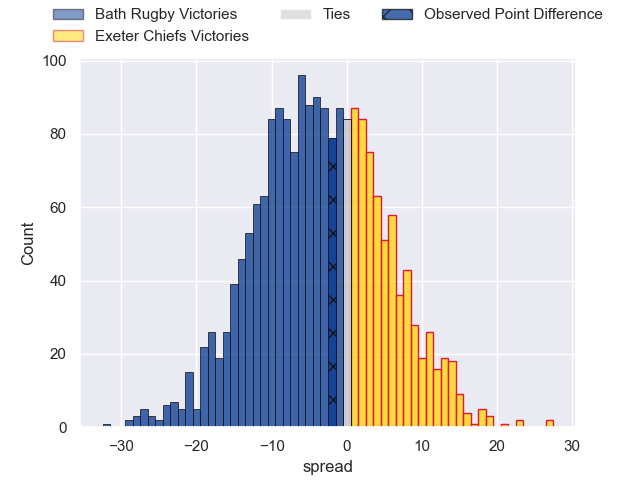

---  
layout: page  
title: Bath Rugby at Exeter Chiefs; 26-24  
date: 2025-04-19 18:00:00 -0500  
categories: "Gallagher Premiership 24/25" match review  
---
# Bath Rugby at Exeter Chiefs; 26-24

# Club Level Predictions

The first set of predictions treats a club as the smallest object, as the club develops its members, organizes a gameplan, and deploys its players as needed for each match. This club model has a prediction of 0.403, which translates to predicting Bath Rugby to win by 3.5.

Our Over/Under is 51.5 - and combined with the spread above, we have a predicted scoreline of 28 to 24

Each club has a rating and a rating deviation (similar to a Glicko rating), and expected performances can be generated. This allows for simulated matches and spreads like the ones below.
## Projected Performances - Club Model

## Projected Spreads - Club Model

## Projected Results - Club Model

# Player Level Predictions

Treating teams instead as an entity made up of the currently active players, I have ratings for each player in an altogether different system. These can be combined to form team ratings once teamsheets are announced, weighting starters a bit higher than the reserves. After the match is played, players can be weighted by their minutes on the field, allowing for an accurate measure of the team's composition. With these compiled team ratings, we can make predictions, measure inaccuracy, and update the individual player ratings.
## Prediction without Player Minutes: Bath Rugby by 3.6

Bath Rugby by 11.7 on a neutral pitch

## Projected Performances - Player Model

## Projected Spreads - Player Model

## Projected Results - Player Model

|   Away Minutes | Away Player         |   Away Percentile |   Number |   Home Percentile | Home Player       |   Home Minutes |
|---------------:|:--------------------|------------------:|---------:|------------------:|:------------------|---------------:|
|             26 | Francois van Wyk    |             89.59 |        1 |             98.06 | Scott Sio         |             66 |
|             47 | Niall Annett        |             70.07 |        2 |             96.43 | Jack Yeandle      |             80 |
|             41 | Thomas du Toit      |             99.76 |        3 |             68.44 | Marcus Street     |             41 |
|             25 | Ewan Richards       |             66.76 |        4 |             19.08 | Rusiate Tuima     |              0 |
|             64 | Charlie Ewels       |             84.39 |        5 |             89.98 | Dafydd Jenkins    |             53 |
|             76 | Josh Bayliss        |             55.49 |        6 |             56.98 | Martin Moloney    |             33 |
|             30 | Miles Reid          |             97.3  |        7 |              7.91 | Richard Capstick  |             80 |
|              0 | Arthur Green        |             42.84 |        8 |             81.19 | Greg Fisilau      |             80 |
|             27 | Ben Spencer         |             86.82 |        9 |             80.91 | Tom Cairns        |             80 |
|             27 | Finn Russell        |             99.6  |       10 |             32.39 | Harvey Skinner    |             67 |
|             35 | Will Muir           |             10.58 |       11 |             38.61 | Paul Brown-Bampoe |             80 |
|             59 | Cameron Redpath     |             62.49 |       12 |             65.35 | Joe Hawkins       |             55 |
|             58 | Max Ojomoh          |             96.64 |       13 |             97.83 | Henry Slade       |             45 |
|             72 | Ruaridh McConnochie |             92.95 |       14 |             45.19 | Ben Hammersley    |             45 |
|             80 | Tom de Glanville    |             69.67 |       15 |              2.25 | Josh Hodge        |             25 |
|             80 | Tom Dunn            |             99.32 |       16 |             72.96 | Max Norey         |             76 |
|             80 | Beno Obano          |             94.19 |       17 |            nan    | Kwenzo Blose      |             39 |
|             80 | Will Stuart         |             67.8  |       18 |            nan    | Jimmy Roots       |             22 |
|             50 | Ross Molony         |             94.03 |       19 |             88.27 | Jacques Vermeulen |             22 |
|             74 | Ted Hill            |             83.33 |       20 |             79.96 | Ross Vintcent     |             58 |
|             38 | Louis Schreuder     |             85.98 |       21 |            nan    | Niall Armstrong   |             35 |
|             80 | Orlando Bailey      |             80.57 |       22 |             42.51 | Will Haydon-Wood  |             62 |
|             20 | Alfie Barbeary      |             95.71 |       23 |             86.77 | Will Rigg         |             16 |

