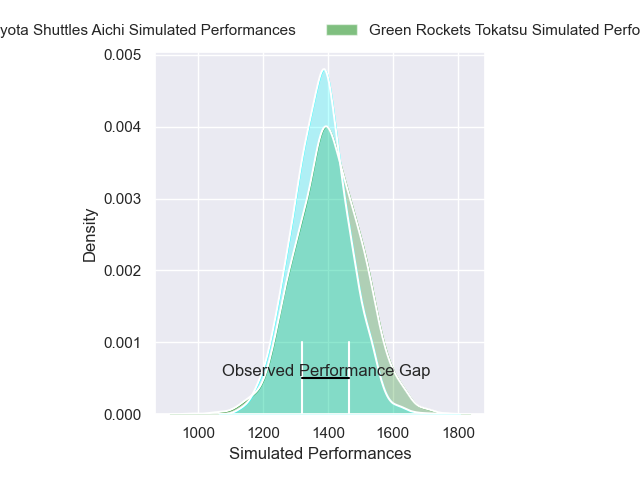
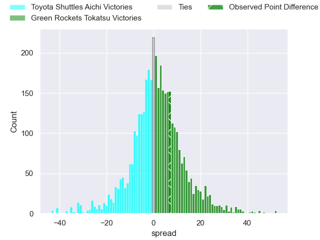
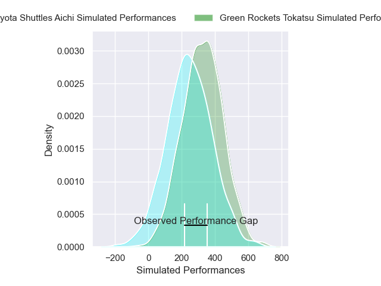
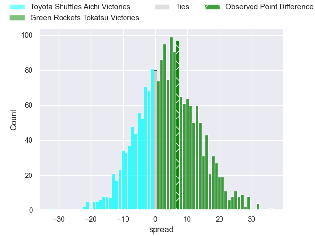
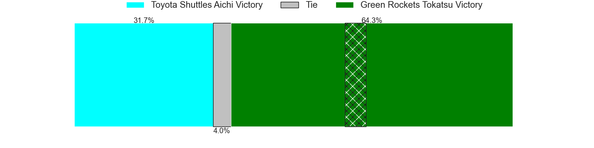

---  
layout: page  
title: Toyota Shuttles Aichi at Green Rockets Tokatsu; 8-15  
date: 2025-04-19 18:00:00 -0500  
categories: "Japan Rugby League One D2 24/25" match review  
---
# Toyota Shuttles Aichi at Green Rockets Tokatsu; 8-15

# Club Level Predictions

The first set of predictions treats a club as the smallest object, as the club develops its members, organizes a gameplan, and deploys its players as needed for each match. This club model has a prediction of 0.539, which translates to predicting Green Rockets Tokatsu to win by 1.4.

Our Over/Under is 51.5 - and combined with the spread above, we have a predicted scoreline of 25 to 27

Each club has a rating and a rating deviation (similar to a Glicko rating), and expected performances can be generated. This allows for simulated matches and spreads like the ones below.
## Projected Performances - Club Model

## Projected Spreads - Club Model

## Projected Results - Club Model

# Player Level Predictions

Treating teams instead as an entity made up of the currently active players, I have ratings for each player in an altogether different system. These can be combined to form team ratings once teamsheets are announced, weighting starters a bit higher than the reserves. After the match is played, players can be weighted by their minutes on the field, allowing for an accurate measure of the team's composition. With these compiled team ratings, we can make predictions, measure inaccuracy, and update the individual player ratings.
## Prediction without Player Minutes: Green Rockets Tokatsu by 7.6

Green Rockets Tokatsu by 3.1 on a neutral pitch

## Projected Performances - Player Model

## Projected Spreads - Player Model

## Projected Results - Player Model

|   Away Minutes | Away Player          |   Away Percentile |   Number |   Home Percentile | Home Player           |   Home Minutes |
|---------------:|:---------------------|------------------:|---------:|------------------:|:----------------------|---------------:|
|           80   | Tomoki Yamaguchi     |             52.86 |        1 |             93.25 | Kosei Yamamoto        |           39   |
|           80   | Takuma Oyama         |             79.87 |        2 |             60.73 | Ren Osawa             |           29   |
|           80   | Nobuyuki Takahashi   |             61.88 |        3 |             91.29 | Keisuke Kikuta        |           21   |
|           80   | Taishi Nakamura      |             80.02 |        4 |             81.34 | Daiki Yamagiwa        |           80   |
|           80   | James Gaskell        |             58.62 |        5 |             95.29 | Pari Pari Parkinson   |           39   |
|           77   | Tama Kapene          |             85.22 |        6 |             95.04 | Geoff Cridge          |           80   |
|           21   | Chang Chao Yi        |             82    |        7 |             82.46 | Viliami Lutua Ahofono |           80   |
|           70   | Taleni Seu           |             96.5  |        8 |             88.68 | Aseri Masivou         |           52   |
|           46   | Atsushi Yumoto       |             80.37 |        9 |             29.27 | Tatsuya Fujii         |           80   |
|           59   | Freddie Burns        |             94.63 |       10 |             98.21 | Rhys Patchell         |            0   |
|           46   | Go Nakano            |             31.16 |       11 |             88.62 | Kenta Omata           |           15   |
|           55   | Tiaan Thomas-Wheeler |              2.72 |       12 |             11.37 | Orbyn Leger           |           52   |
|           71   | Daigo Doi            |             66.9  |       13 |              4.12 | Maritino Nemani       |           27.5 |
|           80   | Chance Peni          |             56.16 |       14 |              9.7  | Teruya Goto           |           80   |
|           80   | Josua Kerevi         |             79.55 |       15 |             53.24 | Keagan Faria          |           55   |
|           34   | Hiroaki Saito        |              7.65 |       16 |             83.2  | Mitieli Tuinakauvadra |           80   |
|           58   | Isi Manu             |            nan    |       17 |            nan    | Masaki Obata          |           41   |
|           20.5 | Takumi Sue           |             60.93 |       18 |            nan    | Yoshiki Yoshioka      |           47   |
|           11   | James Mollentze      |             16.9  |       19 |            nan    | Ash Dixon             |           69   |
|           34   | Seta Naivaluwaga     |             38.55 |       20 |             46.72 | Ko Yoshimura          |           65   |
|           15   | Jone Kerevi          |              9.96 |       21 |            nan    | Sera Hwang            |           80   |
|           80   | Ryuma Hirabayashi    |            nan    |       22 |            nan    | Suliasi Tolu          |           80   |
|            0   | Takuya Tsushida      |            nan    |       23 |            nan    | nan                   |          nan   |

