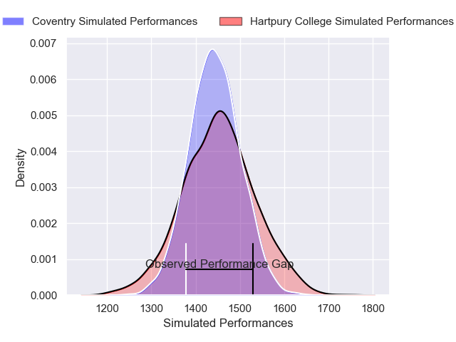
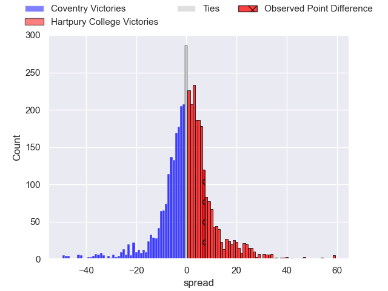
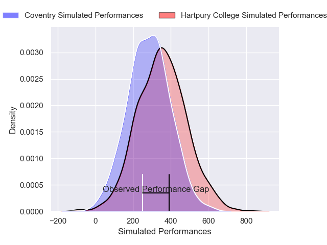
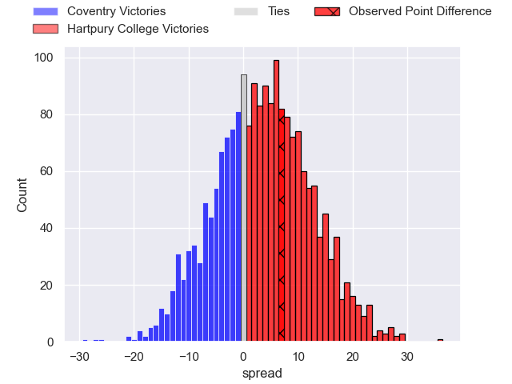

---  
layout: page  
title: Coventry at Hartpury College; 24-31  
date: 2025-04-19 18:00:00 -0500  
categories: "RFU Championship 24/25" match review  
---
# Coventry at Hartpury College; 24-31

# Club Level Predictions

The first set of predictions treats a club as the smallest object, as the club develops its members, organizes a gameplan, and deploys its players as needed for each match. This club model has a prediction of 0.511, which translates to predicting Hartpury College to win by 0.4.

Our Over/Under is 57.5 - and combined with the spread above, we have a predicted scoreline of 28 to 29

Each club has a rating and a rating deviation (similar to a Glicko rating), and expected performances can be generated. This allows for simulated matches and spreads like the ones below.
## Projected Performances - Club Model

## Projected Spreads - Club Model

## Projected Results - Club Model

# Player Level Predictions

Treating teams instead as an entity made up of the currently active players, I have ratings for each player in an altogether different system. These can be combined to form team ratings once teamsheets are announced, weighting starters a bit higher than the reserves. After the match is played, players can be weighted by their minutes on the field, allowing for an accurate measure of the team's composition. With these compiled team ratings, we can make predictions, measure inaccuracy, and update the individual player ratings.
## Prediction without Player Minutes: Hartpury College by 5.2

Hartpury College by 1.0 on a neutral pitch

## Projected Performances - Player Model

## Projected Spreads - Player Model

## Projected Results - Player Model

|   Away Minutes | Away Player      |   Away Percentile |   Number |   Home Percentile | Home Player           |   Home Minutes |
|---------------:|:-----------------|------------------:|---------:|------------------:|:----------------------|---------------:|
|             67 | Toby Trinder     |             92.5  |        1 |             86.9  | Aristot Benz-Salomon  |             30 |
|             55 | Jordon Poole     |             89.13 |        2 |             81.44 | Ethan Hunt            |             80 |
|             80 | Eliot Salt       |             53.71 |        3 |             58.81 | Jonathan Benz-Salomon |             40 |
|             80 | Mackenzie Graham |             61.95 |        4 |             80.65 | Dale Lemon            |             73 |
|             67 | Rhys Anstey      |             23.24 |        5 |             77.32 | Jack Rees Davies      |             80 |
|             55 | Chester Owen     |             15.91 |        6 |             73.48 | Samuel Lewis          |             32 |
|             80 | Tom Ball         |             88.54 |        7 |             93.47 | Harry Short           |             17 |
|             80 | Senitiki Nayalo  |             98.14 |        8 |             55.58 | Cameron Cobbett       |             47 |
|             15 | Josh Barton      |             26.84 |        9 |             86.32 | Michael Austin        |             63 |
|             48 | Liam Richman     |             12.16 |       10 |             84.91 | Harry Bazalgette      |             48 |
|             80 | James Martin     |             93.94 |       11 |             88.73 | Oliver Holliday       |             80 |
|             50 | Tommy Mathews    |             67.45 |       12 |             66.12 | Robbie Smith          |             80 |
|             33 | Oli Morris       |             52.26 |       13 |             46.1  | James Short           |             51 |
|             50 | Jacob Henry      |             36.65 |       14 |             87.22 | Bradley Denty         |             80 |
|              0 | Logan Trotter    |             41.77 |       15 |             94.24 | Matt Protheroe        |             80 |
|             26 | Ralph Mceachran  |            nan    |       16 |             70.92 | Archie McArthur       |             56 |
|             30 | Suva Ma'asi      |             88.83 |       17 |             14.25 | Alfie Petch           |             80 |
|             30 | Tye Raymont      |            nan    |       18 |             73.35 | Josh Gray             |             40 |
|              7 | Dan Green        |             56.83 |       19 |             38.05 | Will Jeanes           |             80 |
|             46 | Jack Bennett     |             55.4  |       20 |             71.36 | Josiah Edwards-Giraud |             80 |
|             34 | Sam Maunder      |             16.75 |       21 |             79.6  | William Crane         |             61 |
|             29 | Thomas Hitchcock |             39.53 |       22 |            nan    | Keir Clark            |             80 |
|             17 | Will Lane        |            nan    |       23 |            nan    | nan                   |            nan |

