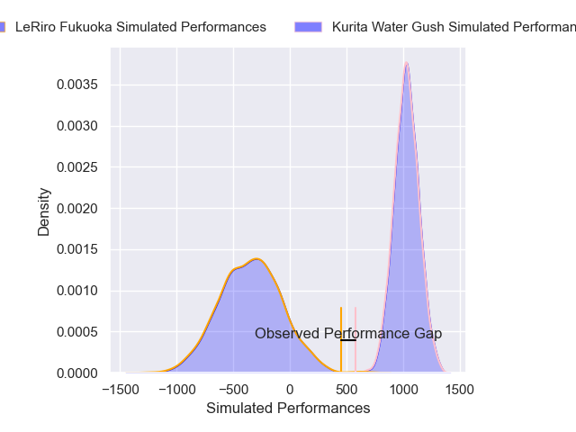
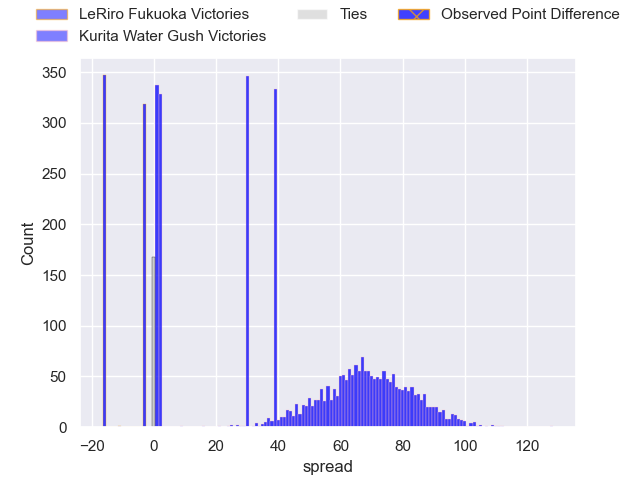
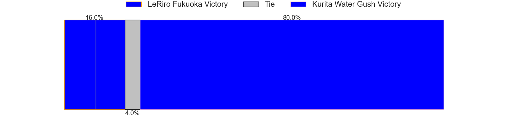
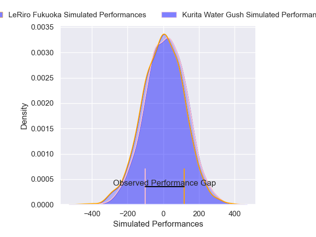
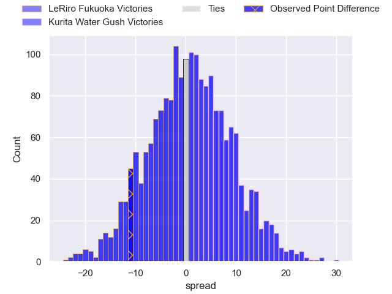
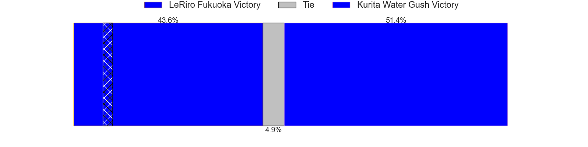

---  
layout: page  
title: LeRiro Fukuoka at Kurita Water Gush; 37-26  
date: 2025-04-19 18:00:00 -0500  
categories: "Japan Rugby League One D3 24/25" match review  
---
# LeRiro Fukuoka at Kurita Water Gush; 37-26

# Club Level Predictions

The first set of predictions treats a club as the smallest object, as the club develops its members, organizes a gameplan, and deploys its players as needed for each match. This club model has a prediction of 0.997, which translates to predicting Kurita Water Gush to win by 68.2.

Our Over/Under is 55.5 - and combined with the spread above, we have a predicted scoreline of -6 to 62

Each club has a rating and a rating deviation (similar to a Glicko rating), and expected performances can be generated. This allows for simulated matches and spreads like the ones below.
## Projected Performances - Club Model

## Projected Spreads - Club Model

## Projected Results - Club Model

# Player Level Predictions

Treating teams instead as an entity made up of the currently active players, I have ratings for each player in an altogether different system. These can be combined to form team ratings once teamsheets are announced, weighting starters a bit higher than the reserves. After the match is played, players can be weighted by their minutes on the field, allowing for an accurate measure of the team's composition. With these compiled team ratings, we can make predictions, measure inaccuracy, and update the individual player ratings.
## Prediction without Player Minutes: LeRiro Fukuoka by 1.4

LeRiro Fukuoka by 4.3 on a neutral pitch

## Projected Performances - Player Model

## Projected Spreads - Player Model

## Projected Results - Player Model

|   Away Minutes | Away Player         |   Away Percentile |   Number |   Home Percentile | Home Player          |   Home Minutes |
|---------------:|:--------------------|------------------:|---------:|------------------:|:---------------------|---------------:|
|             34 | Keita Kimura        |             42.35 |        1 |             52.08 | Kei Takusagawa       |             41 |
|             29 | Yoshiaki Takeuchi   |             29.7  |        2 |             32.34 | Kota Hojo            |             69 |
|             52 | Shun Terawaki       |             11.92 |        3 |             31.84 | Rui Kuriyama         |             50 |
|             45 | Kennta Ueda         |             57.02 |        4 |              1.98 | Kota Nakamura        |             80 |
|             50 | Keita Terada        |             11.97 |        5 |              0.38 | Daymon Leasuasu      |             15 |
|             54 | Ryosei Kohara       |             79.71 |        6 |             90.63 | Harrison Brewer      |             25 |
|             39 | Yuusuke Hisada      |             27.36 |        7 |             28.1  | Taisei Nakao         |             73 |
|             80 | Finau Makavaha      |             27.98 |        8 |             24.69 | Teariki Ben-Nicholas |             41 |
|             28 | Hisanori Mimata     |             80.2  |        9 |              9.81 | Ryo Omasa            |             80 |
|             80 | Shotaro Matsuo      |             51.49 |       10 |              7.95 | Piers Francis        |             46 |
|             54 | Masakazu Yatsumonji |             60.54 |       11 |              6.44 | Keigo Hamazoe        |             59 |
|             80 | Rinto Kagawa        |             32.09 |       12 |             45.37 | Leo Gordon           |             80 |
|             58 | Issei Shige         |             23.14 |       13 |             22.74 | Daiki Yokota         |             62 |
|             52 | Amanaki Lisala      |             16.23 |       14 |              2.99 | Kentaro Sugimori     |             80 |
|             67 | Doga Maeda          |             15.99 |       15 |              3.64 | Shinpei Suganuma     |             57 |
|             80 | Atsuro Nakamura     |            nan    |       16 |              7.44 | Kengo Nakamura       |             29 |
|             11 | Tomoki Nobeta       |             24.39 |       17 |            nan    | Ryota Kuribara       |             26 |
|             80 | Iosefatu Mareko     |            nan    |       18 |            nan    | Aki Kajiwara         |             78 |
|             12 | Hibiki Nakazawa     |             23.28 |       19 |            nan    | Shohei Tsujimura     |             28 |
|             18 | Daishirou Inoue     |            nan    |       20 |            nan    | Hiroki Kawase        |             29 |
|             11 | Masafumi Tanabe     |             14.55 |       21 |              5.75 | Sho Nakamura         |             29 |
|             38 | Syuuta Takami       |             42.88 |       22 |              6.56 | Takuro Hayashida     |             26 |
|             80 | Haruto Sugisaki     |             13.38 |       23 |            nan    | Takuma Enomoto       |             13 |

