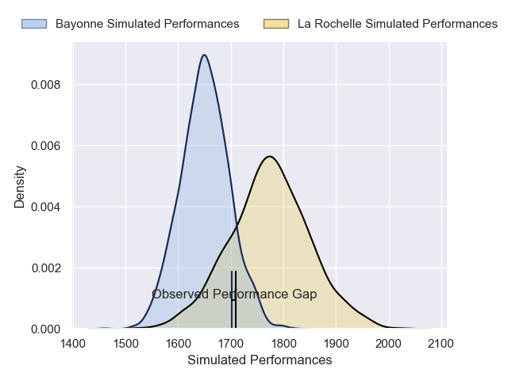
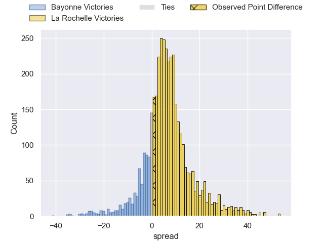
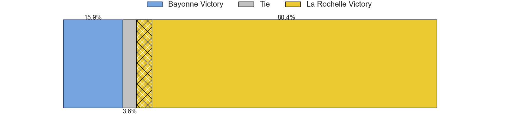
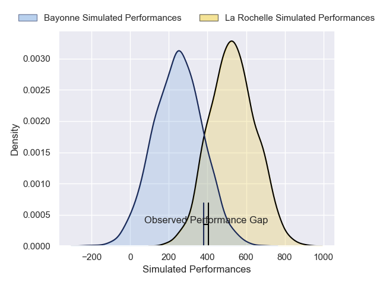
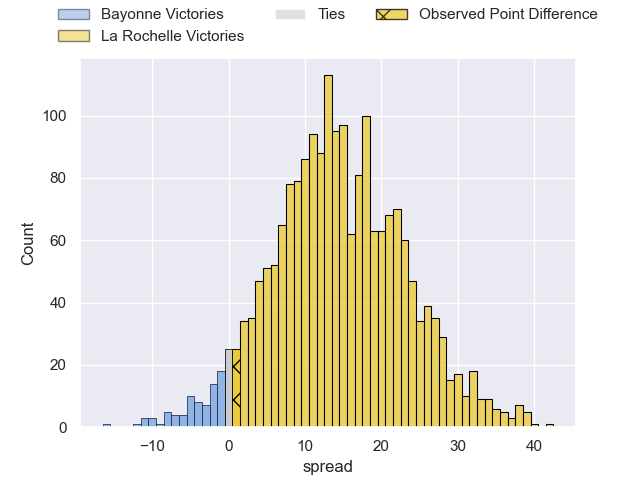
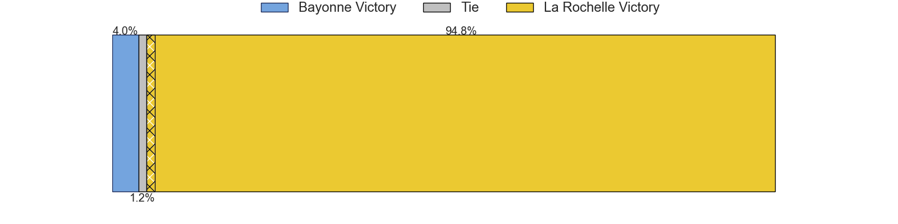

---  
layout: page  
title: Bayonne at La Rochelle; 28-29  
date: 2025-04-19 18:00:00 -0500  
categories: "Top 14 Orange 24/25" match review  
---
# Bayonne at La Rochelle; 28-29

# Club Level Predictions

The first set of predictions treats a club as the smallest object, as the club develops its members, organizes a gameplan, and deploys its players as needed for each match. This club model has a prediction of 0.668, which translates to predicting La Rochelle to win by 6.1.

Our Over/Under is 52.5 - and combined with the spread above, we have a predicted scoreline of 23 to 29

Each club has a rating and a rating deviation (similar to a Glicko rating), and expected performances can be generated. This allows for simulated matches and spreads like the ones below.
## Projected Performances - Club Model

## Projected Spreads - Club Model

## Projected Results - Club Model

# Player Level Predictions

Treating teams instead as an entity made up of the currently active players, I have ratings for each player in an altogether different system. These can be combined to form team ratings once teamsheets are announced, weighting starters a bit higher than the reserves. After the match is played, players can be weighted by their minutes on the field, allowing for an accurate measure of the team's composition. With these compiled team ratings, we can make predictions, measure inaccuracy, and update the individual player ratings.
## Prediction without Player Minutes: La Rochelle by 18.0

La Rochelle by 6.3 on a neutral pitch

## Projected Performances - Player Model

## Projected Spreads - Player Model

## Projected Results - Player Model

|   Away Minutes | Away Player             |   Away Percentile |   Number |   Home Percentile | Home Player         |   Home Minutes |
|---------------:|:------------------------|------------------:|---------:|------------------:|:--------------------|---------------:|
|             80 | Swan Cormenier          |             64.16 |        1 |             92.41 | Reda Wardi          |             80 |
|             26 | Vincent Giudicelli      |              8.5  |        2 |             80.61 | Tolu Latu           |             30 |
|             80 | Tevita Tatafu           |             97.5  |        3 |             94.35 | Uini Atonio         |             80 |
|             20 | Tevita Tatafu           |             97.5  |        3 |             94.35 | Uini Atonio         |             80 |
|             11 | Veikoso Poloniati       |             35.36 |        4 |             73.03 | Thomas Lavault      |             57 |
|             73 | Alex Moon               |             98.46 |        5 |             92.68 | Will Skelton        |             54 |
|              3 | Rodrigo Bruni           |             99.35 |        6 |             92.36 | Levani Botia        |             80 |
|             52 | Baptiste Chouzenoux     |             90.6  |        7 |             41.9  | Oscar Jegou         |             21 |
|             35 | Giovanni Habel-Kueffner |             92.02 |        8 |             98.16 | Gregory Alldritt    |             23 |
|             24 | Guillaume Rouet         |             23.31 |        9 |             97.13 | Tawera Kerr-Barlow  |             80 |
|             80 | Camille Lopez           |             88.66 |       10 |             33.2  | Antoine Hastoy      |             13 |
|             56 | Mateo Carreras          |             14.87 |       11 |             19.35 | Hoani Bosmorin      |             35 |
|             50 | Manu Tuilagi            |             99.11 |       12 |             85.19 | Jules Favre         |             29 |
|             58 | Guillaume Martocq       |             38.4  |       13 |             60.41 | Teddy Thomas        |             80 |
|             80 | Tom Spring              |             17.25 |       14 |             96.09 | Dillyn Leyds        |             26 |
|             80 | Cheikh Tiberghien       |             15.16 |       15 |             98.98 | Brice Dulin         |             28 |
|             26 | Facundo Bosch           |             93.37 |       16 |             17.18 | Nika Sutidze        |              5 |
|             26 | Facundo Bosch           |             93.37 |       16 |             17.18 | Nika Sutidze        |             80 |
|             50 | Pierre Castillon        |            nan    |       17 |             67.23 | Thierry Paiva       |             26 |
|             45 | Lucas Paulos            |             15.32 |       18 |             11.37 | Judicael Cancoriet  |             80 |
|             80 | Esteban Capilla         |             12.1  |       19 |              5.68 | Paul Boudehent      |             64 |
|             13 | Baptiste Germain        |             38.85 |       20 |             30.06 | Matthias Haddad     |             50 |
|             25 | Joris Segonds           |             69.64 |       21 |             85.81 | Thomas Berjon       |             64 |
|             18 | Arnaud Erbinartegaray   |             23.16 |       22 |             31.78 | Ihaia West          |             80 |
|             67 | Pieter Scholtz          |              7.34 |       23 |             17.43 | Aleksandre Kuntelia |              4 |

