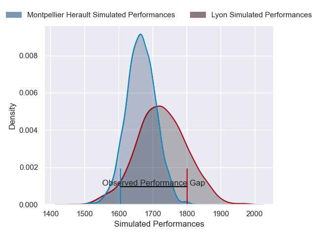
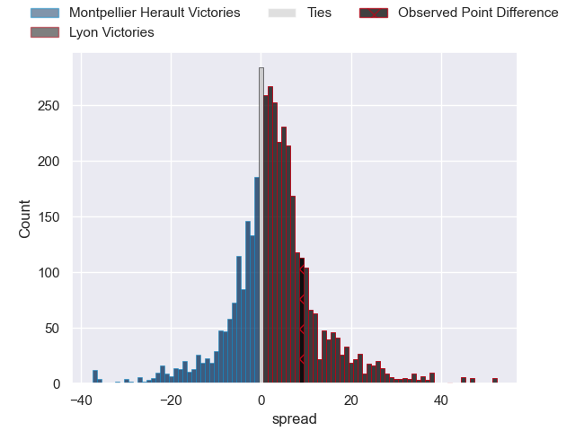
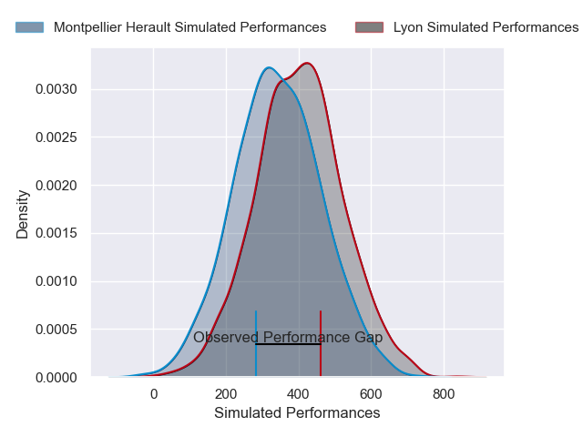
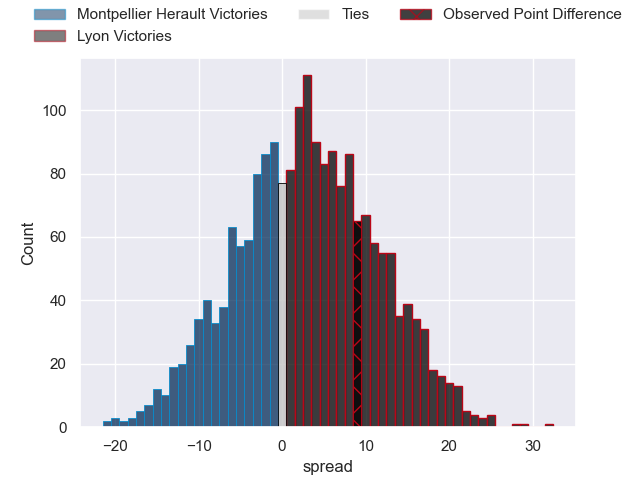

---  
layout: page  
title: Montpellier Herault at Lyon; 23-32  
date: 2025-04-19 18:00:00 -0500  
categories: "Top 14 Orange 24/25" match review  
---
# Montpellier Herault at Lyon; 23-32

# Club Level Predictions

The first set of predictions treats a club as the smallest object, as the club develops its members, organizes a gameplan, and deploys its players as needed for each match. This club model has a prediction of 0.588, which translates to predicting Lyon to win by 3.1.

Our Over/Under is 51.5 - and combined with the spread above, we have a predicted scoreline of 24 to 27

Each club has a rating and a rating deviation (similar to a Glicko rating), and expected performances can be generated. This allows for simulated matches and spreads like the ones below.
## Projected Performances - Club Model

## Projected Spreads - Club Model

## Projected Results - Club Model

# Player Level Predictions

Treating teams instead as an entity made up of the currently active players, I have ratings for each player in an altogether different system. These can be combined to form team ratings once teamsheets are announced, weighting starters a bit higher than the reserves. After the match is played, players can be weighted by their minutes on the field, allowing for an accurate measure of the team's composition. With these compiled team ratings, we can make predictions, measure inaccuracy, and update the individual player ratings.
## Prediction without Player Minutes: Lyon by 8.6

Montpellier Herault by 3.9 on a neutral pitch

## Projected Performances - Player Model

## Projected Spreads - Player Model

## Projected Results - Player Model

|   Away Minutes | Away Player                 |   Away Percentile |   Number |   Home Percentile | Home Player          |   Home Minutes |
|---------------:|:----------------------------|------------------:|---------:|------------------:|:---------------------|---------------:|
|             34 | Baptiste Erdocio            |              7.83 |        1 |             34.54 | Jerome Rey           |             21 |
|             11 | Jordan Uelese               |             16.84 |        2 |             22.28 | Guillaume Marchand   |             77 |
|             51 | Mohamed Haouas              |             53.35 |        3 |             67.72 | Irakli Aptsiauri     |             80 |
|             80 | Florian Verhaeghe           |             73.12 |        4 |             22.06 | Killian Geraci       |             67 |
|             68 | Tyler Duguid                |             83.62 |        5 |             61.37 | Mickael Guillard     |             75 |
|             30 | Lenni Nouchi                |             92.64 |        6 |             60.06 | Dylan Cretin         |             29 |
|             47 | Alexandre Becognee          |             77.84 |        7 |             80.63 | Liam Allen           |             13 |
|             29 | Sam Simmonds                |             48.47 |        8 |             91    | Arno Botha           |             12 |
|             80 | Cobus Reinach               |             87.67 |        9 |             93.07 | Baptiste Couilloud   |             30 |
|             80 | Stuart Hogg                 |             97.77 |       10 |             85.22 | Leo Berdeu           |             80 |
|             52 | Gabriel Ngandebe            |              8.58 |       11 |             88.47 | Vincent Rattez       |             18 |
|             80 | Auguste Cadot               |             32.58 |       12 |             62.59 | Theo Millet          |             80 |
|             80 | Arthur Vincent              |             61.9  |       13 |              6.12 | Josiah Maraku        |             48 |
|             13 | Mael Moustin                |             35.18 |       14 |             27.07 | Ethan Dumortier      |             68 |
|             40 | Anthony Bouthier            |             66.6  |       15 |             89.55 | Davit Niniashvili    |             23 |
|             40 | Anthony Bouthier            |             66.6  |       15 |             89.55 | Davit Niniashvili    |             80 |
|             20 | Christopher Tolofua         |             97.62 |       16 |             40.82 | Yanis Charcosset     |             15 |
|             80 | Enzo Forletta               |             91.04 |       17 |             17.59 | Sebastien Taofifenua |             15 |
|              0 | Marco Tauleigne             |             98.27 |       18 |              6.52 | Theo William         |              0 |
|             34 | Nicolaas Janse van Rensburg |             87.96 |       19 |            nan    | Beka Saginadze       |             77 |
|             63 | Billy Vunipola              |            100    |       20 |             85.3  | Charlie Cassang      |             67 |
|             28 | Leo Coly                    |             79.73 |       21 |              5.94 | Martin Meliande      |             80 |
|             28 | Hugo Reus                   |             65.18 |       22 |            nan    | Thibaut Regard       |             60 |
|             80 | Wilfrid Hounkpatin          |             59    |       23 |              8.23 | Hamza Kaabeche       |             54 |

