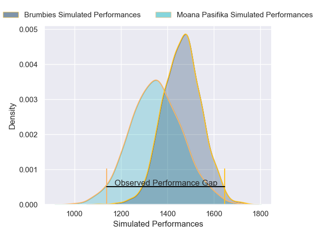
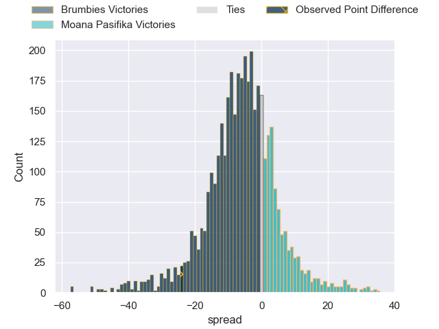
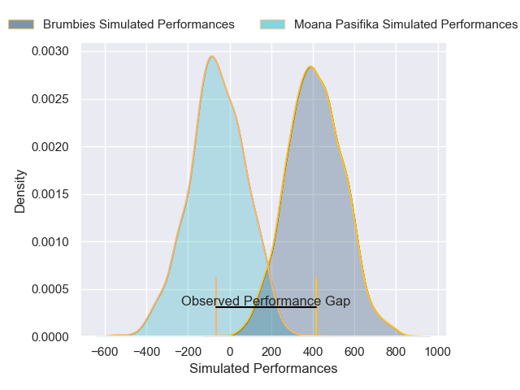
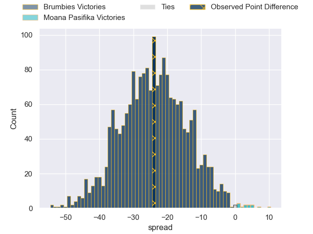

---  
layout: page  
title: Brumbies at Moana Pasifika; 24-0  
date: 2025-04-19 18:00:00 -0500  
categories: "Super Rugby Pacific 2025" match review  
---
# Brumbies at Moana Pasifika; 24-0

# Club Level Predictions

The first set of predictions treats a club as the smallest object, as the club develops its members, organizes a gameplan, and deploys its players as needed for each match. This club model has a prediction of 0.355, which translates to predicting Brumbies to win by 5.4.

Our Over/Under is 75.5 - and combined with the spread above, we have a predicted scoreline of 40 to 35

Each club has a rating and a rating deviation (similar to a Glicko rating), and expected performances can be generated. This allows for simulated matches and spreads like the ones below.
## Projected Performances - Club Model

## Projected Spreads - Club Model

## Projected Results - Club Model

# Player Level Predictions

Treating teams instead as an entity made up of the currently active players, I have ratings for each player in an altogether different system. These can be combined to form team ratings once teamsheets are announced, weighting starters a bit higher than the reserves. After the match is played, players can be weighted by their minutes on the field, allowing for an accurate measure of the team's composition. With these compiled team ratings, we can make predictions, measure inaccuracy, and update the individual player ratings.
## Prediction without Player Minutes: Brumbies by 12.6

Brumbies by 15.2 on a neutral pitch

## Projected Performances - Player Model

## Projected Spreads - Player Model

## Projected Results - Player Model

|   Away Minutes | Away Player         |   Away Percentile |   Number |   Home Percentile | Home Player           |   Home Minutes |
|---------------:|:--------------------|------------------:|---------:|------------------:|:----------------------|---------------:|
|             80 | Rhys Van Nek        |             72.07 |        1 |             17.03 | Abraham Pole          |          49    |
|             80 | Rhys Van Nek        |             72.07 |        1 |             17.03 | Abraham Pole          |          80    |
|             80 | Rhys Van Nek        |             72.07 |        1 |             17.03 | Abraham Pole          |          13    |
|             80 | Lachlan Lonergan    |              5.61 |        2 |              0.17 | Samiuela Moli         |          27    |
|             80 | Allan Alaalatoa     |             96.93 |        3 |             41.08 | Sione Mafile'o        |          19    |
|             66 | Nick Frost          |             62.04 |        4 |             81.02 | Tom Savage            |          30    |
|              0 | Tom Hooper          |             79.48 |        5 |             83.33 | Michael Curry         |          20    |
|             68 | Rob Valetini        |             98.14 |        6 |             77.75 | Miracle Faiilagi      |          29    |
|             54 | Rory Scott          |             71.6  |        7 |              4.66 | Sione Havili Talitui  |          24.25 |
|             54 | Rory Scott          |             71.6  |        7 |              4.66 | Sione Havili Talitui  |          59    |
|             54 | Rory Scott          |             71.6  |        7 |              4.66 | Sione Havili Talitui  |          80    |
|             80 | Tuaina Taii Tualima |             70.14 |        8 |             60.74 | Semisi Tupou Ta'eiloa |          47    |
|             26 | Ryan Lonergan       |             83.78 |        9 |             46.11 | Jonathan Taumateine   |          40    |
|              0 | Noah Lolesio        |             84.62 |       10 |             74.09 | Patrick Pellegrini    |           7    |
|              0 | Noah Lolesio        |             84.62 |       10 |             74.09 | Patrick Pellegrini    |          13    |
|             27 | Corey Toole         |             62.73 |       11 |             21.35 | Kyren Taumoefolau     |          16    |
|             24 | David Feliuai       |             34.65 |       12 |             97.93 | Julian Savea          |           6    |
|             80 | Ollie Sapsford      |             90.62 |       13 |             79.86 | Pepesana Patafilo     |          29    |
|             49 | Andy Muirhead       |             95.33 |       14 |              0.57 | Fine Inisi            |           9    |
|             55 | Tom Wright          |             75    |       15 |             24.39 | Tevita Ofa            |          24    |
|             31 | Billy Pollard       |             81.8  |       16 |             80.1  | Sama Malolo           |          80    |
|             80 | James Slipper       |             96.05 |       17 |            nan    | Lavengamonu Moli      |          80    |
|             63 | James Slipper       |             96.05 |       17 |            nan    | Lavengamonu Moli      |          80    |
|             80 | Feao Fotuaika       |            nan    |       18 |            nan    | Feleti Sae-Ta'ufo'ou  |          49    |
|             37 | Lachlan Shaw        |            nan    |       19 |             18.02 | Sam Slade             |          24.25 |
|             20 | Cadeyrn Neville     |             99.04 |       20 |             22.35 | Ola Tauelangi         |          80    |
|             80 | Harrison Goddard    |             24.32 |       21 |             58.28 | Melani Matavao        |          20    |
|             49 | Declan Meredith     |            nan    |       22 |              4.45 | Jackson Garden-Bachop |          80    |
|              0 | Hudson Creighton    |            nan    |       23 |              5.92 | Danny Toala           |          80    |

