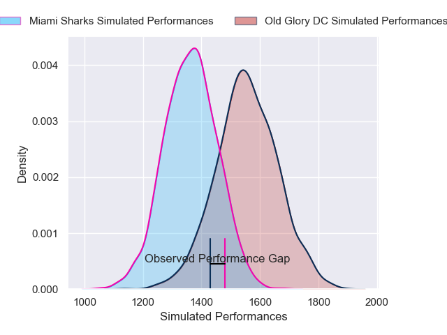
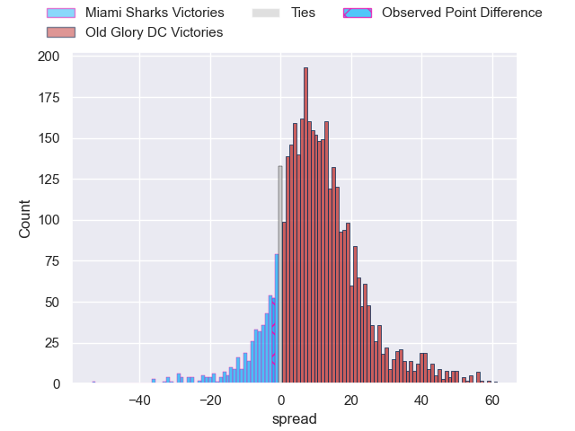
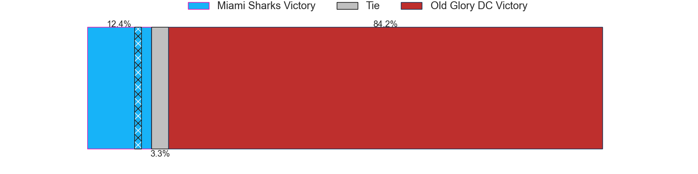
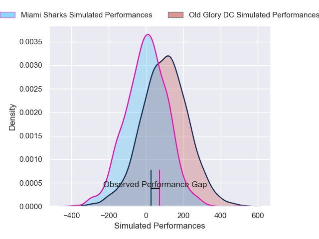
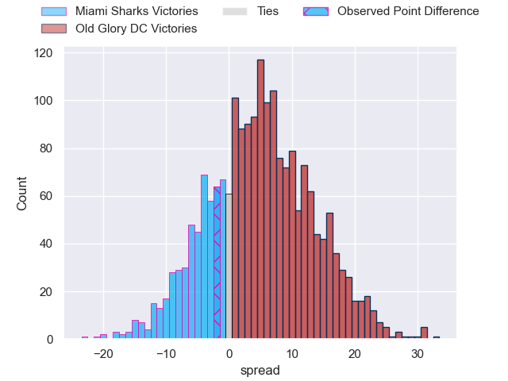
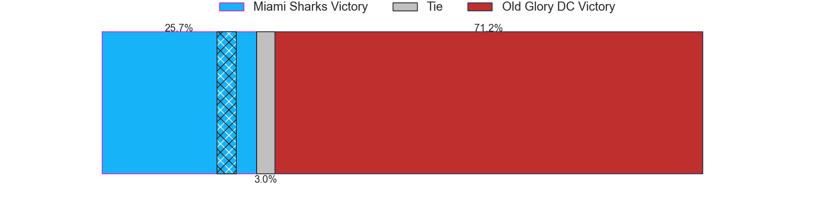

---  
layout: page  
title: Miami Sharks at Old Glory DC; 37-35  
date: 2025-04-19 18:00:00 -0500  
categories: "Major League Rugby 2025" match review  
---
# Miami Sharks at Old Glory DC; 37-35

# Club Level Predictions

The first set of predictions treats a club as the smallest object, as the club develops its members, organizes a gameplan, and deploys its players as needed for each match. This club model has a prediction of 0.747, which translates to predicting Old Glory DC to win by 9.8.

Our Over/Under is 57.5 - and combined with the spread above, we have a predicted scoreline of 24 to 33

Each club has a rating and a rating deviation (similar to a Glicko rating), and expected performances can be generated. This allows for simulated matches and spreads like the ones below.
## Projected Performances - Club Model

## Projected Spreads - Club Model

## Projected Results - Club Model

# Player Level Predictions

Treating teams instead as an entity made up of the currently active players, I have ratings for each player in an altogether different system. These can be combined to form team ratings once teamsheets are announced, weighting starters a bit higher than the reserves. After the match is played, players can be weighted by their minutes on the field, allowing for an accurate measure of the team's composition. With these compiled team ratings, we can make predictions, measure inaccuracy, and update the individual player ratings.
## Prediction without Player Minutes: Old Glory DC by 6.7

Old Glory DC by 3.8 on a neutral pitch

## Projected Performances - Player Model

## Projected Spreads - Player Model

## Projected Results - Player Model

|   Away Minutes | Away Player             |   Away Percentile |   Number |   Home Percentile | Home Player      |   Home Minutes |
|---------------:|:------------------------|------------------:|---------:|------------------:|:-----------------|---------------:|
|       72       | Ma'ake Muti             |             17.92 |        1 |              4.76 | Jack Iscaro      |       80       |
|       26       | Sean McNulty            |             39.29 |        2 |             17.35 | KoiKoi Nelligan  |       80       |
|       19       | Reinaldo Piussi Mendoza |             48.99 |        3 |              2.58 | Joe Rees         |       80       |
|       46       | Tomas Casares           |             20.13 |        4 |             87.38 | Rob Harley       |       54       |
|       46       | Mauro Rebussone         |             72.35 |        5 |             13.01 | Tevita Naqali    |       28       |
|       57       | Manuel Ardao            |              0.84 |        6 |              9.59 | Logan Weidner    |       60       |
|        0       | Benja Bonassoa          |             76.54 |        7 |             15.92 | Collin Grosse    |       48       |
|       80       | Marques Fuala'au        |             58.9  |        8 |             96.32 | Lautaro Bavaro   |       55       |
|       45       | Tomas Cubelli           |              7.26 |        9 |             30.24 | Connor Buckley   |       48       |
|       45       | Martin Elias            |             94.74 |       10 |              1.21 | Jason Emery      |       76       |
|       56       | Josiah Morra            |             73.4  |       11 |             83.79 | Axel Muller      |       80       |
|       80       | Tomas Cubilla           |             82.43 |       12 |              5.33 | Nick Grigg       |       20       |
|       80       | Matias Orlando          |              5.23 |       13 |             74.53 | Steffan Hughes   |        6.66667 |
|       70       | Marcos Young            |             46.62 |       14 |             21.07 | Perry Humphreys  |       24       |
|        6       | Shane O'Leary           |              7.99 |       15 |              3.69 | Owen Sheehy      |       46       |
|       52       | Kirby Myhill            |              8.33 |       16 |             32.98 | John Rizzo       |       80       |
|        6.66667 | Tau Koloamatangi        |              8.15 |       17 |              7.99 | Calixto Martinez |       71       |
|        9.33333 | Braemar Murray          |             15.22 |       18 |             79.9  | Ethan McVeigh    |        9.33333 |
|       62       | Tomas Inciarte          |             82.43 |       19 |             29.25 | Facundo Gattas   |       80       |
|       65       | Alec McDonnell          |             31.07 |       20 |              0.69 | Tommaso Boni     |       80       |
|       37       | Tomas Bekerman          |             76.44 |       21 |             87.04 | Sam Davies       |       80       |
|       35       | Rick Rose               |             29.87 |       22 |             15.08 | Cory Daniel      |       71       |
|       56       | Guiseppe du Toit        |              8.29 |       23 |             62.14 | Bill Whiteside   |       24       |

