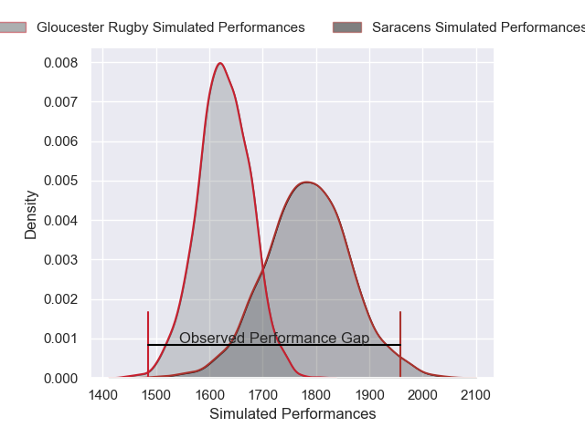
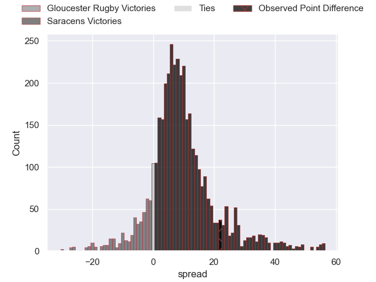
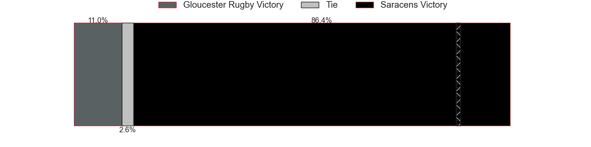
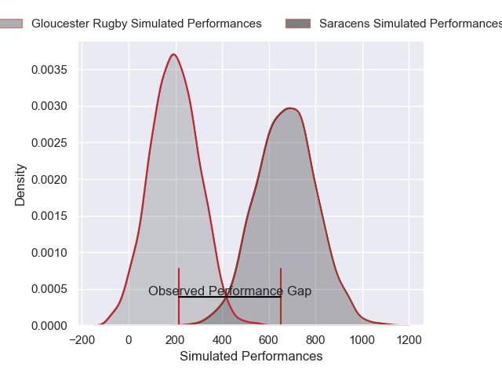
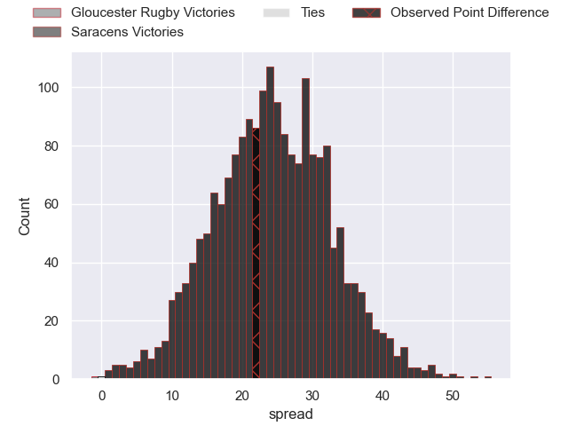
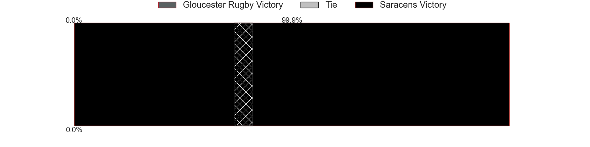

---  
layout: page  
title: Gloucester Rugby at Saracens; 14-36  
date: 2025-04-19 18:00:00 -0500  
categories: "Gallagher Premiership 24/25" match review  
---
# Gloucester Rugby at Saracens; 14-36

# Club Level Predictions

The first set of predictions treats a club as the smallest object, as the club develops its members, organizes a gameplan, and deploys its players as needed for each match. This club model has a prediction of 0.709, which translates to predicting Saracens to win by 7.8.

Our Over/Under is 55.5 - and combined with the spread above, we have a predicted scoreline of 24 to 32

Each club has a rating and a rating deviation (similar to a Glicko rating), and expected performances can be generated. This allows for simulated matches and spreads like the ones below.
## Projected Performances - Club Model

## Projected Spreads - Club Model

## Projected Results - Club Model

# Player Level Predictions

Treating teams instead as an entity made up of the currently active players, I have ratings for each player in an altogether different system. These can be combined to form team ratings once teamsheets are announced, weighting starters a bit higher than the reserves. After the match is played, players can be weighted by their minutes on the field, allowing for an accurate measure of the team's composition. With these compiled team ratings, we can make predictions, measure inaccuracy, and update the individual player ratings.
## Prediction without Player Minutes: Saracens by 23.4

Saracens by 12.3 on a neutral pitch

## Projected Performances - Player Model

## Projected Spreads - Player Model

## Projected Results - Player Model

|   Away Minutes | Away Player         |   Away Percentile |   Number |   Home Percentile | Home Player           |   Home Minutes |
|---------------:|:--------------------|------------------:|---------:|------------------:|:----------------------|---------------:|
|             28 | Val Rapava-Ruskin   |             84.18 |        1 |             93.06 | Eroni Mawi            |             76 |
|             62 | Jack Singleton      |             92.01 |        2 |              8.84 | Theo Dan              |             58 |
|             45 | Afolabi Fasogbon    |             49.23 |        3 |             76.43 | Marco Riccioni        |             22 |
|             20 | Arthur Clark        |             10.89 |        4 |             98.65 | Maro Itoje            |             53 |
|             80 | Freddie Thomas      |             60.89 |        5 |             98.7  | Nick Isiekwe          |             38 |
|             80 | Jack Clement        |              6.89 |        6 |             36.41 | Theo McFarland        |             60 |
|             52 | Lewis Ludlow        |             15.27 |        7 |             99.07 | Ben Earl              |             52 |
|             35 | Ruan Ackermann      |             71.17 |        8 |             21.06 | Tom Willis            |             80 |
|             80 | Tomos Williams      |             78.04 |        9 |             86.15 | Ivan van Zyl          |             27 |
|             50 | Gareth Anscombe     |             66.4  |       10 |             61.94 | Fergus Burke          |             15 |
|             18 | Jake Morris         |             18.02 |       11 |             84.65 | Rotimi Segun          |             20 |
|             42 | Seb Atkinson        |             45.01 |       12 |             14.41 | Olly Hartley          |             80 |
|             55 | Chris Harris        |             32.38 |       13 |             99.9  | Nick Tompkins         |             80 |
|             54 | George Barton       |             63.01 |       14 |             43.76 | Tobias Elliott        |             62 |
|             25 | Santiago Carreras   |             84.43 |       15 |             93.24 | Elliot Daly           |             80 |
|              2 | Seb Blake           |             78.57 |       16 |            100    | Jamie George          |             80 |
|             21 | Jamal Ford-Robinson |              6.7  |       17 |             53.83 | Rhys Carre            |             80 |
|             34 | Kirill Gotovtsev    |             88.46 |       18 |             94.92 | Alec Clarey           |             80 |
|             34 | Cameron Jordan      |             97.59 |       19 |             85.36 | Hugh Tizard           |             65 |
|             25 | Cameron Jordan      |             97.59 |       19 |             85.36 | Hugh Tizard           |             65 |
|             25 | Freddie Clarke      |             21.58 |       20 |             61.27 | Andy Onyeama-Christie |             80 |
|             78 | Caolan Englefield   |             37.84 |       21 |             96.55 | Juan Martin Gonzalez  |             52 |
|             40 | Charlie Atkinson    |             81.78 |       22 |            nan    | Charlie Bracken       |             52 |
|             26 | Jack Cotgreave      |            nan    |       23 |             94.67 | Alex Goode            |             80 |

