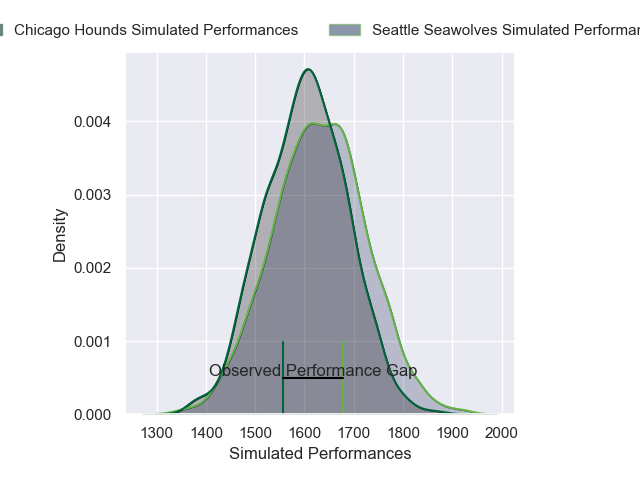
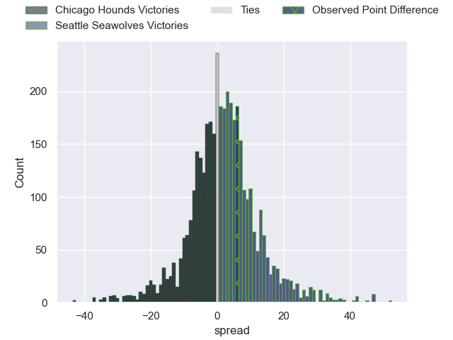
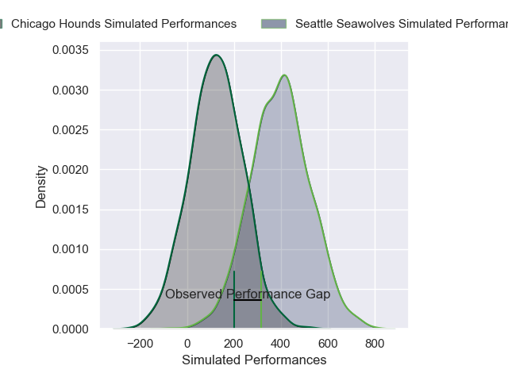
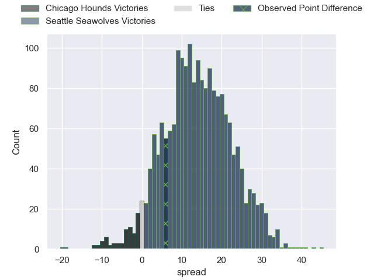
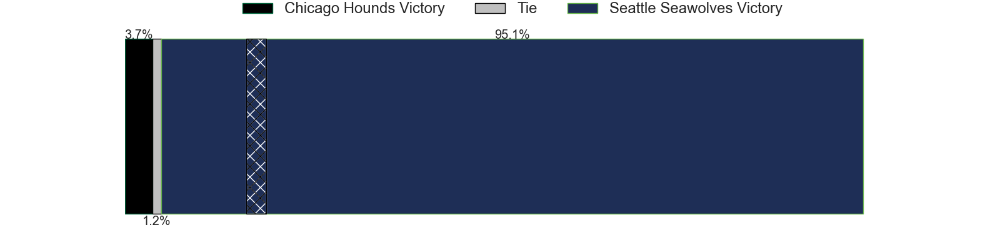

---  
layout: page  
title: Chicago Hounds at Seattle Seawolves; 22-28  
date: 2025-04-19 18:00:00 -0500  
categories: "Major League Rugby 2025" match review  
---
# Chicago Hounds at Seattle Seawolves; 22-28

# Club Level Predictions

The first set of predictions treats a club as the smallest object, as the club develops its members, organizes a gameplan, and deploys its players as needed for each match. This club model has a prediction of 0.535, which translates to predicting Seattle Seawolves to win by 1.3.

Our Over/Under is 58.5 - and combined with the spread above, we have a predicted scoreline of 29 to 30

Each club has a rating and a rating deviation (similar to a Glicko rating), and expected performances can be generated. This allows for simulated matches and spreads like the ones below.
## Projected Performances - Club Model

## Projected Spreads - Club Model

## Projected Results - Club Model

# Player Level Predictions

Treating teams instead as an entity made up of the currently active players, I have ratings for each player in an altogether different system. These can be combined to form team ratings once teamsheets are announced, weighting starters a bit higher than the reserves. After the match is played, players can be weighted by their minutes on the field, allowing for an accurate measure of the team's composition. With these compiled team ratings, we can make predictions, measure inaccuracy, and update the individual player ratings.
## Prediction without Player Minutes: Seattle Seawolves by 13.0

Seattle Seawolves by 9.5 on a neutral pitch

## Projected Performances - Player Model

## Projected Spreads - Player Model

## Projected Results - Player Model

|   Away Minutes | Away Player       |   Away Percentile |   Number |   Home Percentile | Home Player       |   Home Minutes |
|---------------:|:------------------|------------------:|---------:|------------------:|:------------------|---------------:|
|             80 | Faka'osi Pifeleti |             90.28 |        1 |             75.7  | Cameron Orr       |             30 |
|             18 | Janus Venter      |             61.71 |        2 |             42.47 | Kerron van Vuuren |              5 |
|             18 | Charlie Abel      |             20.59 |        3 |              3.62 | Mason Pedersen    |             80 |
|             50 | James Scott       |             84.54 |        4 |             87.86 | OJ Noa            |             80 |
|             27 | Hamish Bain       |             55.98 |        5 |             91.56 | Rhyno Herbst      |              5 |
|             27 | Hamish Bain       |             55.98 |        5 |             91.56 | Rhyno Herbst      |             80 |
|             27 | Hamish Bain       |             55.98 |        5 |             91.56 | Rhyno Herbst      |             52 |
|             50 | Luke White        |             12.41 |        6 |              1.33 | Huw Taylor        |             24 |
|             52 | Lucas Rumball     |              0.19 |        7 |             82.39 | Charles Elton     |             64 |
|             43 | Matthew Oworu     |             48.35 |        8 |             89.05 | Riekert Hattingh  |             20 |
|             80 | Michael Baska     |             24.79 |        9 |             72.31 | Juan Philip Smith |             51 |
|              2 | Tim Swiel         |              5.87 |       10 |             21.38 | Rod Iona          |             26 |
|             80 | Mark O'Keeffe     |             16.1  |       11 |             95.64 | Toni Pulu         |             54 |
|             68 | Noah Flesch       |             50.82 |       12 |             50    | Dan Kriel         |             80 |
|             80 | Bryce Campbell    |             89.12 |       13 |              9.34 | Divan Rossouw     |             29 |
|             80 | Noah Brown        |             94.79 |       14 |             36.93 | Lauina Futi       |             30 |
|             30 | Michael Hand II   |             20.58 |       15 |             90.12 | Duncan Matthews   |             30 |
|             50 | Ignacio Peculo    |             86.16 |       16 |             31.61 | Dewald Kotze      |             37 |
|             34 | Jackson Zabierek  |            nan    |       17 |            nan    | Njabula Gumede    |             56 |
|             50 | Chris Hilsenbeck  |              5.45 |       18 |             17.14 | Devin Short       |             28 |
|              0 | Liam Fletcher     |            nan    |       19 |              8.24 | Malacchi Esdale   |             80 |
|             80 | Conall Boomer     |             81.82 |       20 |            nan    | Chance Wenglewski |             60 |
|             10 | Brad Tucker       |            nan    |       21 |             83.44 | Eddie Fouche      |             80 |
|             20 | Jason Higgins     |             24.62 |       22 |            nan    | Isaia Lotawa      |             30 |
|             15 | Jake Kinneeveauk  |            nan    |       23 |            nan    | nan               |            nan |

