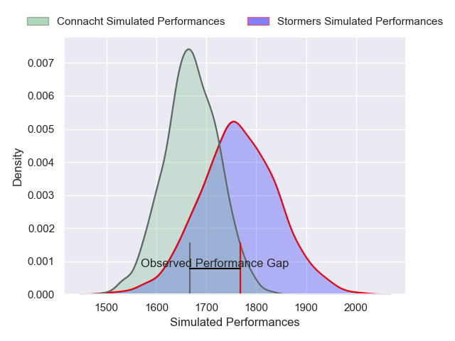
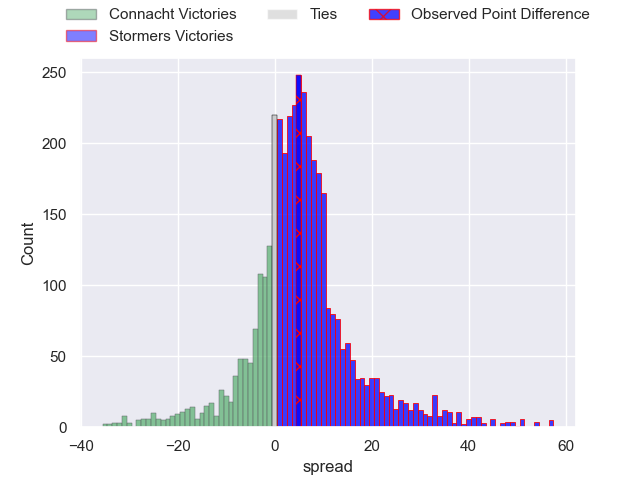
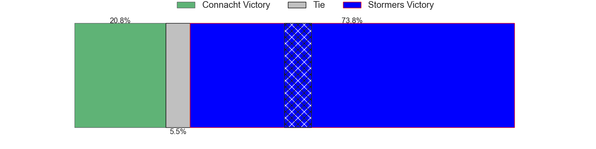
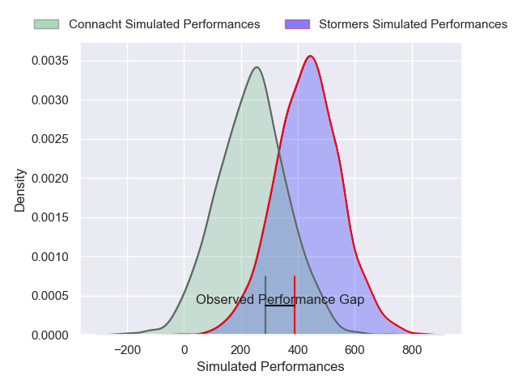
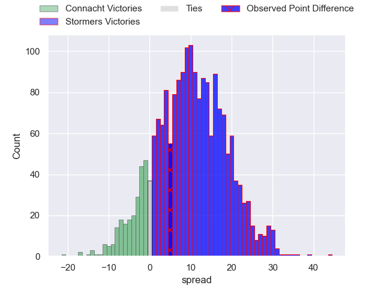
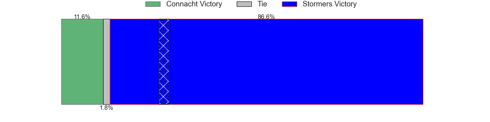

---  
layout: page  
title: Connacht at Stormers; 29-34  
date: 2025-04-19 18:00:00 -0500  
categories: "United Rugby Championship 24/25" match review  
---
# Connacht at Stormers; 29-34

# Club Level Predictions

The first set of predictions treats a club as the smallest object, as the club develops its members, organizes a gameplan, and deploys its players as needed for each match. This club model has a prediction of 0.632, which translates to predicting Stormers to win by 4.8.

Our Over/Under is 55.5 - and combined with the spread above, we have a predicted scoreline of 25 to 30

Each club has a rating and a rating deviation (similar to a Glicko rating), and expected performances can be generated. This allows for simulated matches and spreads like the ones below.
## Projected Performances - Club Model

## Projected Spreads - Club Model

## Projected Results - Club Model

# Player Level Predictions

Treating teams instead as an entity made up of the currently active players, I have ratings for each player in an altogether different system. These can be combined to form team ratings once teamsheets are announced, weighting starters a bit higher than the reserves. After the match is played, players can be weighted by their minutes on the field, allowing for an accurate measure of the team's composition. With these compiled team ratings, we can make predictions, measure inaccuracy, and update the individual player ratings.
## Prediction without Player Minutes: Stormers by 9.7

Stormers by 1.0 on a neutral pitch

## Projected Performances - Player Model

## Projected Spreads - Player Model

## Projected Results - Player Model

|   Away Minutes | Away Player          |   Away Percentile |   Number |   Home Percentile | Home Player               |   Home Minutes |
|---------------:|:---------------------|------------------:|---------:|------------------:|:--------------------------|---------------:|
|             38 | Peter Dooley         |             98.14 |        1 |             83.94 | Alistair Vermaak          |             51 |
|             59 | Dylan Tierney-Martin |             70.24 |        2 |             67.01 | Andre-Hugo Venter         |             80 |
|             50 | Finlay Bealham       |             92.25 |        3 |             12.43 | Sazi Sandi                |             68 |
|             40 | Oisin Dowling        |             79.19 |        4 |             81.89 | Salmaan Moerat            |             80 |
|             80 | Darragh Murray       |             61.27 |        5 |             87.09 | Ruben van Heerden         |             46 |
|             80 | Cian Prendergast     |             40.69 |        6 |             40.78 | Paul De Villiers          |             50 |
|             59 | Conor Oliver         |             91.71 |        7 |             14.06 | Marcel Theunissen         |             80 |
|             80 | Paul Boyle           |             54.81 |        8 |             90.18 | Evan Roos                 |             80 |
|             80 | Ben Murphy           |             59.8  |        9 |             35.3  | Stefan Ungerer            |             40 |
|             80 | Jack Carty           |             95.14 |       10 |             68.42 | Sacha Feinberg-Mngomezulu |             80 |
|             15 | Shane Jennings       |             95.52 |       11 |             77.79 | Seabelo Senatla           |             30 |
|             40 | Cathal Forde         |             11.45 |       12 |             92.3  | Damian Willemse           |             12 |
|             54 | David Hawkshaw       |             69.6  |       13 |             91.71 | Daniel du Plessis         |             15 |
|             34 | Chay Mullins         |             49.09 |       14 |             61.77 | Suleiman Hartzenberg      |             50 |
|             26 | Piers O'Conor        |             82.79 |       15 |             99.59 | Warrick Gelant            |             10 |
|             65 | Dave Heffernan       |             34.86 |       16 |              3.23 | JJ Kotze                  |             63 |
|             39 | Jordan Duggan        |             44.23 |       17 |             71.19 | Vernon Matongo            |             12 |
|             42 | Jack Aungier         |             61.66 |       18 |             99.92 | Brok Harris               |             70 |
|              6 | Josh Murphy          |             94.8  |       19 |              2.22 | JD Schickerling           |             12 |
|             21 | Joe Joyce            |             94.61 |       20 |             77.19 | Louw Nel                  |             21 |
|             80 | Matthew Devine       |             52.2  |       21 |             95.81 | Deon Fourie               |             29 |
|             17 | Santiago Cordero     |             98.47 |       22 |             78.21 | Paul de Wet               |             45 |
|             54 | Sean Jansen          |             10.02 |       23 |             94.18 | Ben Loader                |             80 |

