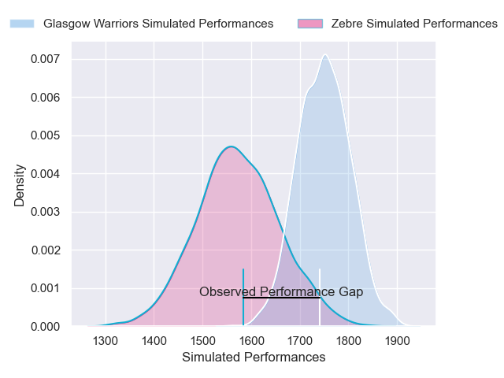
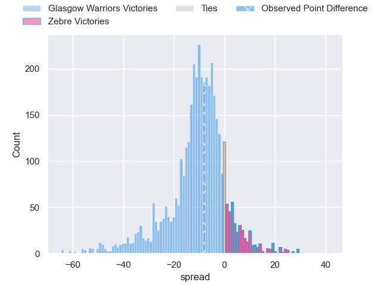
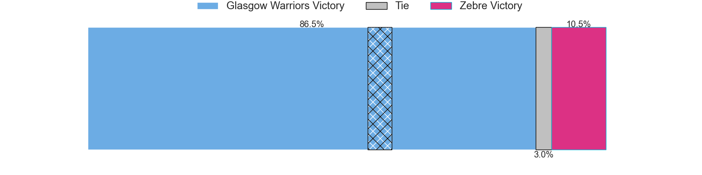
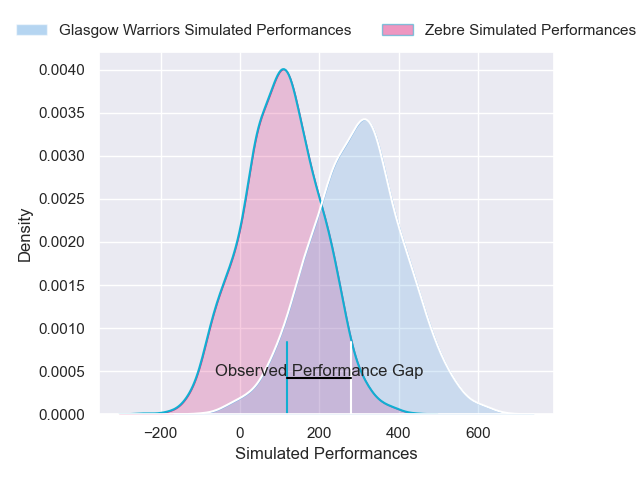
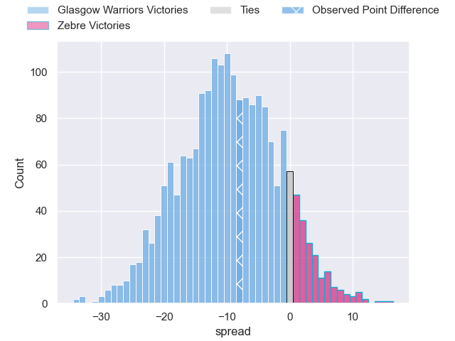
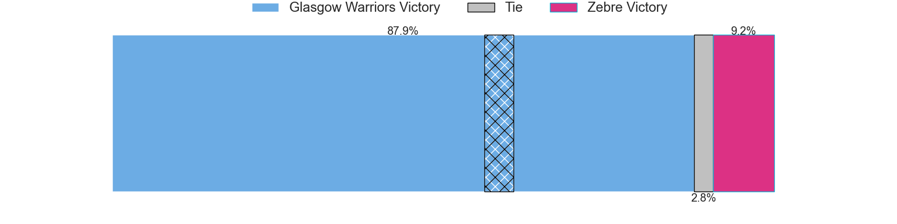

---  
layout: page  
title: Glasgow Warriors at Zebre; 14-6  
date: 2025-04-19 18:00:00 -0500  
categories: "United Rugby Championship 24/25" match review  
---
# Glasgow Warriors at Zebre; 14-6

# Club Level Predictions

The first set of predictions treats a club as the smallest object, as the club develops its members, organizes a gameplan, and deploys its players as needed for each match. This club model has a prediction of 0.268, which translates to predicting Glasgow Warriors to win by 8.9.

Our Over/Under is 55.5 - and combined with the spread above, we have a predicted scoreline of 32 to 23

Each club has a rating and a rating deviation (similar to a Glicko rating), and expected performances can be generated. This allows for simulated matches and spreads like the ones below.
## Projected Performances - Club Model

## Projected Spreads - Club Model

## Projected Results - Club Model

# Player Level Predictions

Treating teams instead as an entity made up of the currently active players, I have ratings for each player in an altogether different system. These can be combined to form team ratings once teamsheets are announced, weighting starters a bit higher than the reserves. After the match is played, players can be weighted by their minutes on the field, allowing for an accurate measure of the team's composition. With these compiled team ratings, we can make predictions, measure inaccuracy, and update the individual player ratings.
## Prediction without Player Minutes: Glasgow Warriors by 14.9

Glasgow Warriors by 21.1 on a neutral pitch

## Projected Performances - Player Model

## Projected Spreads - Player Model

## Projected Results - Player Model

|   Away Minutes | Away Player           |   Away Percentile |   Number |   Home Percentile | Home Player            |   Home Minutes |
|---------------:|:----------------------|------------------:|---------:|------------------:|:-----------------------|---------------:|
|              0 | Jamie Bhatti          |             95.8  |        1 |             42.7  | Danilo Fischetti       |             17 |
|             78 | Gregor Hiddleston     |             70.75 |        2 |             68.71 | Tommaso Di Bartolomeo  |             24 |
|             58 | Finlay Richardson     |             76.19 |        3 |             57.55 | Muhamed Hasa           |             24 |
|             69 | Olujare Oguntibeju    |             29.67 |        4 |             85.55 | Matteo Canali          |             26 |
|             80 | Alex Samuel           |             47.21 |        5 |              2.02 | Leonard Krumov         |             80 |
|             80 | Euan Ferrie           |             45.9  |        6 |             49.81 | Davide Ruggeri         |             39 |
|             67 | Sione Vailanu         |             18.25 |        7 |             26.07 | Bautista Stavile       |             46 |
|             25 | Jack Mann             |             41.92 |        8 |             35.99 | Giovanni Licata        |             39 |
|             15 | Jamie Dobie           |             90.54 |        9 |              5.74 | Alessandro Fusco       |             31 |
|             80 | Adam Hastings         |             98.18 |       10 |             22.06 | Giacomo Da Re          |             38 |
|             22 | Kyle Steyn            |             99.05 |       11 |              4.96 | Simone Gesi            |             80 |
|             80 | Stafford McDowall     |             89.44 |       12 |             74.93 | Damiano Mazza          |             38 |
|             47 | Ollie Smith           |             23.99 |       13 |             23.3  | Fetuli Paea            |             64 |
|             38 | Sebastian Cancelliere |             99.52 |       14 |              7.38 | Jacopo Trulla          |             46 |
|             20 | Josh McKay            |             77.66 |       15 |             91.39 | Geronimo Prisciantelli |             22 |
|             71 | Johnny Matthews       |             56.46 |       16 |             71.09 | Luca Bigi              |             57 |
|             70 | Patrick Schickerling  |             86.6  |       17 |             37.37 | Paolo Buonfiglio       |             39 |
|             22 | Sam Talakai           |             11.06 |       18 |             29.86 | Juan Pitinari          |             25 |
|             34 | Max Williamson        |             66.28 |       19 |             66.09 | Rusiate Nasove         |             33 |
|             34 | Rory Darge            |             88.73 |       20 |             75.05 | Giacomo Ferrari        |             28 |
|             34 | Sean Kennedy          |            nan    |       21 |             40.03 | Gonzalo Garcia         |              0 |
|             34 | Sean Kennedy          |            nan    |       21 |             40.03 | Gonzalo Garcia         |             39 |
|             34 | Tom Jordan            |             70.58 |       22 |             91.51 | Luca Morisi            |             70 |
|             10 | Facundo Cordero       |             95.23 |       23 |             70.35 | Scott Gregory          |             47 |

