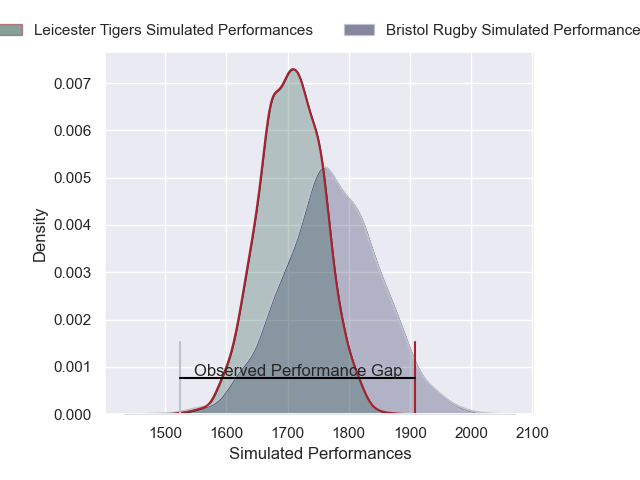
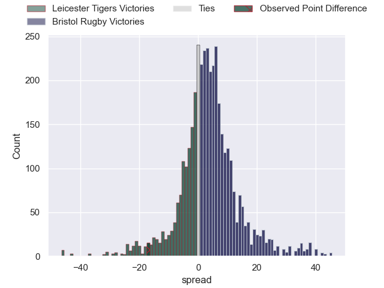
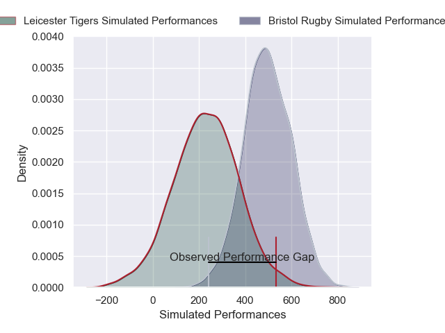
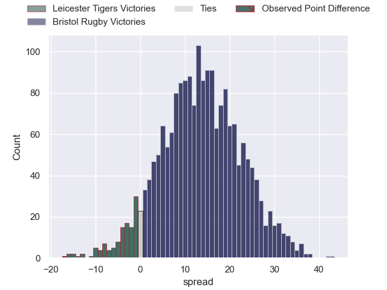

---  
layout: page  
title: Leicester Tigers at Bristol Rugby; 36-19  
date: 2025-04-20 18:00:00 -0500  
categories: "Gallagher Premiership 24/25" match review  
---
# Leicester Tigers at Bristol Rugby; 36-19

# Club Level Predictions

The first set of predictions treats a club as the smallest object, as the club develops its members, organizes a gameplan, and deploys its players as needed for each match. This club model has a prediction of 0.594, which translates to predicting Bristol Rugby to win by 3.4.

Our Over/Under is 59.5 - and combined with the spread above, we have a predicted scoreline of 28 to 32

Each club has a rating and a rating deviation (similar to a Glicko rating), and expected performances can be generated. This allows for simulated matches and spreads like the ones below.
## Projected Performances - Club Model

## Projected Spreads - Club Model

## Projected Results - Club Model

# Player Level Predictions

Treating teams instead as an entity made up of the currently active players, I have ratings for each player in an altogether different system. These can be combined to form team ratings once teamsheets are announced, weighting starters a bit higher than the reserves. After the match is played, players can be weighted by their minutes on the field, allowing for an accurate measure of the team's composition. With these compiled team ratings, we can make predictions, measure inaccuracy, and update the individual player ratings.
## Prediction without Player Minutes: Bristol Rugby by 25.2

Bristol Rugby by 18.3 on a neutral pitch

## Projected Performances - Player Model

## Projected Spreads - Player Model

## Projected Results - Player Model

|   Away Minutes | Away Player           |   Away Percentile |   Number |   Home Percentile | Home Player                |   Home Minutes |
|---------------:|:----------------------|------------------:|---------:|------------------:|:---------------------------|---------------:|
|             60 | Nicky Smith           |             85.1  |        1 |             73.96 | Ellis Genge                |             55 |
|             54 | Julian Montoya        |             91.09 |        2 |             73.76 | Gabriel Oghre              |             55 |
|             40 | Joe Heyes             |             96.24 |        3 |             55.22 | George Kloska              |             80 |
|             80 | Cameron Henderson     |             88.69 |        4 |             96.32 | James Dun                  |             19 |
|             58 | Ollie Chessum         |             81.53 |        5 |             55.98 | Josh Caulfield             |             54 |
|             71 | Hanro Liebenberg      |             93.02 |        6 |            100    | Steven Luatua              |             24 |
|             60 | Tommy Reffell         |             85.03 |        7 |             96.24 | Fitz Harding               |             61 |
|             35 | Olly Cracknell        |             53.91 |        8 |             10.49 | Viliame Mata               |             63 |
|             78 | Jack van Poortvliet   |             80.88 |        9 |             95.77 | Harry Randall              |             28 |
|             80 | Handre Pollard        |             92.05 |       10 |             96.62 | AJ MacGinty                |             18 |
|             80 | Ollie Hassell-Collins |             83.49 |       11 |             97.57 | Gabriel Ibitoye            |             80 |
|             80 | Joseph Woodward       |             72.64 |       12 |             96.48 | Benhard Janse van Rensburg |             58 |
|             80 | Solomone Kata         |             13.98 |       13 |             75.25 | Kalaveti Ravouvou          |             67 |
|             80 | Adam Radwan           |             29.2  |       14 |             24.53 | Deago Bailey               |             29 |
|              4 | Freddie Steward       |              3.04 |       15 |             61.74 | Richard Lane               |             26 |
|             20 | Charlie Clare         |             15.68 |       16 |             74.92 | Harry Thacker              |             80 |
|             80 | James Whitcombe       |             20.16 |       17 |             90.51 | Yann Thomas                |             70 |
|             80 | Will Hurd             |            nan    |       18 |             84.39 | Max Lahiff                 |             19 |
|             35 | Matt Rogerson         |             88.89 |       19 |             77.37 | Benjamin Grondona          |             31 |
|             80 | Emeka Ilione          |             81.73 |       20 |             57.94 | Jake Heenan                |              9 |
|             48 | Ben Youngs            |             70.73 |       21 |             95.94 | Kieran Marmion             |              2 |
|             60 | Jamie Shillcock       |             39.76 |       22 |             79.58 | Benjamin Elizalde          |             23 |
|             20 | Dan Kelly             |             85.41 |       23 |             30.78 | Joe Jenkins                |             61 |

