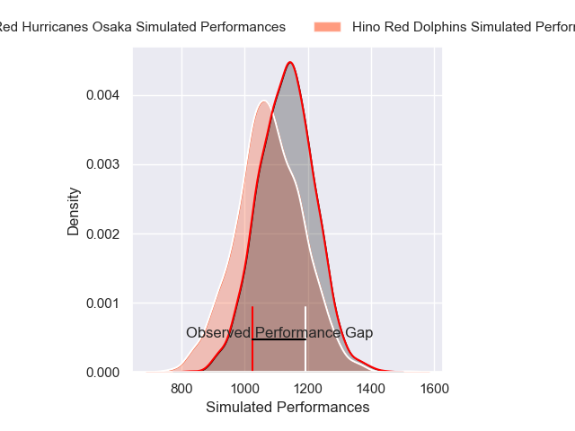
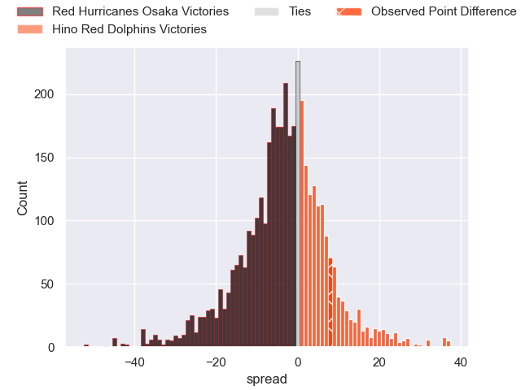
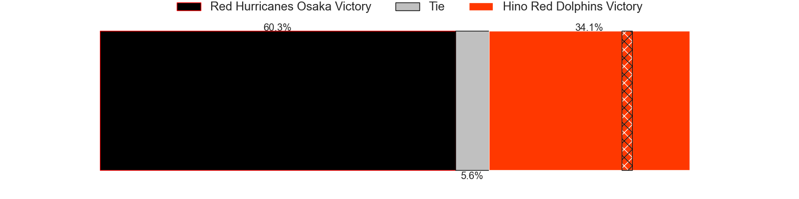
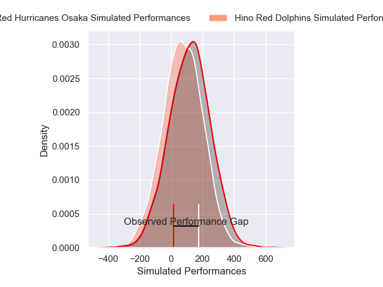
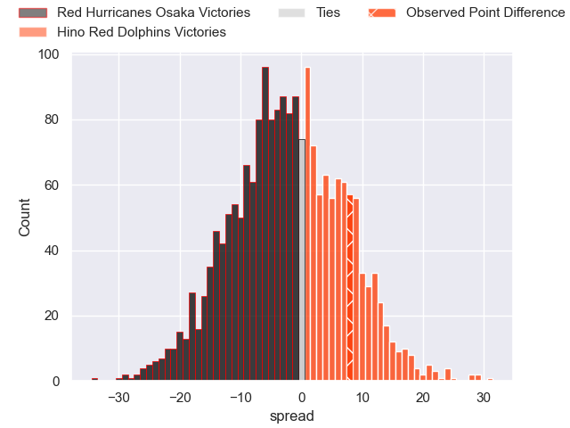
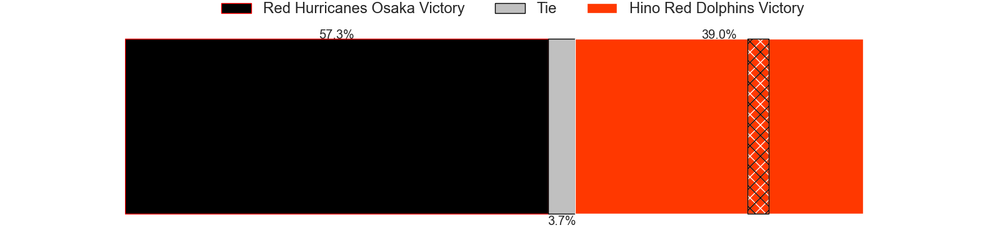

---  
layout: page  
title: Red Hurricanes Osaka at Hino Red Dolphins; 12-20  
date: 2025-04-20 18:00:00 -0500  
categories: "Japan Rugby League One D2 24/25" match review  
---
# Red Hurricanes Osaka at Hino Red Dolphins; 12-20

# Club Level Predictions

The first set of predictions treats a club as the smallest object, as the club develops its members, organizes a gameplan, and deploys its players as needed for each match. This club model has a prediction of 0.424, which translates to predicting Red Hurricanes Osaka to win by 2.8.

Our Over/Under is 56.5 - and combined with the spread above, we have a predicted scoreline of 30 to 27

Each club has a rating and a rating deviation (similar to a Glicko rating), and expected performances can be generated. This allows for simulated matches and spreads like the ones below.
## Projected Performances - Club Model

## Projected Spreads - Club Model

## Projected Results - Club Model

# Player Level Predictions

Treating teams instead as an entity made up of the currently active players, I have ratings for each player in an altogether different system. These can be combined to form team ratings once teamsheets are announced, weighting starters a bit higher than the reserves. After the match is played, players can be weighted by their minutes on the field, allowing for an accurate measure of the team's composition. With these compiled team ratings, we can make predictions, measure inaccuracy, and update the individual player ratings.
## Prediction without Player Minutes: Red Hurricanes Osaka by 0.8

Red Hurricanes Osaka by 3.7 on a neutral pitch

## Projected Performances - Player Model

## Projected Spreads - Player Model

## Projected Results - Player Model

|   Away Minutes | Away Player          |   Away Percentile |   Number |   Home Percentile | Home Player     |   Home Minutes |
|---------------:|:---------------------|------------------:|---------:|------------------:|:----------------|---------------:|
|              0 | Hiromichi Sakamoto   |              9.8  |        1 |             19.92 | Yuto Tokuda     |             41 |
|             73 | Yo Sato              |              2.64 |        2 |             12.21 | Towa Taniguchi  |             10 |
|             51 | Munekata Sashida     |             29.1  |        3 |             21.73 | Shosuke Funaki  |             56 |
|             22 | Toru Sugishita       |              4.52 |        4 |             14.42 | Noah Tovio      |             80 |
|             80 | Tatsunari Fujita     |              7.45 |        5 |             92.18 | Rory Arnold     |             80 |
|             24 | Hiroki Hanada        |             29.02 |        6 |             56.47 | Shun Nakashika  |             80 |
|             80 | Blake Gibson         |             69.24 |        7 |             44.54 | Kyosuke Horie   |             76 |
|             80 | Jack O'Sullivan      |             86.42 |        8 |              2.67 | Josh Fenner     |             65 |
|             40 | Toshihiro Yamamouchi |             12.52 |        9 |             30.63 | Kotaro Hatada   |             63 |
|             32 | Fumiya Dobashi       |             41.15 |       10 |             57.85 | Junpei Noguchi  |             77 |
|             26 | Yuki Ishii           |             54.2  |       11 |             18.47 | Moeki Fukushi   |             59 |
|             22 | Mifiposeti Paea      |              3.62 |       12 |             20.52 | Taroma Togo     |             80 |
|             80 | Henry Taefu          |             14.49 |       13 |             14.39 | Sora Ouchi      |             79 |
|             80 | Kouki Shigeno        |              8.77 |       14 |             36.19 | Yuto Mizuma     |             66 |
|             39 | Taiki Yamaguchi      |             40.08 |       15 |             51.42 | Takumi Ishimoto |             45 |
|             51 | Kanta Kurahashi      |             49.86 |       16 |             66.76 | Shohei Ijima    |             29 |
|             18 | Shota Takai          |            nan    |       17 |            nan    | Taiga Yamaguchi |             61 |
|             72 | Shinnosuke Toyonaga  |            nan    |       18 |            nan    | Yuki Kagoshima  |             80 |
|             62 | Tatsuya Hamano       |             74.28 |       19 |              8.7  | Kyoji Takano    |             80 |
|             80 | Daisuke Iba          |             54.73 |       20 |            nan    | Yutaro Danno    |             19 |
|             80 | Elliott Stooke       |             84.54 |       21 |            nan    | Ryuji Hirose    |             51 |
|             80 | Kanta Yamamoto       |             11.57 |       22 |             18.76 | AJ Wolf         |             22 |

