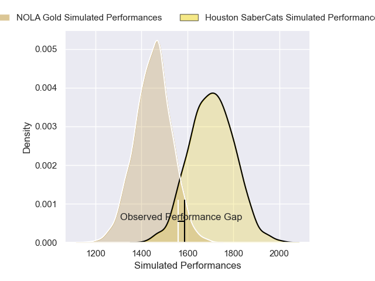
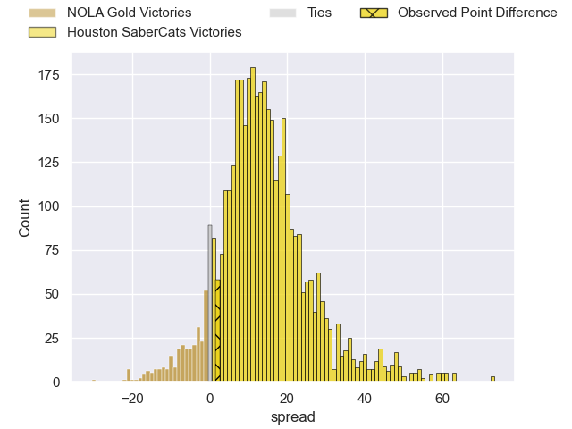
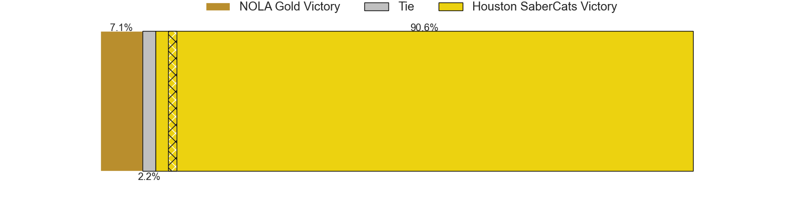
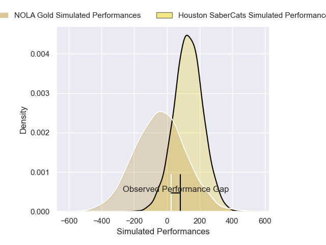
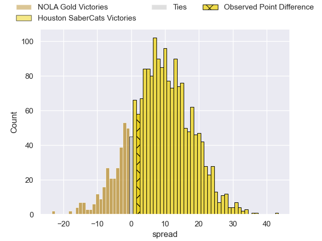
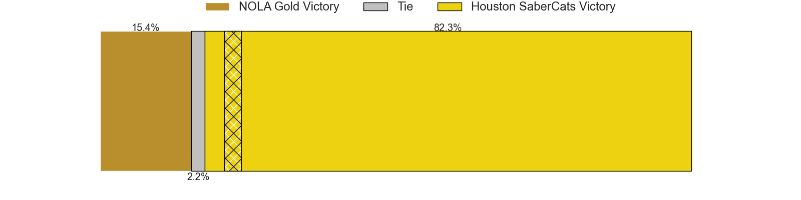

---  
layout: page  
title: NOLA Gold at Houston SaberCats; 15-17  
date: 2025-04-20 18:00:00 -0500  
categories: "Major League Rugby 2025" match review  
---
# NOLA Gold at Houston SaberCats; 15-17

# Club Level Predictions

The first set of predictions treats a club as the smallest object, as the club develops its members, organizes a gameplan, and deploys its players as needed for each match. This club model has a prediction of 0.807, which translates to predicting Houston SaberCats to win by 12.8.

Our Over/Under is 53.5 - and combined with the spread above, we have a predicted scoreline of 20 to 33

Each club has a rating and a rating deviation (similar to a Glicko rating), and expected performances can be generated. This allows for simulated matches and spreads like the ones below.
## Projected Performances - Club Model

## Projected Spreads - Club Model

## Projected Results - Club Model

# Player Level Predictions

Treating teams instead as an entity made up of the currently active players, I have ratings for each player in an altogether different system. These can be combined to form team ratings once teamsheets are announced, weighting starters a bit higher than the reserves. After the match is played, players can be weighted by their minutes on the field, allowing for an accurate measure of the team's composition. With these compiled team ratings, we can make predictions, measure inaccuracy, and update the individual player ratings.
## Prediction without Player Minutes: Houston SaberCats by 10.7

Houston SaberCats by 7.2 on a neutral pitch

## Projected Performances - Player Model

## Projected Spreads - Player Model

## Projected Results - Player Model

|   Away Minutes | Away Player          |   Away Percentile |   Number |   Home Percentile | Home Player        |   Home Minutes |
|---------------:|:---------------------|------------------:|---------:|------------------:|:-------------------|---------------:|
|             80 | Bart Vermeulen       |             69.65 |        1 |             84.99 | Ezekiel Lindenmuth |              6 |
|             67 | Alex Lopeti          |             46.09 |        2 |             89.29 | Pita Anae Ah-Sue   |             80 |
|             55 | Isaac Salmon         |             90.88 |        3 |              2.91 | Pono Davis         |             21 |
|             77 | Jay Tuivaiti         |             60.21 |        4 |             91.91 | Justin Basson      |              0 |
|             80 | Cam Dolan            |             23.41 |        5 |             20.33 | Nathan Den Hoedt   |             13 |
|             80 | Moni Tonga'uiha      |              8.01 |        6 |             48.88 | Emmanuel Albert    |             25 |
|             80 | Aidan King           |             76.26 |        7 |              2.33 | Johan Momsen       |             27 |
|             40 | Tupou Ma'afu-Afungia |             23.93 |        8 |             64.21 | Sam Tuifua         |             23 |
|             20 | Ruben de Haas        |             16.39 |        9 |             41.22 | Andre Warner       |             21 |
|             50 | Luke Carty           |              5.06 |       10 |             44.53 | Max Schumacher     |             24 |
|             20 | Ed Fidow             |             86.75 |       11 |              3.34 | Seimou Smith       |             13 |
|             80 | JP Du Plessis        |              1.38 |       12 |             89.83 | Sam Hill           |              6 |
|             19 | Nikolai Foliaki      |              1.09 |       13 |             52.52 | Tautalatasi Tasi   |             77 |
|             80 | Xavier Mignot        |             79.5  |       14 |             38.04 | Rufus McLean       |             27 |
|             80 | Julian Roberts       |             84.02 |       15 |              7.17 | Drew Wild          |             53 |
|             59 | Paul Mullen          |             17.27 |       16 |              2.53 | Jay Renton         |             40 |
|             55 | Paul Mullen          |             17.27 |       16 |              2.53 | Jay Renton         |             40 |
|             50 | Paul Mullen          |             17.27 |       16 |              2.53 | Jay Renton         |             40 |
|             80 | Cooper Coats         |              6.35 |       17 |             68.54 | Jeremy Misailegalu |             80 |
|             40 | Matthew Harmon       |             30.75 |       18 |             45.75 | AJ Alatimu         |             68 |
|             80 | Jonah Mau'u          |             78.94 |       19 |            nan    | LaRome White       |             24 |
|             80 | Callum Botchar       |             65.7  |       20 |             24.7  | Valdermar Lee-Lo   |             80 |
|             25 | Luke Campbell        |             16.72 |       21 |            nan    | nan                |            nan |
|             55 | William Waguespack   |             65.32 |       22 |            nan    | nan                |            nan |

