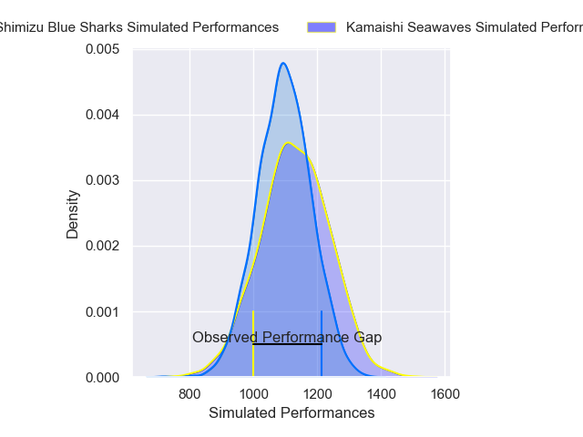
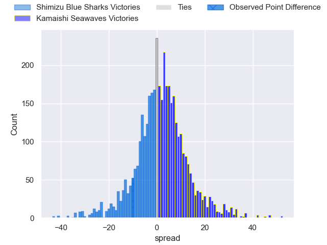
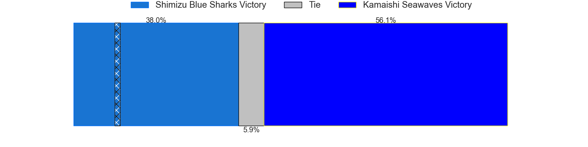
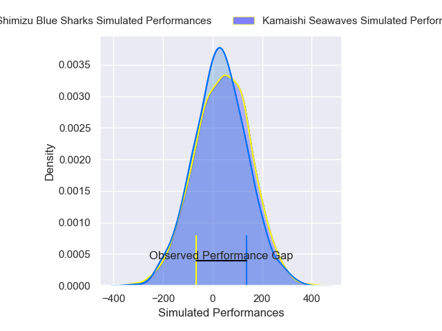
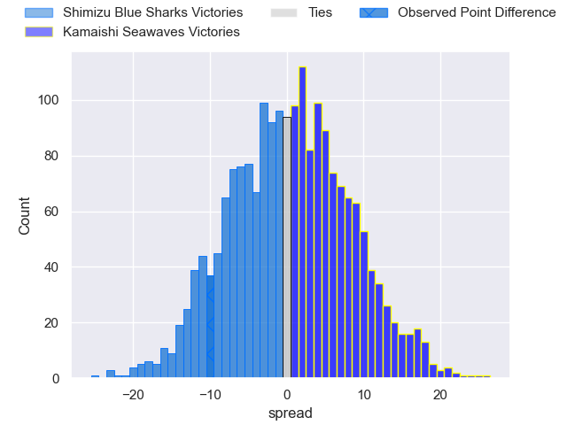
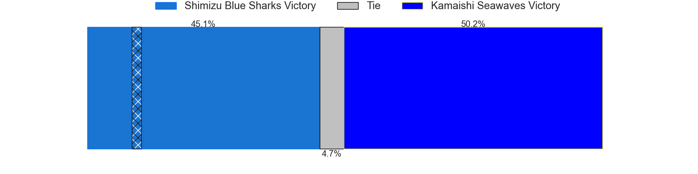

---  
layout: page  
title: Shimizu Blue Sharks at Kamaishi Seawaves; 34-24  
date: 2025-04-20 18:00:00 -0500  
categories: "Japan Rugby League One D2 24/25" match review  
---
# Shimizu Blue Sharks at Kamaishi Seawaves; 34-24

# Club Level Predictions

The first set of predictions treats a club as the smallest object, as the club develops its members, organizes a gameplan, and deploys its players as needed for each match. This club model has a prediction of 0.543, which translates to predicting Kamaishi Seawaves to win by 1.6.

Our Over/Under is 45.5 - and combined with the spread above, we have a predicted scoreline of 22 to 24

Each club has a rating and a rating deviation (similar to a Glicko rating), and expected performances can be generated. This allows for simulated matches and spreads like the ones below.
## Projected Performances - Club Model

## Projected Spreads - Club Model

## Projected Results - Club Model

# Player Level Predictions

Treating teams instead as an entity made up of the currently active players, I have ratings for each player in an altogether different system. These can be combined to form team ratings once teamsheets are announced, weighting starters a bit higher than the reserves. After the match is played, players can be weighted by their minutes on the field, allowing for an accurate measure of the team's composition. With these compiled team ratings, we can make predictions, measure inaccuracy, and update the individual player ratings.
## Prediction without Player Minutes: Shimizu Blue Sharks by 2.1

Shimizu Blue Sharks by 4.9 on a neutral pitch

## Projected Performances - Player Model

## Projected Spreads - Player Model

## Projected Results - Player Model

|   Away Minutes | Away Player       |   Away Percentile |   Number |   Home Percentile | Home Player         |   Home Minutes |
|---------------:|:------------------|------------------:|---------:|------------------:|:--------------------|---------------:|
|             63 | Sanshiro Nomura   |             66.47 |        1 |             33.53 | Yusuke Yamada       |             58 |
|             49 | Naomichi Tatekawa |             53.68 |        2 |              2.84 | Daiki Ito           |             28 |
|             76 | Uha Lee           |             77.92 |        3 |             22.65 | Taiki Noguchi       |             29 |
|             45 | Koyo Adachi       |             46.49 |        4 |             39.37 | Satoshi Hatazawa    |             21 |
|              4 | Ed Holmes         |             44.59 |        5 |             10.63 | Hamish Dalzell      |             54 |
|             70 | Tetsunori Osaki   |             25.09 |        6 |             11.74 | Ben Nee Nee         |             70 |
|             24 | Josh Basham       |             34.56 |        7 |             35.32 | Ryota Kono          |             76 |
|             15 | Sosiceni Tokoqio  |             14.05 |        8 |             69.42 | Muller Uys          |             69 |
|             26 | Tatsuya Kanetsuki |             19.83 |        9 |              3.25 | Youhei Murakami     |             80 |
|             22 | Lima Sopoaga      |             95.39 |       10 |             58.49 | Mitch Hunt          |              0 |
|             39 | John-Ben Kotze    |             76.42 |       11 |             12.69 | Ryuji Abe           |             26 |
|             65 | Terrence Hepetema |             25.15 |       12 |             15.2  | Gerdus van der Walt |             29 |
|             35 | Tatsuya Fujioka   |             38.3  |       13 |              2.98 | Osuka Lloyd Murata  |             29 |
|             10 | Tatsuhiro Ozaki   |              2.46 |       14 |              9.19 | Gousuke Kawakami    |             72 |
|             26 | Coenie van Wyk    |             67.9  |       15 |             29.01 | Kazuki Ochi         |             80 |
|             80 | Kaito Tamori      |              3.85 |       16 |            nan    | Kohei Ishigaki      |             31 |
|             80 | Shinya Nara       |            nan    |       17 |            nan    | Syou Kataoka        |             80 |
|             66 | Fumiyake Mato     |            nan    |       18 |            nan    | Taichi Takahashi    |             14 |
|             41 | Murphy Taramai    |              8.9  |       19 |            nan    | Sei Matsuyama       |             57 |
|             80 | Ryo Sato          |             13.73 |       20 |            nan    | Naoki Ouno          |             67 |
|             12 | Soichiro Kuwata   |              5.24 |       21 |            nan    | Atsushi Minami      |             56 |
|             46 | Reijiro Usui      |             30.43 |       22 |            nan    | Mosese Tonga        |             29 |
|             18 | Essendon Tuitupou |            nan    |       23 |            nan    | Ryunosuke Yamada    |             80 |

