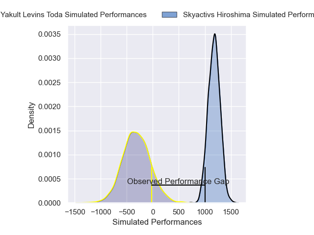
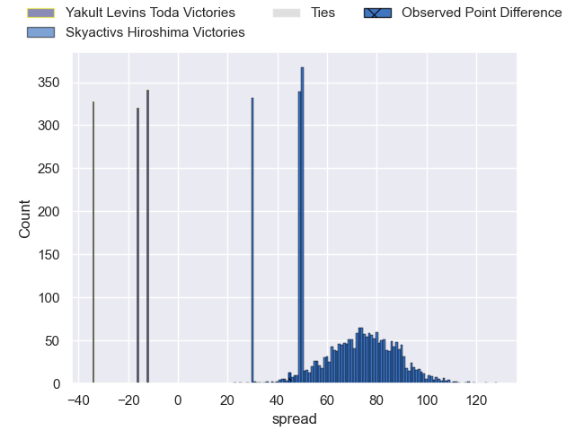
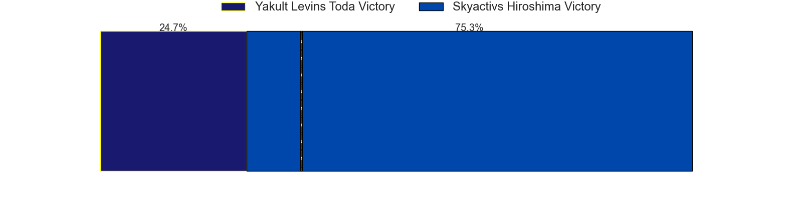
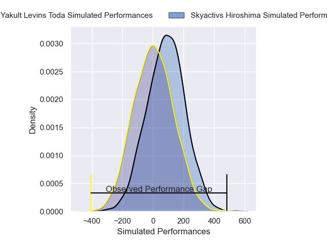
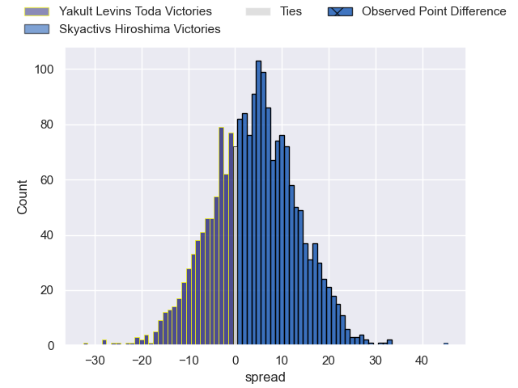

---  
layout: page  
title: Yakult Levins Toda at Skyactivs Hiroshima; 3-48  
date: 2025-04-20 18:00:00 -0500  
categories: "Japan Rugby League One D3 24/25" match review  
---
# Yakult Levins Toda at Skyactivs Hiroshima; 3-48

# Club Level Predictions

The first set of predictions treats a club as the smallest object, as the club develops its members, organizes a gameplan, and deploys its players as needed for each match. This club model has a prediction of 0.999, which translates to predicting Skyactivs Hiroshima to win by 74.8.

Our Over/Under is 60.5 - and combined with the spread above, we have a predicted scoreline of -7 to 67

Each club has a rating and a rating deviation (similar to a Glicko rating), and expected performances can be generated. This allows for simulated matches and spreads like the ones below.
## Projected Performances - Club Model

## Projected Spreads - Club Model

## Projected Results - Club Model

# Player Level Predictions

Treating teams instead as an entity made up of the currently active players, I have ratings for each player in an altogether different system. These can be combined to form team ratings once teamsheets are announced, weighting starters a bit higher than the reserves. After the match is played, players can be weighted by their minutes on the field, allowing for an accurate measure of the team's composition. With these compiled team ratings, we can make predictions, measure inaccuracy, and update the individual player ratings.
## Prediction without Player Minutes: Skyactivs Hiroshima by 1.2

Yakult Levins Toda by 1.5 on a neutral pitch

## Projected Performances - Player Model

## Projected Spreads - Player Model

## Projected Results - Player Model

|   Away Minutes | Away Player          |   Away Percentile |   Number |   Home Percentile | Home Player        |   Home Minutes |
|---------------:|:---------------------|------------------:|---------:|------------------:|:-------------------|---------------:|
|             51 | Iori Nozaki          |             15.32 |        1 |              9.8  | Koshi Kato         |             80 |
|             26 | Kosetu Kawachi       |             40.97 |        2 |              1    | Tomohiro Takeda    |             80 |
|             18 | Atsushi Furuya       |             22.98 |        3 |             10.38 | Tomoya Otake       |             80 |
|             51 | Masashi Ogawa        |             10.06 |        4 |             87.95 | Tye Nash           |             80 |
|             73 | Daisuke Yokoyama     |              9.3  |        5 |             37.67 | Andrew Davidson    |             29 |
|              0 | Yuto Usuda           |             17.71 |        6 |             72.73 | Jackson Pugh       |             29 |
|             50 | Kosuke Urabe         |             14.68 |        7 |              2.75 | Tomoki Ashida      |             80 |
|             19 | Rikiya Oishi         |             37.4  |        8 |              7.02 | Tevin Ferris       |             51 |
|             54 | Junpei Tada          |             10.09 |        9 |             54.02 | Taiyo Fukuyama     |             22 |
|             51 | Nick Evemy           |              6.92 |       10 |             77.15 | Issen Kano         |             51 |
|             58 | Hikaru Ishikawa      |             35.8  |       11 |             27.08 | Hayato Kanamuru    |             80 |
|             55 | Takumi Furukawa      |             28.75 |       12 |              7.39 | Clinton Knox       |             16 |
|             58 | Antonio Mikaele-Tu'u |              3.7  |       13 |             83.88 | Jacob Abel         |             10 |
|             80 | Kagechika Ota        |             10.42 |       14 |             13.73 | Yuto Nakamura      |              0 |
|             80 | Masatoshi Doi        |              8.44 |       15 |              0.21 | Ginjiro Sakiguchi  |             50 |
|             55 | Daichi Kono          |            nan    |       16 |             83.24 | Iori Suzuki        |             17 |
|              4 | Shun Sawamura        |             18.28 |       17 |             84.7  | Hitaka Inoue       |             26 |
|             55 | Fuma Uekata          |            nan    |       18 |             28.54 | Kaito Sasaoka      |             80 |
|             80 | Genki Tokushige      |            nan    |       19 |             80.56 | Tadatsugu Kanayama |             64 |
|             80 | Takudo Okazaki       |            nan    |       20 |             85.95 | Yusuke Kitabayashi |             80 |
|             65 | Takuma Suto          |            nan    |       21 |            nan    | Ryoto Tomita       |             80 |
|             80 | Masaya Makino        |             49.72 |       22 |             89.57 | Syoya Maeda        |             80 |
|             80 | Ren Taninaka         |            nan    |       23 |             60.53 | Yutaro Tanaka      |             58 |

