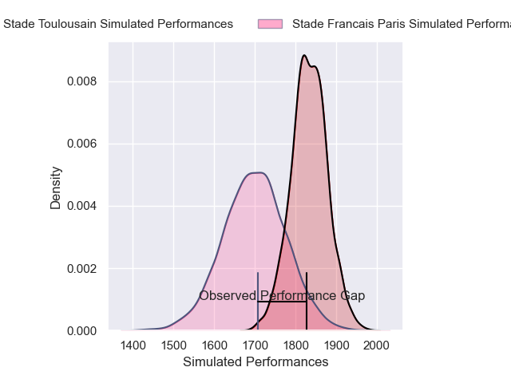
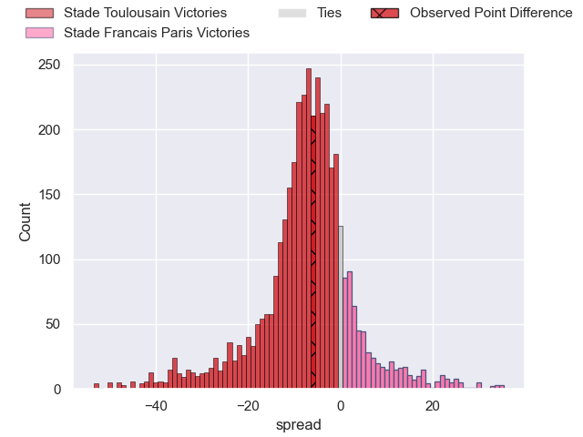
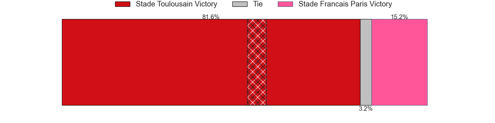
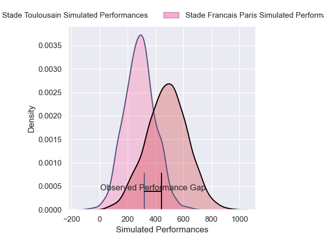
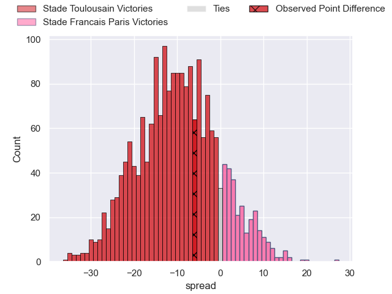
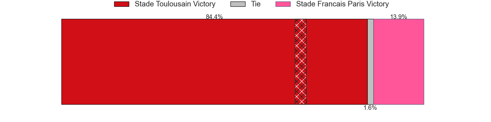

---  
layout: page  
title: Stade Toulousain at Stade Francais Paris; 27-21  
date: 2025-04-20 18:00:00 -0500  
categories: "Top 14 Orange 24/25" match review  
---
# Stade Toulousain at Stade Francais Paris; 27-21

# Club Level Predictions

The first set of predictions treats a club as the smallest object, as the club develops its members, organizes a gameplan, and deploys its players as needed for each match. This club model has a prediction of 0.317, which translates to predicting Stade Toulousain to win by 6.7.

Our Over/Under is 50.5 - and combined with the spread above, we have a predicted scoreline of 29 to 22

Each club has a rating and a rating deviation (similar to a Glicko rating), and expected performances can be generated. This allows for simulated matches and spreads like the ones below.
## Projected Performances - Club Model

## Projected Spreads - Club Model

## Projected Results - Club Model

# Player Level Predictions

Treating teams instead as an entity made up of the currently active players, I have ratings for each player in an altogether different system. These can be combined to form team ratings once teamsheets are announced, weighting starters a bit higher than the reserves. After the match is played, players can be weighted by their minutes on the field, allowing for an accurate measure of the team's composition. With these compiled team ratings, we can make predictions, measure inaccuracy, and update the individual player ratings.
## Prediction without Player Minutes: Stade Toulousain by 9.7

Stade Toulousain by 25.0 on a neutral pitch

## Projected Performances - Player Model

## Projected Spreads - Player Model

## Projected Results - Player Model

|   Away Minutes | Away Player            |   Away Percentile |   Number |   Home Percentile | Home Player          |   Home Minutes |
|---------------:|:-----------------------|------------------:|---------:|------------------:|:---------------------|---------------:|
|             80 | David Ainu'u           |             86.84 |        1 |             68.04 | Sergo Abramishvili   |             24 |
|             80 | David Ainu'u           |             86.84 |        1 |             68.04 | Sergo Abramishvili   |             29 |
|             65 | Peato Mauvaka          |             95.58 |        2 |              2.21 | Lucas Peyresblanques |             29 |
|             71 | Malachi Hawkes         |             82.97 |        3 |             31.8  | Paul Alo-Emile       |              7 |
|             57 | Joshua Brennan         |             93.55 |        4 |              2.6  | Paul Gabrillagues    |             17 |
|             27 | Clement Verge          |             88.34 |        5 |             20.52 | Baptiste Pesenti     |             73 |
|             48 | Mathis Castro-Ferreira |             70.02 |        6 |              6.8  | Tanginoa Halaifonua  |             18 |
|             80 | Leo Banos              |             95.62 |        7 |              7.17 | Romain Briatte       |             33 |
|             28 | Theo Ntamack           |             65.85 |        8 |             72.6  | Sekou Macalou        |              0 |
|             63 | Naoto Saito            |              5.07 |        9 |              0.51 | Paul Abadie          |             80 |
|             63 | Juan Cruz Mallia       |             98.99 |       10 |             33.6  | Louis Carbonel       |             80 |
|             66 | Matthis Lebel          |             99.43 |       11 |              5.82 | Charles Laloi        |             80 |
|             40 | Santiago Chocobares    |             54.49 |       12 |             46.89 | Lester Etien         |             63 |
|             70 | Paul Costes            |             86.48 |       13 |             20.04 | Joe Marchant         |              0 |
|             80 | Dimitri Delibes        |             91.23 |       14 |             57.67 | Peniasi Dakuwaqa     |             62 |
|             80 | Matias Remue           |             20.7  |       15 |             10.66 | Leo Barre            |              7 |
|             69 | Matias Remue           |             20.7  |       15 |             10.66 | Leo Barre            |              7 |
|             16 | Guillaume Cramont      |             73.81 |       16 |             80.78 | Alvaro Garcia        |             47 |
|             33 | Hugo Reilhes           |            nan    |       17 |             17.84 | Moses Alo-Emile      |             25 |
|             80 | Richie Arnold          |             89.11 |       18 |             87.28 | Pierre-Henri Azagoh  |             80 |
|             80 | Alban Placines         |            nan    |       19 |              7.23 | Juan Martin Scelzo   |             80 |
|             21 | Simon Daroque          |             54.56 |       20 |             39.86 | Thibaut Motassi      |             51 |
|             51 | Nelson Epee            |             36.42 |       21 |             48.99 | Zack Henry           |             80 |
|             80 | Thomas Alary           |             54.3  |       22 |              2.37 | Samuel Ezeala        |             80 |
|             33 | Joel Merkler           |             62.23 |       23 |             95.08 | Giorgi Melikidze     |             11 |

