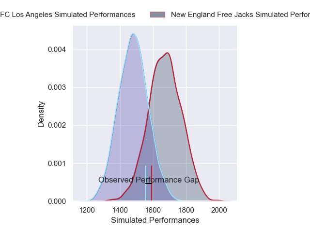
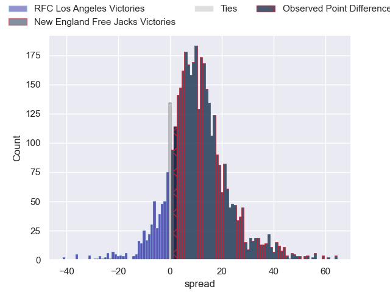
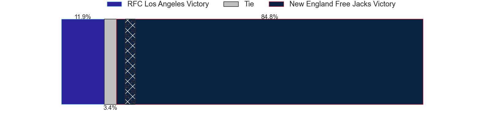
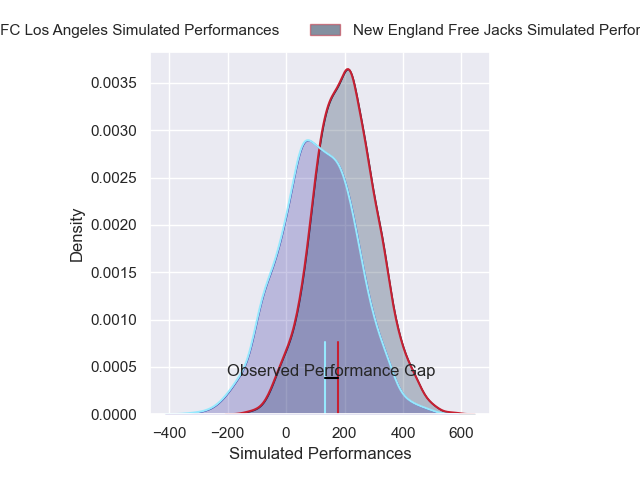
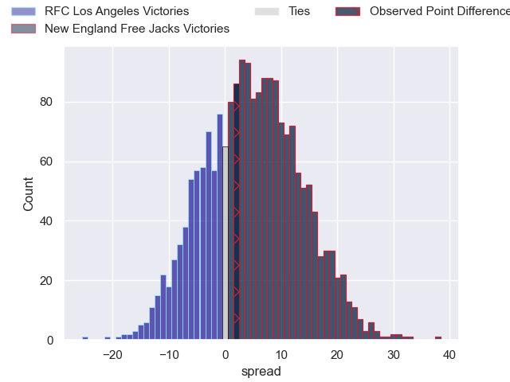
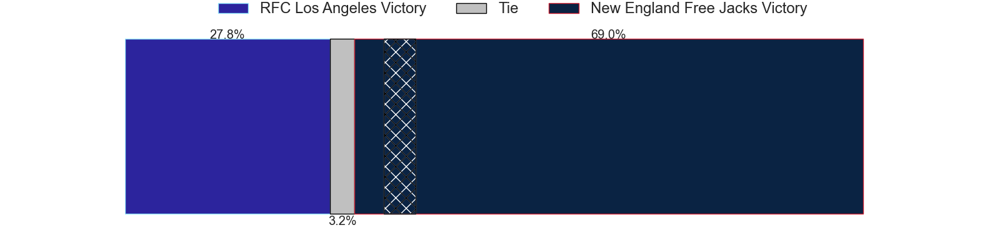

---  
layout: page  
title: RFC Los Angeles at New England Free Jacks; 21-23  
date: 2025-04-23 18:00:00 -0500  
categories: "Major League Rugby 2025" match review  
---
# RFC Los Angeles at New England Free Jacks; 21-23

# Club Level Predictions

The first set of predictions treats a club as the smallest object, as the club develops its members, organizes a gameplan, and deploys its players as needed for each match. This club model has a prediction of 0.745, which translates to predicting New England Free Jacks to win by 9.7.

Our Over/Under is 63.5 - and combined with the spread above, we have a predicted scoreline of 27 to 37

Each club has a rating and a rating deviation (similar to a Glicko rating), and expected performances can be generated. This allows for simulated matches and spreads like the ones below.
## Projected Performances - Club Model

## Projected Spreads - Club Model

## Projected Results - Club Model

# Player Level Predictions

Treating teams instead as an entity made up of the currently active players, I have ratings for each player in an altogether different system. These can be combined to form team ratings once teamsheets are announced, weighting starters a bit higher than the reserves. After the match is played, players can be weighted by their minutes on the field, allowing for an accurate measure of the team's composition. With these compiled team ratings, we can make predictions, measure inaccuracy, and update the individual player ratings.
## Prediction without Player Minutes: New England Free Jacks by 4.5

New England Free Jacks by 1.6 on a neutral pitch

## Projected Performances - Player Model

## Projected Spreads - Player Model

## Projected Results - Player Model

|   Away Minutes | Away Player         |   Away Percentile |   Number |   Home Percentile | Home Player         |   Home Minutes |
|---------------:|:--------------------|------------------:|---------:|------------------:|:--------------------|---------------:|
|             80 | Alessandro Heaney   |             37.13 |        1 |             34.79 | Malakai Hala-Ngatai |             50 |
|             24 | Ben Sugars          |              6.97 |        2 |             92.86 | Connal McInerney    |             67 |
|             14 | Maliu Niuafe        |             54.56 |        3 |             41.57 | Kyle Steeves        |             34 |
|             25 | Lucas Bur           |             32.85 |        4 |             36.42 | Kyle Baillie        |             56 |
|             55 | Jason Damm          |              4.53 |        5 |             63.97 | Conor Keys          |             32 |
|             54 | Tim Anstee          |              3.07 |        6 |              7.82 | Ethan Fryer         |             25 |
|             32 | Edward Timpson      |             56.8  |        7 |             45.62 | Kaipono Kayoshi     |             59 |
|             80 | Semi Kunatani       |             97.96 |        8 |             96.73 | Wian Conradie       |             71 |
|             80 | Tas Smith           |             60.64 |        9 |             72.3  | John Poland         |             43 |
|             80 | Sean Nolan          |             45.34 |       10 |              5.67 | Dan Hollinshead     |             25 |
|             54 | Will Leonard        |             63.68 |       11 |              8.96 | Paula Balekana      |             62 |
|             40 | Nick Chan           |             52.62 |       12 |             46.59 | Isaac Olson         |             58 |
|             50 | Matias Jensen       |             30.5  |       13 |              7.5  | Jack Reeves         |             46 |
|              0 | Rory van Vugt       |              4.39 |       14 |             73.02 | Oscar Lennon        |             80 |
|             24 | Vaughen Isaacs      |             60.25 |       15 |             72.75 | Brock Webster       |             12 |
|             80 | Matt Heaton         |              0.47 |       16 |              4.14 | Josh Larsen         |             13 |
|             55 | Franco van den Berg |              7.18 |       17 |            nan    | Lindsay Stevens     |             55 |
|             73 | Reece MacDonald     |             83.61 |       18 |             91.02 | Le Roux Malan       |             80 |
|             80 | Ben Strang          |             55.27 |       19 |             87.71 | Joe Johnston        |             30 |
|             56 | Gonzalo Bertranou   |             83.45 |       20 |             86.36 | Kaleb Geiger        |             80 |
|             80 | Ben Houston         |             50.31 |       21 |             74.82 | Tevita Sole         |             46 |
|             80 | Mikaea Wynyard      |            nan    |       22 |             70.58 | Jed Melvin          |             13 |
|             37 | Justus Tavai        |            nan    |       23 |            nan    | nan                 |            nan |

