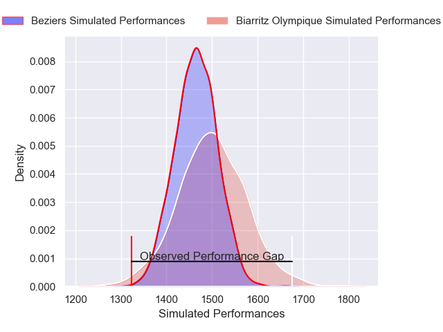
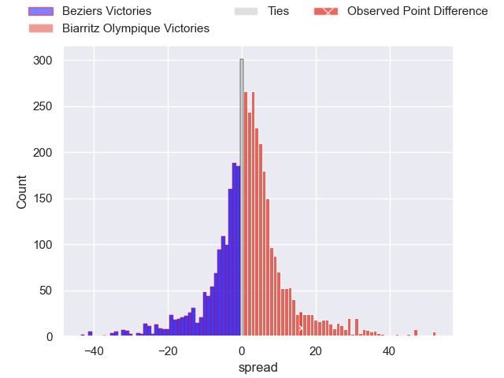
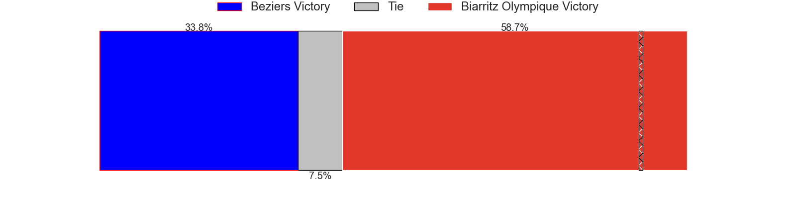
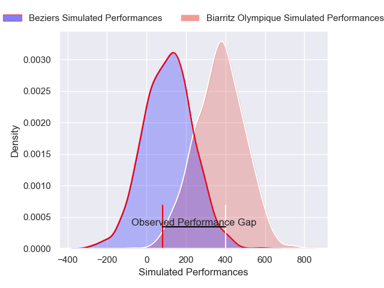
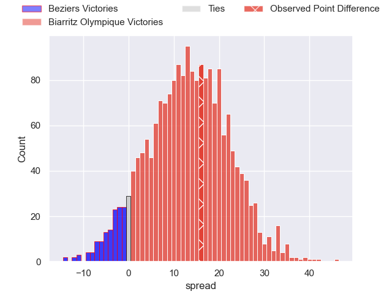
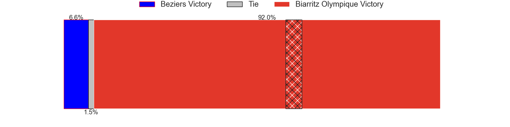

---  
layout: page  
title: Beziers at Biarritz Olympique; 17-33  
date: 2025-04-24 18:00:00 -0500  
categories: "Pro D2 24/25" match review  
---
# Beziers at Biarritz Olympique; 17-33

# Club Level Predictions

The first set of predictions treats a club as the smallest object, as the club develops its members, organizes a gameplan, and deploys its players as needed for each match. This club model has a prediction of 0.549, which translates to predicting Biarritz Olympique to win by 1.7.

Our Over/Under is 56.5 - and combined with the spread above, we have a predicted scoreline of 27 to 29

Each club has a rating and a rating deviation (similar to a Glicko rating), and expected performances can be generated. This allows for simulated matches and spreads like the ones below.
## Projected Performances - Club Model

## Projected Spreads - Club Model

## Projected Results - Club Model

# Player Level Predictions

Treating teams instead as an entity made up of the currently active players, I have ratings for each player in an altogether different system. These can be combined to form team ratings once teamsheets are announced, weighting starters a bit higher than the reserves. After the match is played, players can be weighted by their minutes on the field, allowing for an accurate measure of the team's composition. With these compiled team ratings, we can make predictions, measure inaccuracy, and update the individual player ratings.
## Prediction without Player Minutes: Biarritz Olympique by 7.6

Beziers by 8.1 on a neutral pitch

## Projected Performances - Player Model

## Projected Spreads - Player Model

## Projected Results - Player Model

|   Away Minutes | Away Player                 |   Away Percentile |   Number |   Home Percentile | Home Player         |   Home Minutes |
|---------------:|:----------------------------|------------------:|---------:|------------------:|:--------------------|---------------:|
|             21 | Francisco Fernandes Moreira |              4.6  |        1 |             21.87 | François Mur        |             67 |
|             32 | Yvann Lalevee               |             67.18 |        2 |             12.59 | Yohan Beheregaray   |             30 |
|             60 | Yannick Arroyo              |             71.51 |        3 |              3.95 | Zakaria El Fakir    |             17 |
|             34 | Petero Taviraki Mailulu     |             25.72 |        4 |              1.25 | Aitor Hourcade      |             10 |
|             10 | Pierre Gayraud              |             48.17 |        5 |             37.76 | Piula Faasalele     |             67 |
|             80 | Clement Doumenc             |             89.2  |        6 |             19.83 | Thomas Hebert       |             67 |
|             50 | Cam Dodson                  |             72.25 |        7 |              1.02 | Jessy Jegerlehner   |             40 |
|             80 | Baptiste Abescat-Leroy      |             30.67 |        8 |             77.71 | Filimo Taofifenua   |             80 |
|             80 | Hugo Gomes Camacho          |             42.91 |        9 |             40.71 | Kerman Aurrekoetxea |             68 |
|             46 | Damien Añon                 |             38.06 |       10 |             23.89 | Thomas Dolhagaray   |             20 |
|             80 | Paul Reau                   |             65.97 |       11 |             91.71 | Mathieu Acebes      |             80 |
|             80 | Taylor Gontineac            |             83.22 |       12 |             22.31 | Tyler Morgan        |             80 |
|             80 | Theo Vassallo               |             18.85 |       13 |             64.96 | Carlo Mignot        |             80 |
|             70 | Pierre Courtaud             |             11.06 |       14 |              2    | Zach Kibirige       |             46 |
|             26 | Victor Dreuille             |             16.19 |       15 |             83.2  | Kylian Jaminet      |             80 |
|             30 | Watisoni Votu               |             78.46 |       16 |             79.42 | Nikoloz Narmania    |             70 |
|             26 | Christian Judge             |             66.59 |       17 |              0.65 | Johnny Dyer         |             22 |
|             20 | Youssef Amrouni             |             58.27 |       18 |             17.69 | Ekain Imaz Agirre   |             80 |
|             63 | Shahn Eru                   |              0.39 |       19 |             11.65 | Yohan Tapie         |             55 |
|             24 | Sias Koen                   |             67.69 |       20 |              5.1  | Clement Martinez    |             80 |
|             30 | Yanis Boulassel             |             67.52 |       21 |             68.16 | Baptiste Fariscot   |             80 |
|             60 | William van Bost            |             15.55 |       22 |             13.16 | Edgar Retiere       |             69 |
|             80 | Harry Glynn                 |             30.12 |       23 |             54    | Solomone Tukuafu    |             25 |

