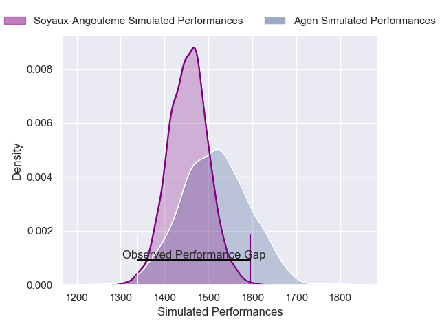
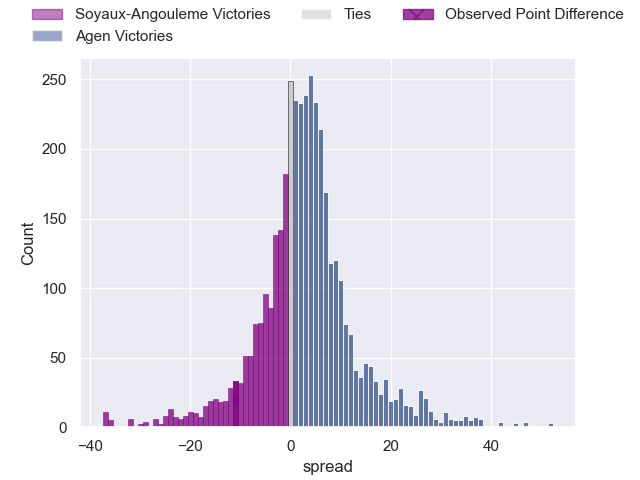
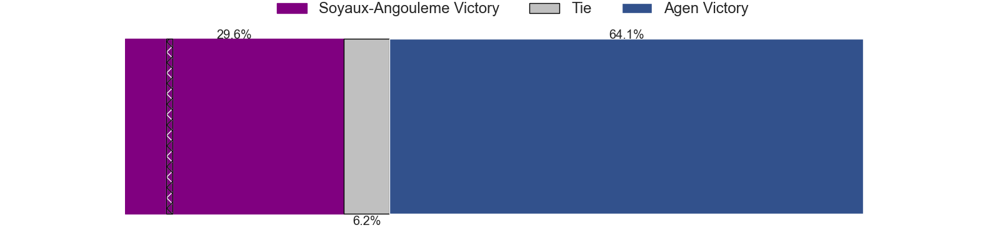
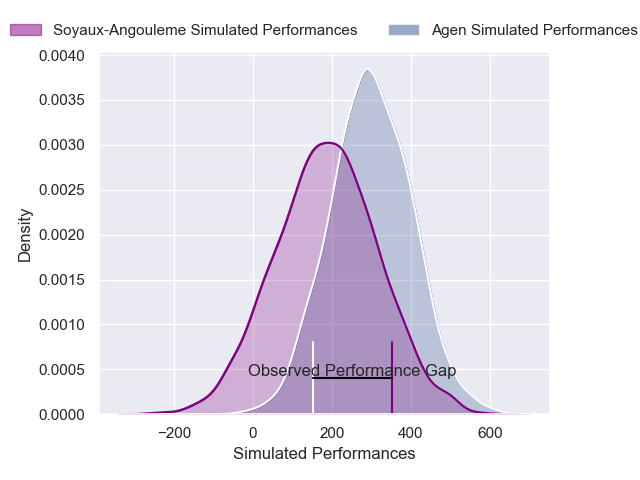
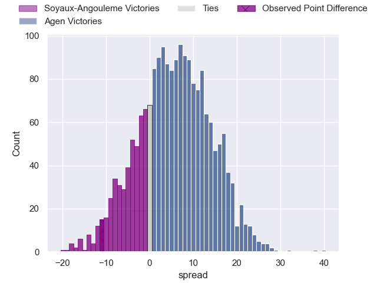
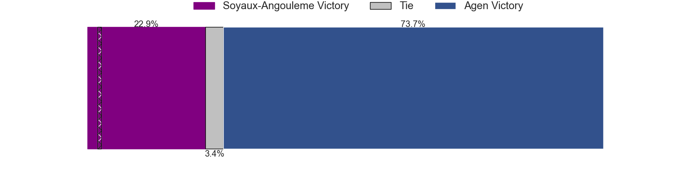

---  
layout: page  
title: Soyaux-Angouleme at Agen; 23-12  
date: 2025-04-25 18:00:00 -0500  
categories: "Pro D2 24/25" match review  
---
# Soyaux-Angouleme at Agen; 23-12

# Club Level Predictions

The first set of predictions treats a club as the smallest object, as the club develops its members, organizes a gameplan, and deploys its players as needed for each match. This club model has a prediction of 0.588, which translates to predicting Agen to win by 3.1.

Our Over/Under is 56.5 - and combined with the spread above, we have a predicted scoreline of 27 to 30

Each club has a rating and a rating deviation (similar to a Glicko rating), and expected performances can be generated. This allows for simulated matches and spreads like the ones below.
## Projected Performances - Club Model

## Projected Spreads - Club Model

## Projected Results - Club Model

# Player Level Predictions

Treating teams instead as an entity made up of the currently active players, I have ratings for each player in an altogether different system. These can be combined to form team ratings once teamsheets are announced, weighting starters a bit higher than the reserves. After the match is played, players can be weighted by their minutes on the field, allowing for an accurate measure of the team's composition. With these compiled team ratings, we can make predictions, measure inaccuracy, and update the individual player ratings.
## Prediction without Player Minutes: Agen by 5.9

Soyaux-Angouleme by 8.3 on a neutral pitch

## Projected Performances - Player Model

## Projected Spreads - Player Model

## Projected Results - Player Model

|   Away Minutes | Away Player        |   Away Percentile |   Number |   Home Percentile | Home Player          |   Home Minutes |
|---------------:|:-------------------|------------------:|---------:|------------------:|:---------------------|---------------:|
|             80 | Georgy Balakarev   |             87.06 |        1 |             11.79 | Florent Guion        |             26 |
|             62 | Rayne Barka        |             92.64 |        2 |             34.25 | Pierre Jouvin        |             23 |
|             75 | Seydou Diakité     |             41.55 |        3 |             28.11 | Alex Burin           |             30 |
|             15 | Clément Sentubery  |             42.94 |        4 |              1.91 | Evan Olmstead        |             26 |
|             80 | Enzo Morand-Bruyat |             83.78 |        5 |             75.1  | William Demotte      |             29 |
|             50 | Germain Burgaud    |             88.84 |        6 |             10.88 | Julien Lebian        |             29 |
|             69 | Hubert Texier      |             70.55 |        7 |             38.59 | Tomasi Fineanganofo  |             80 |
|             56 | Samuel Nollet      |             20.13 |        8 |             23.73 | Valentin Gayraud     |             80 |
|             65 | Manu Saubusse      |             80.17 |        9 |             65.64 | Jack Maunder         |             80 |
|              0 | Corentin Glenat    |             64.03 |       10 |             90.85 | Franck Pourteau      |             59 |
|             11 | Jonny May          |             11.1  |       11 |             24.19 | Iban Etcheverry      |             30 |
|             80 | George Tilsley     |             96.32 |       12 |             19.2  | Clement Garrigues    |             28 |
|             80 | Mathis Lafon       |             72.42 |       13 |             38.61 | Ethan Randle         |             62 |
|             18 | Matthys Gratien    |             78.97 |       14 |              5.87 | Loris Tolot          |             80 |
|             28 | Jules Dubecq       |             63.98 |       15 |             13.66 | Jean-Marcelin Buttin |             66 |
|             46 | Arthur Proult      |              7.66 |       16 |             78.42 | Hayam El Bibouji     |              0 |
|              0 | Mamoudou Meite     |             12.5  |       17 |              4.23 | Fotu Lokotui         |             80 |
|             80 | Omar Dahir         |             44.6  |       18 |             30.77 | Theo Idjellidaine    |              0 |
|             51 | Sami Zouhair       |             96.87 |       19 |              3.53 | Javier Eissmann      |             41 |
|             60 | Ian Kitwanga       |             18.03 |       20 |             33.31 | Mamuka Mstoiani      |             80 |
|             71 | Alexander Masibaka |             46.19 |       21 |             45.34 | Matthieu Bonnet      |             11 |
|             80 | Gautier Gibouin    |              3.27 |       22 |             71.56 | Lasha Macharashvili  |             29 |
|             51 | Adrien Bau         |              3.59 |       23 |             13.1  | Emile Dayral         |             14 |

