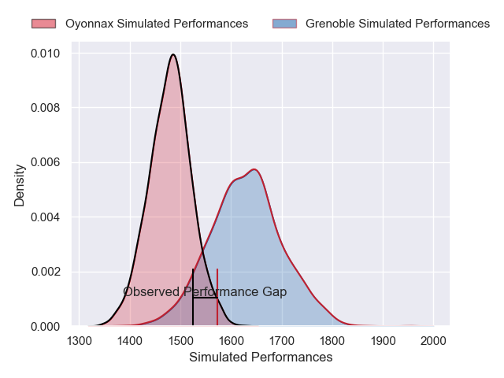
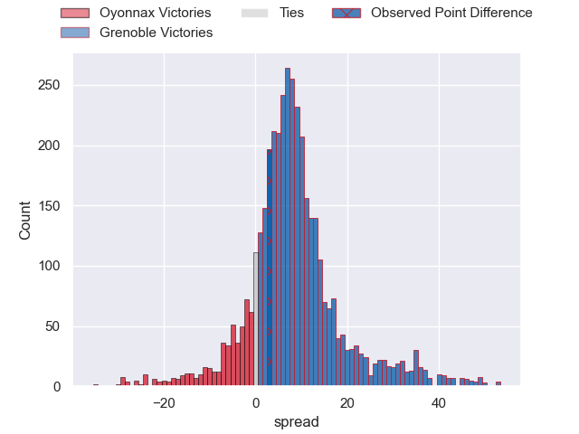
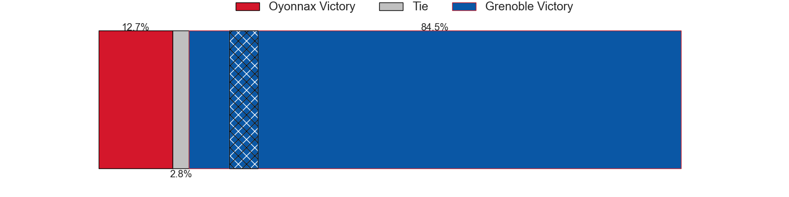
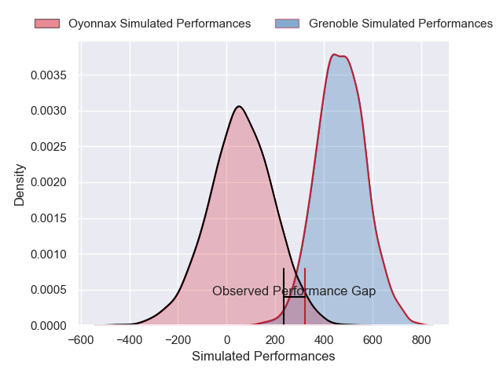
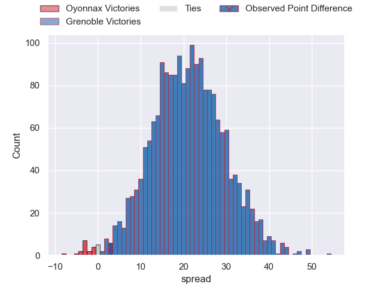
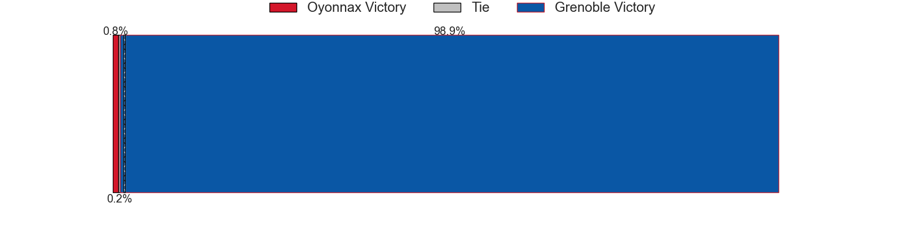

---  
layout: page  
title: Oyonnax at Grenoble; 23-26  
date: 2025-04-25 18:00:00 -0500  
categories: "Pro D2 24/25" match review  
---
# Oyonnax at Grenoble; 23-26

# Club Level Predictions

The first set of predictions treats a club as the smallest object, as the club develops its members, organizes a gameplan, and deploys its players as needed for each match. This club model has a prediction of 0.701, which translates to predicting Grenoble to win by 7.5.

Our Over/Under is 50.5 - and combined with the spread above, we have a predicted scoreline of 21 to 29

Each club has a rating and a rating deviation (similar to a Glicko rating), and expected performances can be generated. This allows for simulated matches and spreads like the ones below.
## Projected Performances - Club Model

## Projected Spreads - Club Model

## Projected Results - Club Model

# Player Level Predictions

Treating teams instead as an entity made up of the currently active players, I have ratings for each player in an altogether different system. These can be combined to form team ratings once teamsheets are announced, weighting starters a bit higher than the reserves. After the match is played, players can be weighted by their minutes on the field, allowing for an accurate measure of the team's composition. With these compiled team ratings, we can make predictions, measure inaccuracy, and update the individual player ratings.
## Prediction without Player Minutes: Grenoble by 23.1

Grenoble by 10.0 on a neutral pitch

## Projected Performances - Player Model

## Projected Spreads - Player Model

## Projected Results - Player Model

|   Away Minutes | Away Player       |   Away Percentile |   Number |   Home Percentile | Home Player        |   Home Minutes |
|---------------:|:------------------|------------------:|---------:|------------------:|:-------------------|---------------:|
|             80 | Antoine Abraham   |             64.8  |        1 |             89.41 | Tommy Raynaud      |           29   |
|             80 | Peniami Narisia   |             93.36 |        2 |             23.6  | Mathis Sarragallet |           71   |
|             80 | Ali Oz            |             27.67 |        3 |             32.96 | Johannes Jonker    |           20   |
|             17 | Phoenix Battye    |             92.39 |        4 |             67.87 | Pierce Phillips    |            8   |
|             80 | Ewan Johnson      |             47.54 |        5 |             55.34 | Brandon Nansen     |           18   |
|             11 | Kevin Lebreton    |             20.48 |        6 |             83.06 | Antonin Berruyer   |           28   |
|             54 | Hugo Hermet       |             22.49 |        7 |             76.46 | Thibaut Martel     |           70   |
|             62 | Antoine Miquel    |             45.17 |        8 |             35.5  | Richard Hardwick   |           59   |
|             46 | Vasil Lobzhanidze |             11.09 |        9 |             91.47 | Eric Escande       |           51   |
|             39 | Chris Smith       |             70.76 |       10 |             35.58 | Sam Davies         |           14   |
|             51 | Karim Qadiri      |             77.15 |       11 |             89.01 | Kaminieli Rasaku   |           80   |
|             62 | Lucas Mensa       |             22.17 |       12 |             69.97 | Romain Trouilloud  |           65   |
|             80 | Zack Holmes       |             85.29 |       13 |             66.8  | Julien Heriteau    |           80   |
|             80 | Maxime Salles     |             73.61 |       14 |             35.56 | Gerswin Mouton     |           37   |
|             44 | Martin Bogado     |             24.54 |       15 |             66.6  | Hugo Trouilloud    |           34   |
|             67 | Adrien Bordenave  |             12.59 |       16 |             90.62 | Zack Gauthier      |           10.5 |
|             72 | Jonathan Ruru     |             93.52 |       17 |             53.85 | Thomas Lainault    |           18   |
|             50 | Gavin Stark       |              3.82 |       18 |             90.16 | Jose Madeira       |           37   |
|             29 | Justin Bouraux    |              2.45 |       19 |             18.09 | Barnabe Couilloud  |           21   |
|             80 | Loic Godener      |              3.99 |       20 |             78.15 | Bastien Soury      |           29   |
|             14 | Manuel Leindekar  |              1.21 |       21 |             90.7  | Giorgi Pertaia     |           10.5 |
|             43 | Paulo Tafili      |             68.48 |       22 |             91.22 | Yan Lestrade       |           80   |
|             80 | Benjamin Geledan  |             27.97 |       23 |              8.79 | Marc Palmier       |           65   |

