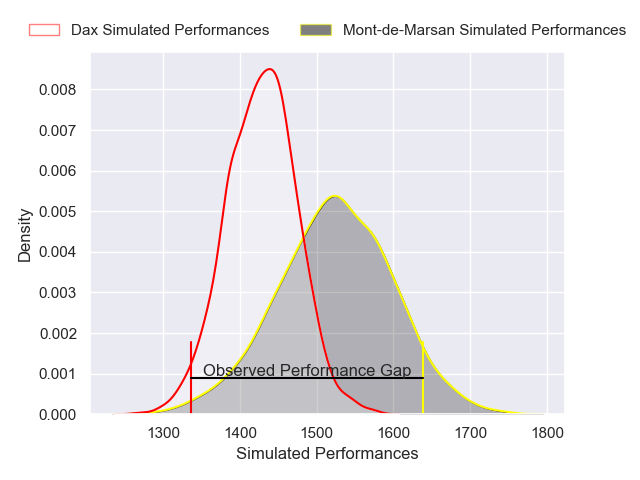
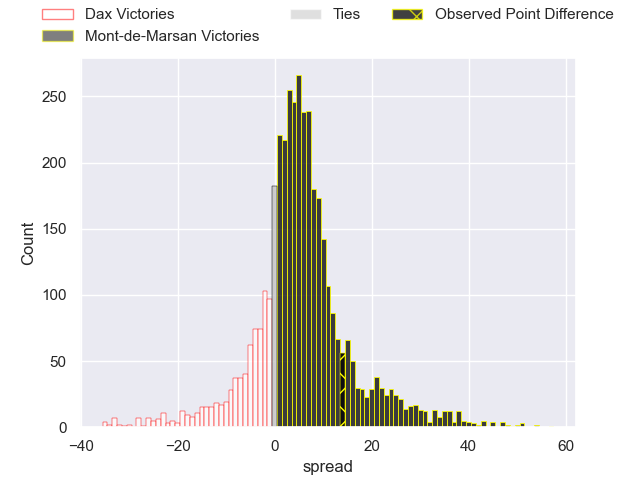
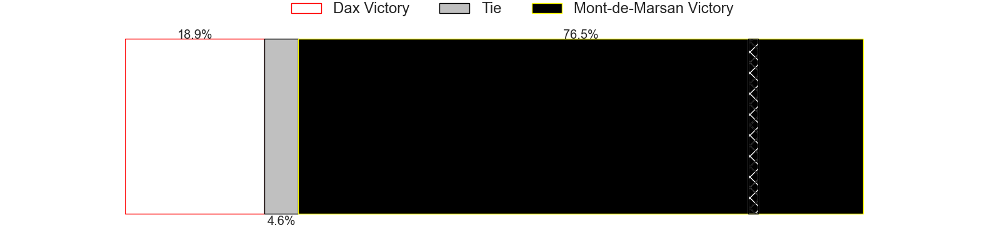
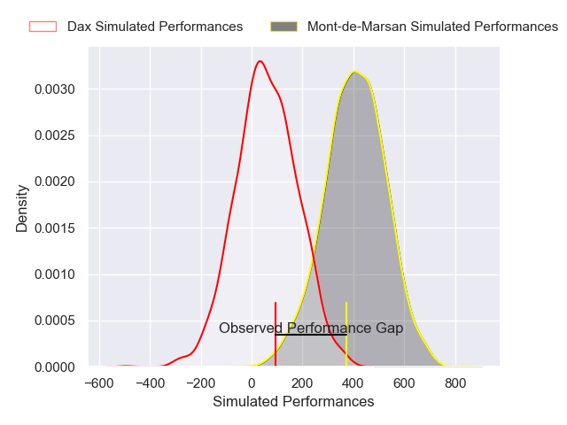
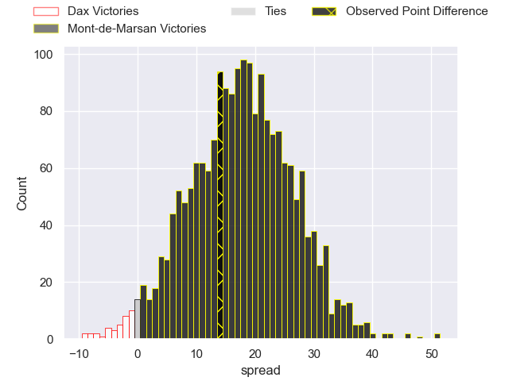
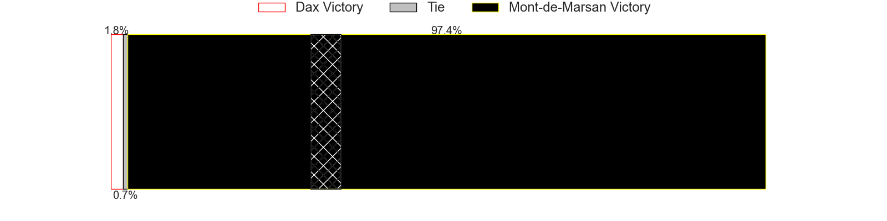

---  
layout: page  
title: Dax at Mont-de-Marsan; 20-34  
date: 2025-04-25 18:00:00 -0500  
categories: "Pro D2 24/25" match review  
---
# Dax at Mont-de-Marsan; 20-34

# Club Level Predictions

The first set of predictions treats a club as the smallest object, as the club develops its members, organizes a gameplan, and deploys its players as needed for each match. This club model has a prediction of 0.634, which translates to predicting Mont-de-Marsan to win by 4.8.

Our Over/Under is 50.5 - and combined with the spread above, we have a predicted scoreline of 23 to 28

Each club has a rating and a rating deviation (similar to a Glicko rating), and expected performances can be generated. This allows for simulated matches and spreads like the ones below.
## Projected Performances - Club Model

## Projected Spreads - Club Model

## Projected Results - Club Model

# Player Level Predictions

Treating teams instead as an entity made up of the currently active players, I have ratings for each player in an altogether different system. These can be combined to form team ratings once teamsheets are announced, weighting starters a bit higher than the reserves. After the match is played, players can be weighted by their minutes on the field, allowing for an accurate measure of the team's composition. With these compiled team ratings, we can make predictions, measure inaccuracy, and update the individual player ratings.
## Prediction without Player Minutes: Mont-de-Marsan by 21.9

Mont-de-Marsan by 9.1 on a neutral pitch

## Projected Performances - Player Model

## Projected Spreads - Player Model

## Projected Results - Player Model

|   Away Minutes | Away Player           |   Away Percentile |   Number |   Home Percentile | Home Player           |   Home Minutes |
|---------------:|:----------------------|------------------:|---------:|------------------:|:----------------------|---------------:|
|             41 | David Lolohea         |             23    |        1 |             24.48 | Thomas Bultel         |             80 |
|             80 | Louis Barrere         |             28.94 |        2 |             56.51 | Luka Begic            |             76 |
|             35 | Diogo Hasse Ferreira  |             22.92 |        3 |             82.11 | Mattéo Lalanne        |             80 |
|             22 | Alexandre Manukula    |             36.45 |        4 |             37.98 | Nicolas Garrault      |              0 |
|              0 | Jean-Baptiste Singer  |              4.29 |        5 |             12.02 | Aston Fortuin         |             41 |
|             22 | Jean-Baptiste Barrère |              5.29 |        6 |             53.8  | Yann Brethous         |             47 |
|             39 | Paul Arnaud Ausset    |             67.28 |        7 |             79.98 | Raphaël Robic         |             74 |
|             58 | Genesis Mamea Lemalu  |             77.33 |        8 |             91.74 | Ioane Iashagashvili   |             27 |
|             45 | Paul Ravier           |             82.39 |        9 |             34.7  | Christophe Loustalot  |             27 |
|             76 | Hugo Cerisier         |             61.95 |       10 |             90.02 | Willie du Plessis     |             25 |
|             39 | Maxime Oltmann        |             10.74 |       11 |             92.24 | Pierre Sayerse        |             35 |
|             53 | Jale Vatubua          |              0.41 |       12 |             11.34 | Semi Lagivala         |             62 |
|             45 | Benjamin Puntous      |             17.77 |       13 |             66.8  | Gatien Masse          |             80 |
|             45 | Théo Gatelier         |             82.94 |       14 |             52.44 | Alexandre de Nardi    |             80 |
|             66 | Théo Duprat           |             33.95 |       15 |              9.32 | Simao Bento           |             64 |
|             80 | Arnaud Aletti         |             46.2  |       16 |             30.82 | Samuel Lagrange       |             80 |
|             67 | Ratu Nacika           |             55.51 |       17 |             84.88 | Nacani Wakaya         |             33 |
|              6 | Raphaël Laboille      |             29.51 |       18 |              9.53 | Waël Ponpon           |             59 |
|             55 | Iban Hiriart-Urruty   |             48.97 |       19 |             75.93 | Gheorghe Gajion       |             80 |
|             50 | Nephi Leatigaga       |              9.07 |       20 |             37.68 | Luka Goginava         |             16 |
|             58 | Étienne Loiret        |             42.46 |       21 |             70.71 | Romain Durand         |             30 |
|             72 | Bastien Daguerre      |             30.44 |       22 |             53.68 | Nicolas Darquier      |             80 |
|             80 | Romuald Séguy         |             52.6  |       23 |             18.43 | Yoann Laousse Azpiazu |             18 |

