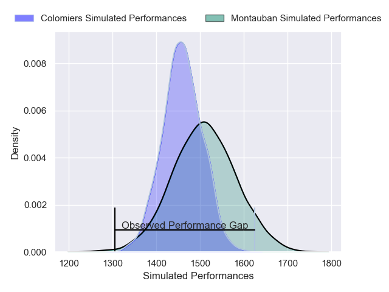
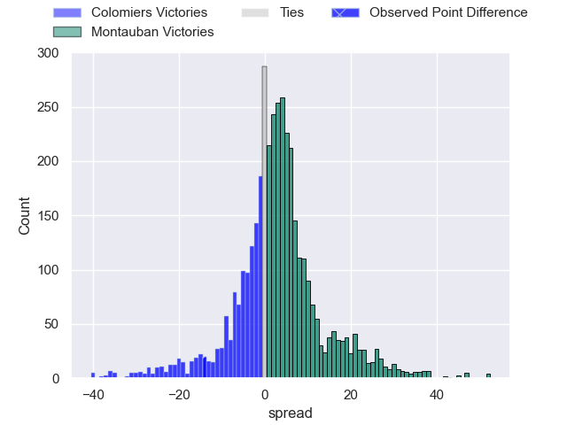
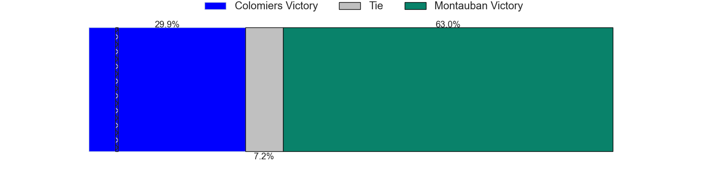
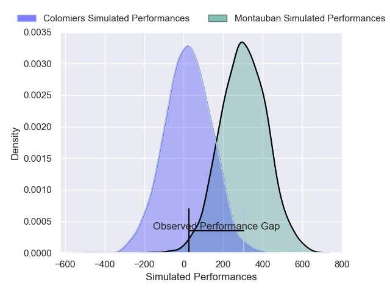
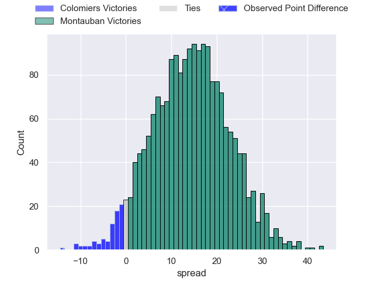
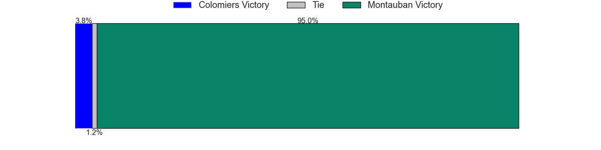

---  
layout: page  
title: Colomiers at Montauban; 31-17  
date: 2025-04-25 18:00:00 -0500  
categories: "Pro D2 24/25" match review  
---
# Colomiers at Montauban; 31-17

# Club Level Predictions

The first set of predictions treats a club as the smallest object, as the club develops its members, organizes a gameplan, and deploys its players as needed for each match. This club model has a prediction of 0.569, which translates to predicting Montauban to win by 2.4.

Our Over/Under is 60.5 - and combined with the spread above, we have a predicted scoreline of 29 to 32

Each club has a rating and a rating deviation (similar to a Glicko rating), and expected performances can be generated. This allows for simulated matches and spreads like the ones below.
## Projected Performances - Club Model

## Projected Spreads - Club Model

## Projected Results - Club Model

# Player Level Predictions

Treating teams instead as an entity made up of the currently active players, I have ratings for each player in an altogether different system. These can be combined to form team ratings once teamsheets are announced, weighting starters a bit higher than the reserves. After the match is played, players can be weighted by their minutes on the field, allowing for an accurate measure of the team's composition. With these compiled team ratings, we can make predictions, measure inaccuracy, and update the individual player ratings.
## Prediction without Player Minutes: Montauban by 15.9

Montauban by 4.7 on a neutral pitch

## Projected Performances - Player Model

## Projected Spreads - Player Model

## Projected Results - Player Model

|   Away Minutes | Away Player        |   Away Percentile |   Number |   Home Percentile | Home Player           |   Home Minutes |
|---------------:|:-------------------|------------------:|---------:|------------------:|:----------------------|---------------:|
|           80   | Guillaume Tartas   |             88.38 |        1 |             25.31 | Leo Aouf              |             80 |
|           45   | Pablo Dimcheff     |             64.04 |        2 |             45.38 | Vakhtang Jintcharadze |             40 |
|           22.5 | Hugo Pirlet        |             37.02 |        3 |             57.54 | Facundo Pomponio      |             47 |
|           40   | Jean Thomas        |             49.43 |        4 |             65.65 | Clément Bitz          |             68 |
|           29   | Maxime Granouillet |             33.4  |        5 |             35.02 | Noa Kanika            |             62 |
|           80   | Anthony Coletta    |             45.52 |        6 |              1.54 | Frédéric Quercy       |             59 |
|           57   | Gregoire Bazin     |             75.55 |        7 |             80.94 | Kyllian Ringuet       |             47 |
|           51   | Caleb Timu         |             49.36 |        8 |             72.03 | Sikhumbuzo Notshe     |             35 |
|           40   | Sadek Deghmache    |             59.66 |        9 |             12.14 | Hugo Zabalza          |             80 |
|           45   | Max Auriac         |             46.57 |       10 |             90.44 | Jérôme Bosviel        |             35 |
|           22.5 | Anzelo Tuitavuki   |             34.84 |       11 |             22.56 | Josua Vici            |             59 |
|           80   | Ray Nu'u           |             61.7  |       12 |             74.87 | Simon Renda           |             37 |
|           80   | Martin Dulon       |             26.86 |       13 |             36.26 | JT Jackson            |              0 |
|           45   | Rodrigo Marta      |             98.01 |       14 |             94.68 | Stephane Ahmed        |             35 |
|           54   | Vincent Pinto      |             81.37 |       15 |              1.66 | Segundo Tuculet       |             40 |
|           78   | Brett Herron       |              0.21 |       16 |             88.82 | Baptiste Mouchous     |             26 |
|           67   | Elliott Maurel     |            nan    |       17 |              4.1  | Victor Moreaux        |             35 |
|           13   | Theo Lachaud       |              3.08 |       18 |              4.11 | Jeremie Maurouard     |             80 |
|           57   | Michael Simutoga   |             57.3  |       19 |             11.64 | Tjuee Uanivi          |             20 |
|           80   | Elias El Ansari    |             18.14 |       20 |             83.08 | Joe Powell            |             80 |
|           13   | Jack Whetton       |              5.15 |       21 |             62.41 | Maxime Espeut         |             80 |
|           34   | Alexis Caumel      |             66.99 |       22 |              5.77 | Lucas Seyrolle        |             80 |
|           54   | Natan Culinat      |            nan    |       23 |              5.61 | Luka Azariashvili     |             80 |

