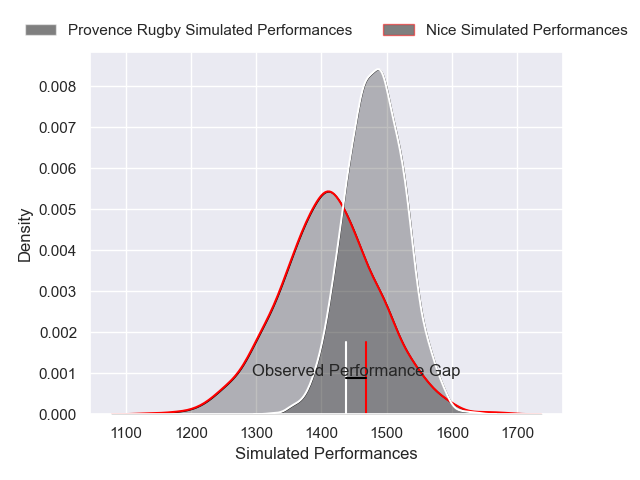
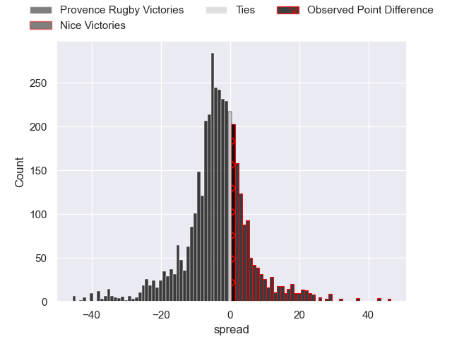
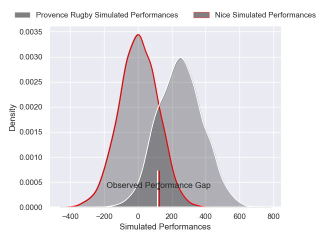
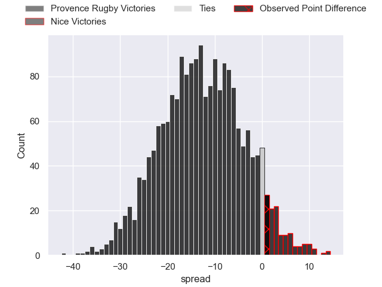
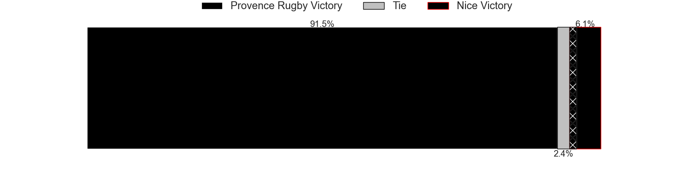

---  
layout: page  
title: Provence Rugby at Nice; 12-13  
date: 2025-04-25 18:00:00 -0500  
categories: "Pro D2 24/25" match review  
---
# Provence Rugby at Nice; 12-13

# Club Level Predictions

The first set of predictions treats a club as the smallest object, as the club develops its members, organizes a gameplan, and deploys its players as needed for each match. This club model has a prediction of 0.399, which translates to predicting Provence Rugby to win by 3.6.

Our Over/Under is 59.5 - and combined with the spread above, we have a predicted scoreline of 31 to 28

Each club has a rating and a rating deviation (similar to a Glicko rating), and expected performances can be generated. This allows for simulated matches and spreads like the ones below.
## Projected Performances - Club Model

## Projected Spreads - Club Model

## Projected Results - Club Model

# Player Level Predictions

Treating teams instead as an entity made up of the currently active players, I have ratings for each player in an altogether different system. These can be combined to form team ratings once teamsheets are announced, weighting starters a bit higher than the reserves. After the match is played, players can be weighted by their minutes on the field, allowing for an accurate measure of the team's composition. With these compiled team ratings, we can make predictions, measure inaccuracy, and update the individual player ratings.
## Prediction without Player Minutes: Provence Rugby by 11.4

Provence Rugby by 14.8 on a neutral pitch

## Projected Performances - Player Model

## Projected Spreads - Player Model

## Projected Results - Player Model

|   Away Minutes | Away Player           |   Away Percentile |   Number |   Home Percentile | Home Player           |   Home Minutes |
|---------------:|:----------------------|------------------:|---------:|------------------:|:----------------------|---------------:|
|             21 | Thomas Vernet         |             75.6  |        1 |              9.4  | Facundo Gigena        |             64 |
|             56 | Kapeli Pifeleti       |              5.31 |        2 |             12.84 | Pierre Strippoli      |             80 |
|             80 | Tomas Francis         |             98.68 |        3 |              3.87 | Tom Ross              |             80 |
|             76 | Andres Zafra Tarazona |              1.53 |        4 |              2.67 | Thibault Rey          |             80 |
|             70 | Izack Rodda           |             76.72 |        5 |             23.57 | Martin Freytes        |             80 |
|             80 | Guillaume Piazzoli    |             78.63 |        6 |              6.83 | Hugo Sarrasin         |             50 |
|             20 | Charly Gambini        |             78.54 |        7 |             89.89 | Louis Suaud           |             80 |
|             29 | Teimana Harrison      |             53.81 |        8 |              9.96 | Kylian Laurans        |              5 |
|             45 | Arthur Coville        |             13.5  |        9 |              8.38 | Jules Solinas         |             24 |
|             56 | Jules Soulan          |             76.3  |       10 |             40.54 | Flavio Asquini        |             80 |
|             63 | Nadir Bouhedjeur      |             89.62 |       11 |             51.81 | Alexis Bouton         |             26 |
|             42 | Kaveinga Finau        |             81.21 |       12 |              1.94 | Alban Conduche        |             80 |
|             80 | Atila Septar          |             61.39 |       13 |             15.02 | Nathan Courtade       |             20 |
|             80 | Adrien Lapegue-Lafaye |             13.54 |       14 |             51.17 | Benjamin Dutard       |             11 |
|             80 | Léo Drouet            |             61.7  |       15 |             86.54 | David Odiete          |             29 |
|             67 | Joseph Laget          |             22.26 |       16 |             54.66 | Fabio Gonzalez        |             13 |
|             80 | Federico Wegrzyn      |             64.47 |       17 |              7.42 | Luvuyo Pupuma         |              3 |
|             60 | Paul Mallez           |             84.91 |       18 |              4.2  | Clément Chartier      |             80 |
|             80 | Jimmy Gopperth        |             91.27 |       19 |             22.62 | Joris Sylvestre Simon |             29 |
|             13 | Mathias Colombet      |             38.72 |       20 |             33.61 | Luca Cutayar          |             52 |
|             52 | Baptiste Belhadj      |            nan    |       21 |            nan    | Julien Beaufils       |             10 |
|             28 | Yannick Youyoutte     |             83.97 |       22 |             65.9  | Mathis Viard          |             67 |

