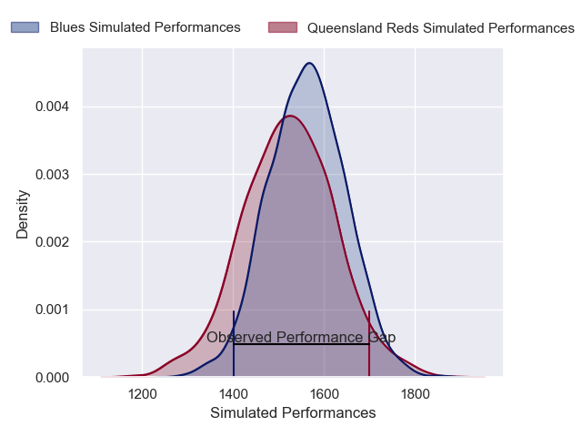
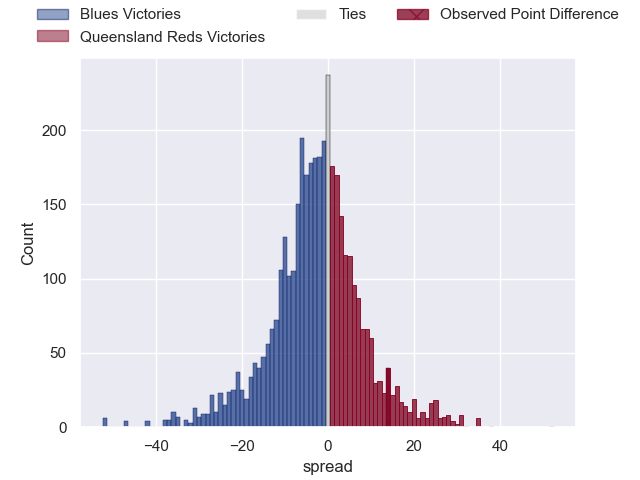
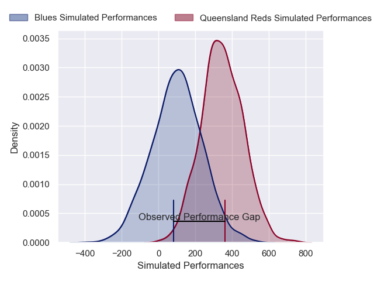
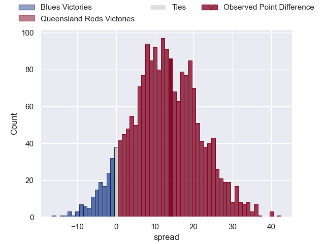

---  
layout: page  
title: Blues at Queensland Reds; 21-35  
date: 2025-04-25 18:00:00 -0500  
categories: "Super Rugby Pacific 2025" match review  
---
# Blues at Queensland Reds; 21-35

# Club Level Predictions

The first set of predictions treats a club as the smallest object, as the club develops its members, organizes a gameplan, and deploys its players as needed for each match. This club model has a prediction of 0.448, which translates to predicting Blues to win by 1.9.

Our Over/Under is 60.5 - and combined with the spread above, we have a predicted scoreline of 31 to 29

Each club has a rating and a rating deviation (similar to a Glicko rating), and expected performances can be generated. This allows for simulated matches and spreads like the ones below.
## Projected Performances - Club Model

## Projected Spreads - Club Model

## Projected Results - Club Model

# Player Level Predictions

Treating teams instead as an entity made up of the currently active players, I have ratings for each player in an altogether different system. These can be combined to form team ratings once teamsheets are announced, weighting starters a bit higher than the reserves. After the match is played, players can be weighted by their minutes on the field, allowing for an accurate measure of the team's composition. With these compiled team ratings, we can make predictions, measure inaccuracy, and update the individual player ratings.
## Prediction without Player Minutes: Queensland Reds by 4.5

Blues by 3.7 on a neutral pitch

## Projected Performances - Player Model

## Projected Spreads - Player Model

## Projected Results - Player Model

|   Away Minutes | Away Player        |   Away Percentile |   Number |   Home Percentile | Home Player          |   Home Minutes |
|---------------:|:-------------------|------------------:|---------:|------------------:|:---------------------|---------------:|
|             27 | Josh Fusitu'a      |             74.5  |        1 |             67.47 | Sef Fa'agase         |             71 |
|              0 | Kurt Eklund        |             93.71 |        2 |             89.12 | Richie Asiata        |             17 |
|             17 | Angus Ta'avao      |             95.48 |        3 |             81.84 | Zane Nonggorr        |             80 |
|              0 | Patrick Tuipulotu  |             92.34 |        4 |             24.66 | Josh Canham          |             65 |
|             17 | Patrick Tuipulotu  |             92.34 |        4 |             24.66 | Josh Canham          |             65 |
|             29 | Josh Beehre        |             82.85 |        5 |              7.9  | Lukhan Salakaia-Loto |             31 |
|             25 | Cam Christie       |             78.96 |        6 |             59.78 | Seru Uru             |             22 |
|             17 | Anton Segner       |             81.94 |        7 |             94.88 | Fraser McReight      |             80 |
|             59 | Hoskins Sotutu     |             98.36 |        8 |             47.65 | Joe Brial            |             65 |
|             26 | Finlay Christie    |             83.28 |        9 |             82.94 | Tate McDermott       |             56 |
|             80 | Harry Plummer      |             95.34 |       10 |             86.64 | Tom Lynagh           |             50 |
|             80 | Cole Forbes        |             89.61 |       11 |             19.07 | Tim Ryan             |             80 |
|             54 | AJ Lam             |             81.34 |       12 |             76.31 | Hunter Paisami       |             80 |
|             22 | Rieko Ioane        |             77.1  |       13 |             44.42 | Dre Pakeho           |             80 |
|             52 | Mark Tele'a        |              0.38 |       14 |             57.86 | Lachie Anderson      |             30 |
|             80 | Mark Tele'a        |              0.38 |       14 |             57.86 | Lachie Anderson      |             30 |
|             80 | Zarn Sullivan      |             71.11 |       15 |             71.93 | Jock Campbell        |             21 |
|             59 | Ricky Riccitelli   |             76.87 |       16 |            nan    | George Blake         |             51 |
|             80 | Mason Tupaea       |            nan    |       17 |             72.32 | Alex Hodgman         |             46 |
|             66 | Hamdahn Tuipulotu  |            nan    |       18 |            nan    | Massimo De Lutiis    |             34 |
|             80 | Laghlan McWhannell |             95.38 |       19 |             93.26 | Angus Blyth          |             26 |
|             80 | Adrian Choat       |             75.98 |       20 |             45.47 | Ryan Smith           |             46 |
|             80 | Sam Nock           |             83.95 |       21 |             55.62 | John Bryant          |             26 |
|             80 | Beauden Barrett    |             99.39 |       22 |             59.97 | Kalani Thomas        |             14 |
|             25 | Corey Evans        |             68.02 |       23 |             17.54 | Heremaia Murray      |             34 |

