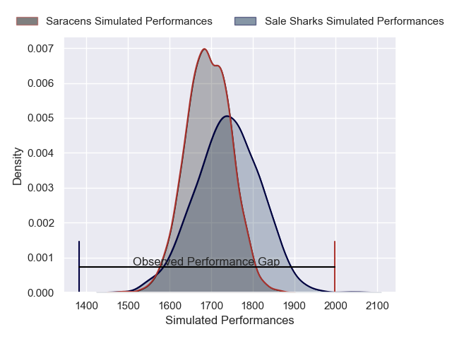
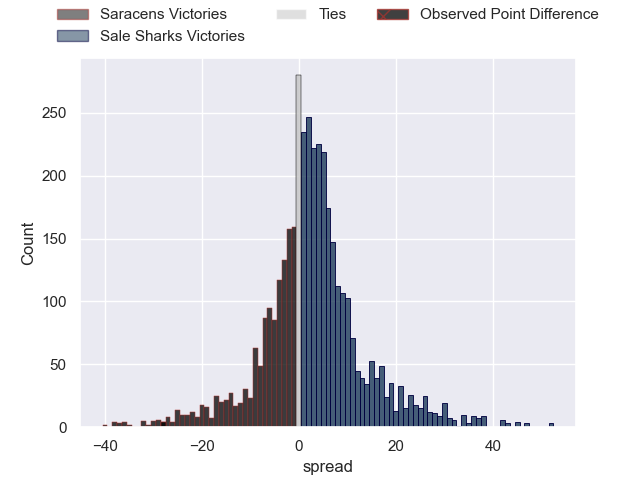
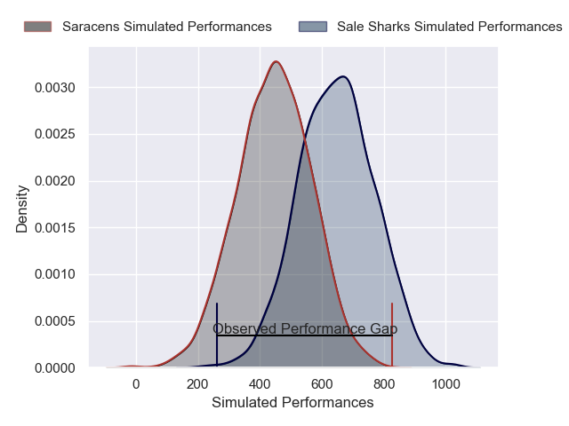
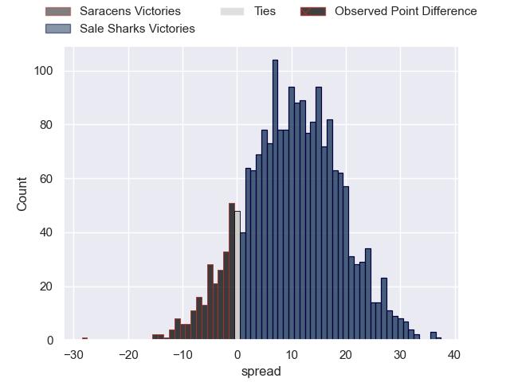

---  
layout: page  
title: Saracens at Sale Sharks; 35-7  
date: 2025-04-25 18:00:00 -0500  
categories: "Gallagher Premiership 24/25" match review  
---
# Saracens at Sale Sharks; 35-7

# Club Level Predictions

The first set of predictions treats a club as the smallest object, as the club develops its members, organizes a gameplan, and deploys its players as needed for each match. This club model has a prediction of 0.569, which translates to predicting Sale Sharks to win by 2.4.

Our Over/Under is 54.5 - and combined with the spread above, we have a predicted scoreline of 26 to 29

Each club has a rating and a rating deviation (similar to a Glicko rating), and expected performances can be generated. This allows for simulated matches and spreads like the ones below.
## Projected Performances - Club Model

## Projected Spreads - Club Model

## Projected Results - Club Model

# Player Level Predictions

Treating teams instead as an entity made up of the currently active players, I have ratings for each player in an altogether different system. These can be combined to form team ratings once teamsheets are announced, weighting starters a bit higher than the reserves. After the match is played, players can be weighted by their minutes on the field, allowing for an accurate measure of the team's composition. With these compiled team ratings, we can make predictions, measure inaccuracy, and update the individual player ratings.
## Prediction without Player Minutes: Sale Sharks by 12.6

Saracens by 0.9 on a neutral pitch

## Projected Performances - Player Model

## Projected Spreads - Player Model

## Projected Results - Player Model

|   Away Minutes | Away Player           |   Away Percentile |   Number |   Home Percentile | Home Player          |   Home Minutes |
|---------------:|:----------------------|------------------:|---------:|------------------:|:---------------------|---------------:|
|             34 | Rhys Carre            |             53.83 |        1 |             89.18 | Bevan Rodd           |             60 |
|             80 | Jamie George          |            100    |        2 |             94.22 | Luke Cowan-Dickie    |             80 |
|             80 | Alec Clarey           |             94.92 |        3 |             85.79 | Asher Opoku-Fordjour |             34 |
|             62 | Maro Itoje            |             98.65 |        4 |             11.18 | Ben Bamber           |             80 |
|             80 | Hugh Tizard           |             85.36 |        5 |             14.45 | Hyron Andrews        |             67 |
|             80 | Nick Isiekwe          |             98.7  |        6 |             83.89 | Ernst van Rhyn       |             80 |
|             29 | Ben Earl              |             99.07 |        7 |             83.24 | Tom Curry            |             46 |
|             24 | Tom Willis            |             21.06 |        8 |             99.8  | Jean-Luc du Preez    |              0 |
|             34 | Ivan van Zyl          |             86.15 |        9 |             50.68 | Gus Warr             |             30 |
|             34 | Fergus Burke          |             61.94 |       10 |             92.11 | George Ford          |             46 |
|             34 | Rotimi Segun          |             84.65 |       11 |             96.57 | Arron Reed           |             20 |
|             13 | Olly Hartley          |             14.41 |       12 |              9.08 | Rekeiti Ma'asi-White |             62 |
|             50 | Nick Tompkins         |             99.9  |       13 |             70.19 | Robert du Preez      |             50 |
|             50 | Nick Tompkins         |             99.9  |       13 |             70.19 | Robert du Preez      |             40 |
|             80 | Angus Hall            |             78.36 |       14 |             71.97 | Tom Roebuck          |              0 |
|             39 | Elliot Daly           |             93.24 |       15 |             10.45 | Joe Carpenter        |              0 |
|             80 | Theo Dan              |              8.84 |       16 |              7.65 | Tadgh McElroy        |             80 |
|             15 | Eroni Mawi            |             93.06 |       17 |            nan    | Simon McIntyre       |             80 |
|             15 | Harvey Beaton         |             62.47 |       18 |             90.56 | WillGriff John       |             62 |
|             24 | Theo McFarland        |             36.41 |       19 |             83.14 | Josh Beaumont        |             34 |
|             80 | Andy Onyeama-Christie |             61.27 |       20 |             92.43 | Daniel du Preez      |             80 |
|             58 | Juan Martin Gonzalez  |             96.55 |       21 |             16.2  | Sam Dugdale          |             46 |
|             29 | Charlie Bracken       |            nan    |       22 |             81.42 | Raffi Quirke         |             30 |
|             80 | Alex Goode            |             94.67 |       23 |             97.43 | Tom O'Flaherty       |             80 |

