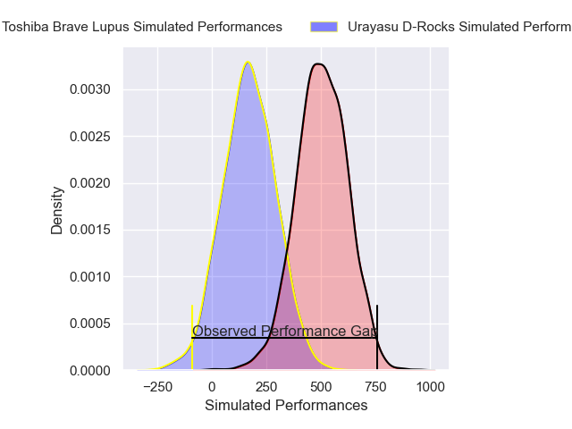
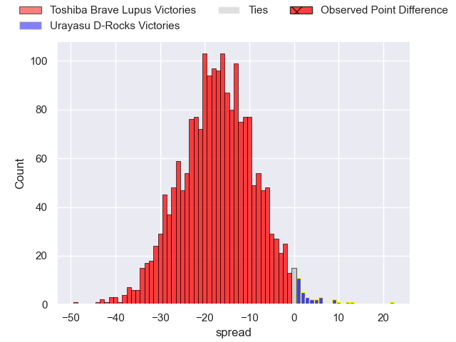
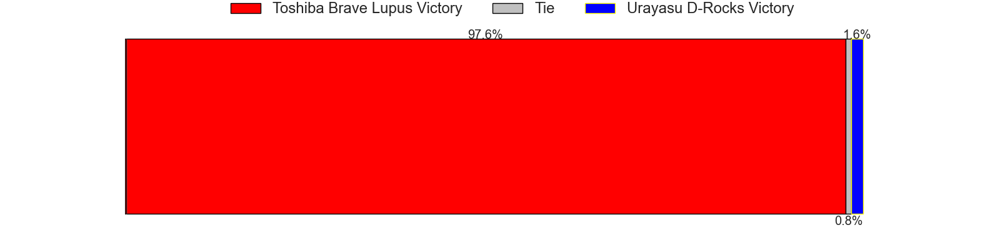

---  
layout: page  
title: Toshiba Brave Lupus at Urayasu D-Rocks; 61-19  
date: 2025-04-25 18:00:00 -0500  
categories: "Japan Rugby League One 24/25" match review  
---
# Toshiba Brave Lupus at Urayasu D-Rocks; 61-19

# Club Level Predictions

The first set of predictions treats a club as the smallest object, as the club develops its members, organizes a gameplan, and deploys its players as needed for each match. This club model has a prediction of 0.129, which translates to predicting Toshiba Brave Lupus to win by 17.0.

Our Over/Under is 63.5 - and combined with the spread above, we have a predicted scoreline of 40 to 23

Each club has a rating and a rating deviation (similar to a Glicko rating), and expected performances can be generated. This allows for simulated matches and spreads like the ones below.
## Projected Performances - Club Model

## Projected Spreads - Club Model

## Projected Results - Club Model

# Player Level Predictions

Treating teams instead as an entity made up of the currently active players, I have ratings for each player in an altogether different system. These can be combined to form team ratings once teamsheets are announced, weighting starters a bit higher than the reserves. After the match is played, players can be weighted by their minutes on the field, allowing for an accurate measure of the team's composition. With these compiled team ratings, we can make predictions, measure inaccuracy, and update the individual player ratings.
## Prediction without Player Minutes: Toshiba Brave Lupus by 16.6

Toshiba Brave Lupus by 20.8 on a neutral pitch

## Projected Performances - Player Model

## Projected Spreads - Player Model

## Projected Results - Player Model

|   Away Minutes | Away Player      |   Away Percentile |   Number |   Home Percentile | Home Player          |   Home Minutes |
|---------------:|:-----------------|------------------:|---------:|------------------:|:---------------------|---------------:|
|             21 | Sena Kimura      |             89.94 |        1 |              3.54 | Hidetomo Nabeshima   |             80 |
|              9 | Mamoru Harada    |             94.35 |        2 |             48.8  | Shokei Kin           |             57 |
|              7 | Taufa Latu       |             47.98 |        3 |             58.53 | Kim Ryom             |             80 |
|             62 | Jacob Pierce     |             99.52 |        4 |             38.74 | Hunter Morrison      |             80 |
|             69 | Warner Dearns    |             89.41 |        5 |             69.75 | Lourens Erasmus      |             80 |
|             80 | Shannon Frizell  |             94.51 |        6 |             71.8  | Tom Parsons          |             80 |
|             80 | Takeshi Sasaki   |             93.74 |        7 |             20.89 | Tetta Shigemitsu     |             80 |
|             79 | Michael Leitch   |             95.13 |        8 |             92.58 | Tone Tukufuka        |             43 |
|             31 | Yuhei Sugiyama   |             87.69 |        9 |             26.67 | Ren Iinuma           |             80 |
|             80 | Richie Mo'unga   |             99.38 |       10 |             84.62 | Yu Tamura            |             39 |
|             80 | Futoshi Mori     |             65.43 |       11 |             89.17 | Takuhei Yasuda       |             25 |
|             29 | Rob Thompson     |             16.96 |       12 |             95.4  | Samu Kerevi          |             55 |
|             30 | Seta Tamanivalu  |             95.81 |       13 |             22.06 | Shane Gates          |             62 |
|             13 | Atsuki Kuwayama  |             90.52 |       14 |             21.66 | Junya Matsumoto      |             18 |
|              9 | Shohei Toyoshima |             71.84 |       15 |             51.97 | Otere Black          |             20 |
|             18 | Yuta Kokaji      |             95.47 |       16 |              5.52 | Shuhei Takeuchi      |             50 |
|             62 | Takahiro Ogawa   |            nan    |       17 |             86.23 | Nathan Hughes        |             80 |
|             13 | Daigo Hashimoto  |             84.59 |       18 |            nan    | Sekonaia Pole        |             67 |
|             80 | Shohei Ito       |             58.21 |       19 |            nan    | James Moore          |             67 |
|             21 | Samuela Anise    |             65.08 |       20 |            nan    | Junichiro Matsushita |             50 |
|             47 | Michael Collins  |             97.34 |       21 |             15.97 | Kai Ishii            |             18 |
|             15 | Teruo Makabe     |            nan    |       22 |              1.37 | Norifumi Hashimoto   |             55 |
|             80 | Toshiki Kuwayama |            nan    |       23 |             47.52 | Uwe Helu             |             20 |

