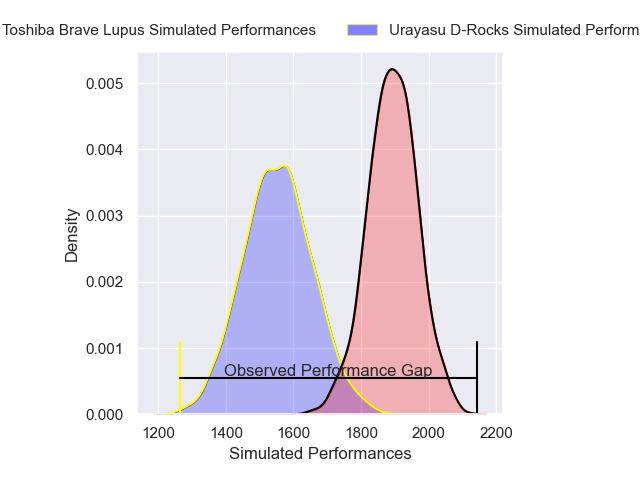
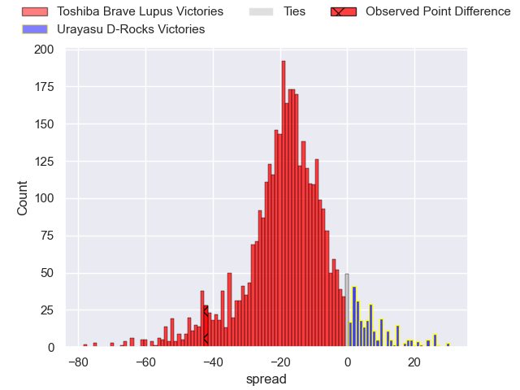
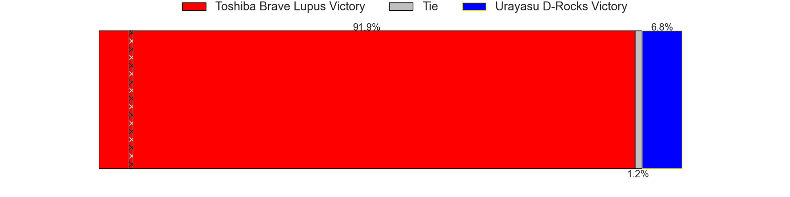

---  
layout: page  
title: Toshiba Brave Lupus at Urayasu D-Rocks; 61-19  
date: 2025-04-25 18:00:00 -0500  
categories: "Japan Rugby League One 24/25" match review  
---
# Toshiba Brave Lupus at Urayasu D-Rocks; 61-19

# Club Level Predictions

The first set of predictions treats a club as the smallest object, as the club develops its members, organizes a gameplan, and deploys its players as needed for each match. This club model has a prediction of 0.129, which translates to predicting Toshiba Brave Lupus to win by 17.0.

Our Over/Under is 62.5 - and combined with the spread above, we have a predicted scoreline of 40 to 23

Each club has a rating and a rating deviation (similar to a Glicko rating), and expected performances can be generated. This allows for simulated matches and spreads like the ones below.
## Projected Performances - Club Model

## Projected Spreads - Club Model

## Projected Results - Club Model

