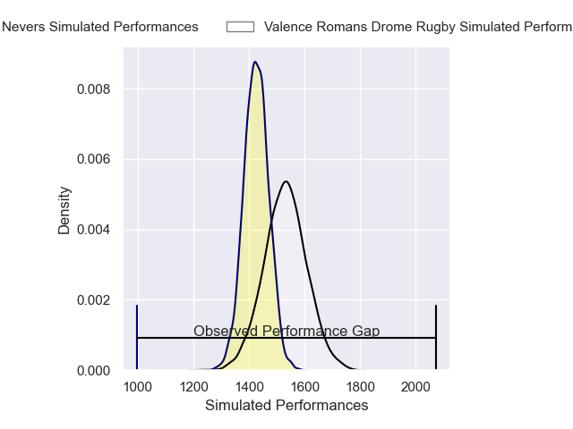
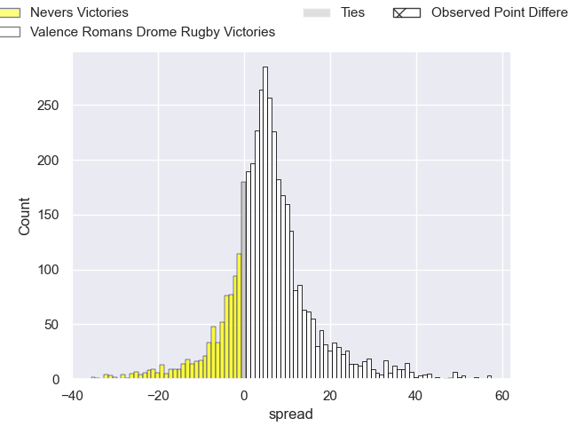
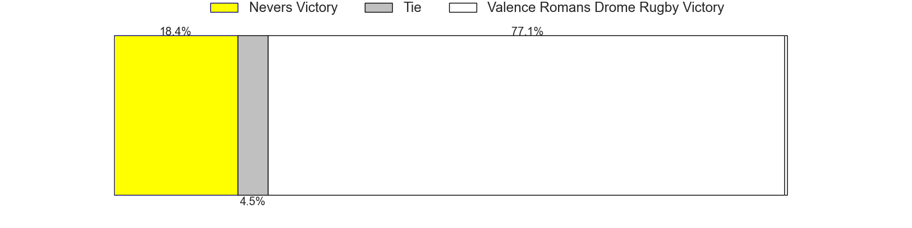
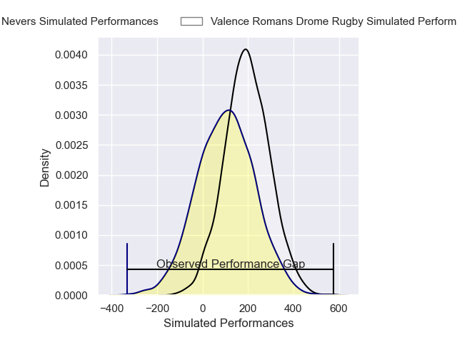
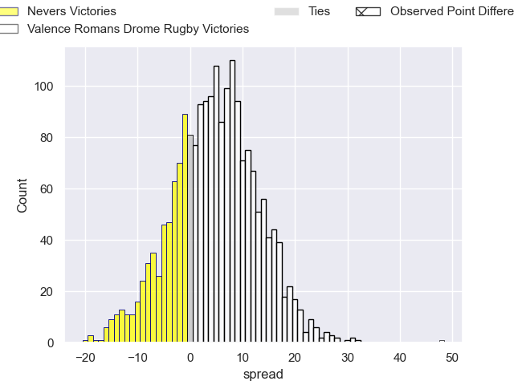
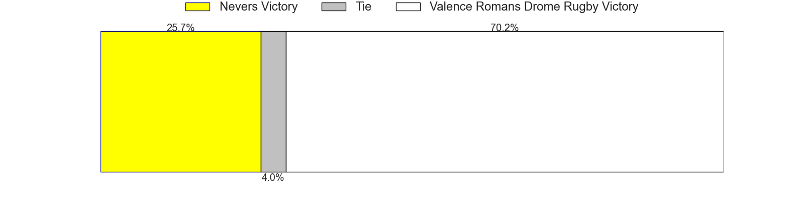

---  
layout: page  
title: Nevers at Valence Romans Drome Rugby; 21-69  
date: 2025-04-25 18:00:00 -0500  
categories: "Pro D2 24/25" match review  
---
# Nevers at Valence Romans Drome Rugby; 21-69

# Club Level Predictions

The first set of predictions treats a club as the smallest object, as the club develops its members, organizes a gameplan, and deploys its players as needed for each match. This club model has a prediction of 0.647, which translates to predicting Valence Romans Drome Rugby to win by 5.3.

Our Over/Under is 57.5 - and combined with the spread above, we have a predicted scoreline of 26 to 32

Each club has a rating and a rating deviation (similar to a Glicko rating), and expected performances can be generated. This allows for simulated matches and spreads like the ones below.
## Projected Performances - Club Model

## Projected Spreads - Club Model

## Projected Results - Club Model

# Player Level Predictions

Treating teams instead as an entity made up of the currently active players, I have ratings for each player in an altogether different system. These can be combined to form team ratings once teamsheets are announced, weighting starters a bit higher than the reserves. After the match is played, players can be weighted by their minutes on the field, allowing for an accurate measure of the team's composition. With these compiled team ratings, we can make predictions, measure inaccuracy, and update the individual player ratings.
## Prediction without Player Minutes: Valence Romans Drome Rugby by 7.7

Valence Romans Drome Rugby by 4.0 on a neutral pitch

## Projected Performances - Player Model

## Projected Spreads - Player Model

## Projected Results - Player Model

|   Away Minutes | Away Player                 |   Away Percentile |   Number |   Home Percentile | Home Player         |   Home Minutes |
|---------------:|:----------------------------|------------------:|---------:|------------------:|:--------------------|---------------:|
|             51 | Louis Chanet                |             42.21 |        1 |             59.93 | Anthony Aléo        |             13 |
|             80 | Stefan Buruiana             |             72.43 |        2 |             86.99 | Dorian Marco Pena   |             38 |
|             40 | Hugo Ndiaye                 |             16.82 |        3 |             22.42 | Gareth Milasinovich |             28 |
|             80 | George Smith                |             30.15 |        4 |             79.48 | Ryan McCauley       |             80 |
|             67 | Senio Toleafoa              |             37.31 |        5 |             71.47 | Florian Goumat      |             67 |
|             80 | Luka Plataret               |             52.74 |        6 |             80.65 | Adrien Roux         |             80 |
|             65 | Julien Kazubek              |             63.14 |        7 |             36.28 | Ilia Spanderashvili |             80 |
|             80 | Mahamadou Coulibaly         |             19.92 |        8 |             65.68 | Loan Real           |             54 |
|             57 | Simon Tarel                 |             14.19 |        9 |             37.44 | Mattéo Rodor        |             77 |
|             21 | Tom Deleuze                 |             11.43 |       10 |             57.59 | Lucas Meret         |             29 |
|             25 | Dylan Jaminet               |             32.67 |       11 |             97.2  | Adam Vargas         |             21 |
|             21 | Noa Pommelet                |             41.78 |       12 |             12.97 | Mathieu Guillomot   |             21 |
|             25 | Atunaisa Taulanga Vaka Manu |             31.36 |       13 |             87.44 | Anatole Pauvert     |             21 |
|             25 | Lucas Blanc                 |             70.58 |       14 |              7.85 | Owen Lane           |             34 |
|             68 | Perry Mayo                  |             30.02 |       15 |             86.13 | Joris De Moura      |             11 |
|             23 | Steven David                |             53.71 |       16 |             87.74 | Ben Neiceru         |             25 |
|             80 | Makatuki Polutele           |             19.08 |       17 |             49.18 | Axel Bruchet        |             21 |
|             80 | Lasha Pkhakadze             |             20.28 |       18 |             82.36 | Andrea Pontanier    |             18 |
|             48 | Paula Walisolio             |             29.21 |       19 |              0.51 | Cyril Deligny       |             25 |
|             80 | Efi Ma'afu                  |             50    |       20 |             74.36 | Thomas Lhusero      |             25 |
|             59 | Aselo Ikahehegi             |             67.68 |       21 |             69.74 | Vincent Vial        |             80 |
|             46 | Enoal Joguet                |            nan    |       22 |             85.95 | Thembelani Bholi    |             80 |

