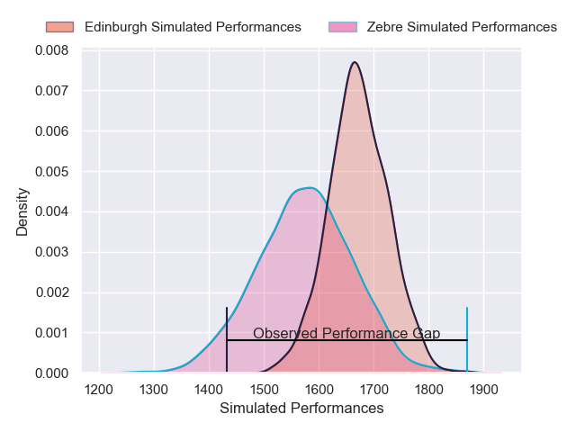
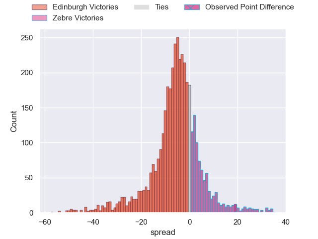
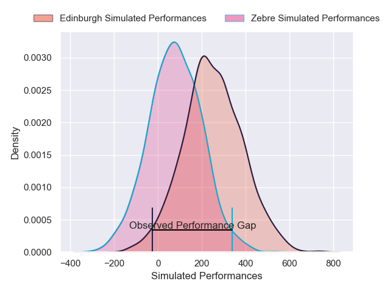
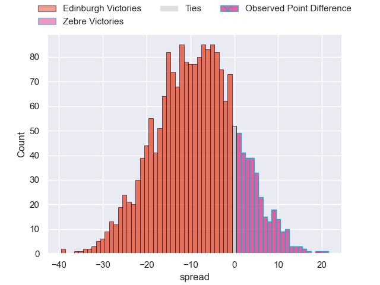

---  
layout: page  
title: Edinburgh at Zebre; 22-41  
date: 2025-04-25 18:00:00 -0500  
categories: "United Rugby Championship 24/25" match review  
---
# Edinburgh at Zebre; 22-41

# Club Level Predictions

The first set of predictions treats a club as the smallest object, as the club develops its members, organizes a gameplan, and deploys its players as needed for each match. This club model has a prediction of 0.362, which translates to predicting Edinburgh to win by 5.0.

Our Over/Under is 53.5 - and combined with the spread above, we have a predicted scoreline of 29 to 24

Each club has a rating and a rating deviation (similar to a Glicko rating), and expected performances can be generated. This allows for simulated matches and spreads like the ones below.
## Projected Performances - Club Model

## Projected Spreads - Club Model

## Projected Results - Club Model

# Player Level Predictions

Treating teams instead as an entity made up of the currently active players, I have ratings for each player in an altogether different system. These can be combined to form team ratings once teamsheets are announced, weighting starters a bit higher than the reserves. After the match is played, players can be weighted by their minutes on the field, allowing for an accurate measure of the team's composition. With these compiled team ratings, we can make predictions, measure inaccuracy, and update the individual player ratings.
## Prediction without Player Minutes: Edinburgh by 8.3

Edinburgh by 14.6 on a neutral pitch

## Projected Performances - Player Model

## Projected Spreads - Player Model

## Projected Results - Player Model

|   Away Minutes | Away Player      |   Away Percentile |   Number |   Home Percentile | Home Player           |   Home Minutes |
|---------------:|:-----------------|------------------:|---------:|------------------:|:----------------------|---------------:|
|             29 | Boan Venter      |             69.98 |        1 |             42.7  | Danilo Fischetti      |             23 |
|             80 | Patrick Harrison |              5.44 |        2 |             68.71 | Tommaso Di Bartolomeo |             80 |
|             51 | D'Arcy Rae       |             37.69 |        3 |             57.55 | Muhamed Hasa          |             80 |
|             15 | Glen Young       |              3.76 |        4 |             85.55 | Matteo Canali         |             57 |
|             65 | Sam Skinner      |             90.27 |        5 |              2.02 | Leonard Krumov        |             56 |
|             80 | Ben Muncaster    |             20.67 |        6 |             75.05 | Giacomo Ferrari       |             65 |
|             24 | Hamish Watson    |             83.99 |        7 |             26.07 | Bautista Stavile      |             80 |
|             65 | Magnus Bradbury  |             74.03 |        8 |             35.99 | Giovanni Licata       |             80 |
|             75 | Ali Price        |             91.05 |        9 |              5.74 | Alessandro Fusco      |             80 |
|             80 | Ross Thompson    |             77.73 |       10 |             22.06 | Giacomo Da Re         |             73 |
|             80 | Jack Brown       |             18.88 |       11 |              4.96 | Simone Gesi           |              9 |
|             27 | James Lang       |             79.76 |       12 |             74.93 | Damiano Mazza         |             64 |
|              5 | Matt Currie      |             83.91 |       13 |             23.3  | Fetuli Paea           |             31 |
|             10 | Darcy Graham     |             33.94 |       14 |             70.35 | Scott Gregory         |              7 |
|             24 | Harry Paterson   |             13.11 |       15 |              7.38 | Jacopo Trulla         |             22 |
|             80 | Harri Morris     |            nan    |       16 |             71.09 | Luca Bigi             |             80 |
|             68 | Robin Hislop     |            nan    |       17 |             37.37 | Paolo Buonfiglio      |             70 |
|             80 | Angus Williams   |            nan    |       18 |             29.86 | Juan Pitinari         |             51 |
|             59 | Grant Gilchrist  |             97.5  |       19 |             75.43 | Andrea Zambonin       |             80 |
|             51 | Freddy Douglas   |              5.87 |       20 |             66.09 | Rusiate Nasove        |             12 |
|             80 | Charlie Shiel    |             64.02 |       21 |             40.03 | Gonzalo Garcia        |             21 |
|             80 | Charlie Shiel    |             64.02 |       21 |             40.03 | Gonzalo Garcia        |             29 |
|             56 | Cameron Scott    |            nan    |       22 |              1.01 | Giovanni Montemauri   |             16 |
|             80 | Mosese Tuipulotu |             54    |       23 |             91.51 | Luca Morisi           |              7 |

