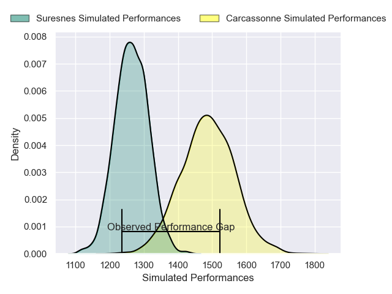
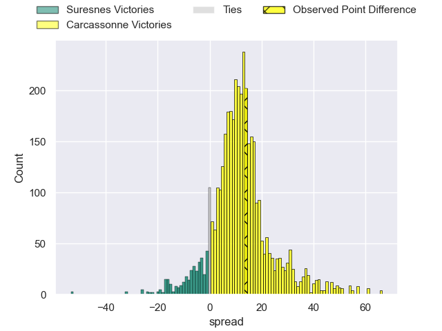
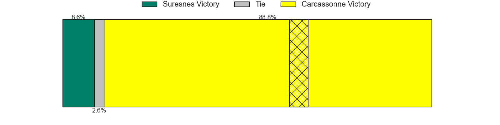
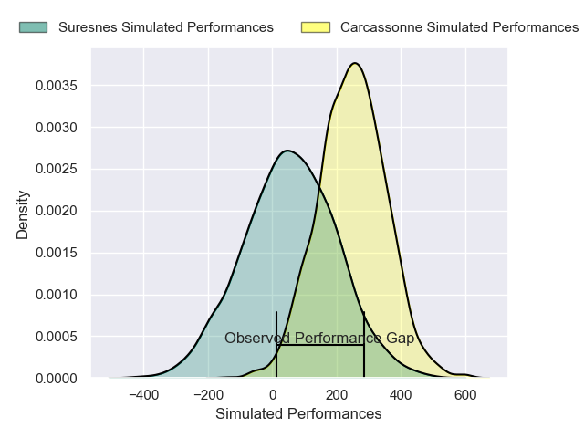
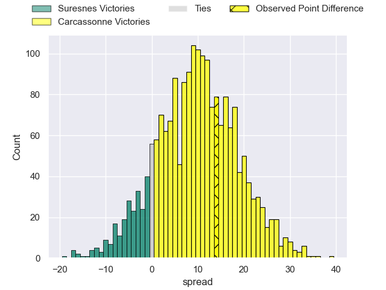
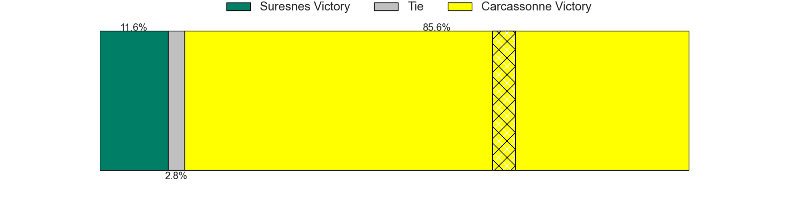

---  
layout: page  
title: Suresnes at Carcassonne; 22-36  
date: 2025-04-26 18:00:00 -0500  
categories: "Nationale 24/25" match review  
---
# Suresnes at Carcassonne; 22-36

# Club Level Predictions

The first set of predictions treats a club as the smallest object, as the club develops its members, organizes a gameplan, and deploys its players as needed for each match. This club model has a prediction of 0.78, which translates to predicting Carcassonne to win by 11.1.

Our Over/Under is 47.5 - and combined with the spread above, we have a predicted scoreline of 18 to 30

Each club has a rating and a rating deviation (similar to a Glicko rating), and expected performances can be generated. This allows for simulated matches and spreads like the ones below.
## Projected Performances - Club Model

## Projected Spreads - Club Model

## Projected Results - Club Model

# Player Level Predictions

Treating teams instead as an entity made up of the currently active players, I have ratings for each player in an altogether different system. These can be combined to form team ratings once teamsheets are announced, weighting starters a bit higher than the reserves. After the match is played, players can be weighted by their minutes on the field, allowing for an accurate measure of the team's composition. With these compiled team ratings, we can make predictions, measure inaccuracy, and update the individual player ratings.
## Prediction without Player Minutes: Carcassonne by 11.0

Carcassonne by 1.7 on a neutral pitch

## Projected Performances - Player Model

## Projected Spreads - Player Model

## Projected Results - Player Model

|   Away Minutes | Away Player            |   Away Percentile |   Number |   Home Percentile | Home Player           |   Home Minutes |
|---------------:|:-----------------------|------------------:|---------:|------------------:|:----------------------|---------------:|
|             32 | Elias Coulibaly        |             63.56 |        1 |             35.28 | Nika Neparidze        |             32 |
|             26 | Ismael Martin          |             19.52 |        2 |             54.97 | Baptiste Moreno       |             80 |
|             68 | Leandro Mario Assi     |             12.45 |        3 |             47.32 | Nicolas Fenuafanote   |             19 |
|             80 | Marvin Woki            |             78.24 |        4 |             74.52 | Romain Guyot          |              9 |
|             55 | Sacha Yahi             |             17.94 |        5 |             53.34 | Clément Fontaine      |             17 |
|             80 | Jean-Baptiste Lachaise |             66.79 |        6 |             55.15 | Maxime Millan         |              0 |
|             73 | Noureddine Agsib       |             45.62 |        7 |             12.13 | Valentin Sese         |             29 |
|             72 | Lakisipone Lee         |             62.08 |        8 |             13.35 | Thomas Hoarau         |             27 |
|             80 | Théo Bachiri           |             11.97 |        9 |              8.72 | Tomas Munilla lo Duca |             80 |
|             80 | Jean Chezeau           |             46.15 |       10 |             34.1  | Nils Chalies          |             80 |
|             80 | Yohan Fournier         |             11.73 |       11 |             40.25 | Naim Ben Alla         |             50 |
|             57 | Jean Delbecq           |             52.2  |       12 |             10.83 | Jordan Puletua        |             80 |
|             56 | Victor Barnier         |             71.91 |       13 |             49.34 | Mathys Barka          |             80 |
|             80 | Alexis Clement         |             12.09 |       14 |             25.63 | Paul Gadea            |             61 |
|             80 | Goulwen Gueho          |              2.9  |       15 |             86.34 | Maxime Gianet         |             26 |
|             80 | Yanis Trabelsi         |             50.62 |       16 |             43.78 | Thomas Agati          |             48 |
|             64 | Antoine Marty-Rybak    |            nan    |       17 |             45.55 | Raphael Carbou        |             46 |
|             32 | Nail Audoire           |             35.61 |       18 |             83.76 | Fabien Lorenzon       |             46 |
|             60 | Corentin Rougier       |             36.48 |       19 |             77.86 | Etienne Herjean       |             80 |
|             23 | Nikita Bekov           |             81.49 |       20 |             11.45 | Marius Iftimiciuc     |             17 |
|             66 | Anthime Gobeaux        |            nan    |       21 |             28.72 | Gaetan Pichon         |              8 |
|             60 | Petero Tuwai           |             54.75 |       22 |             74.84 | Johnny McPhillips     |             50 |
|             80 | Gauthier Wolf          |             25.43 |       23 |            nan    | nan                   |            nan |

