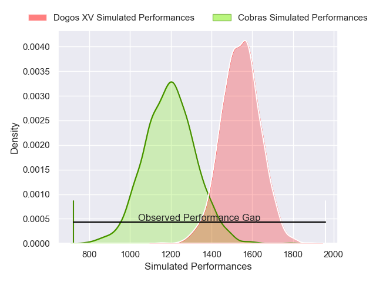
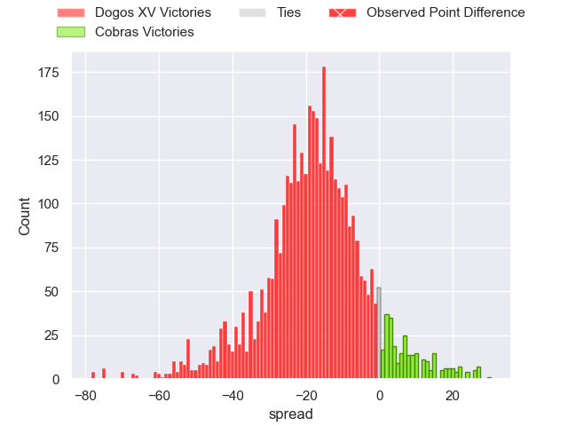
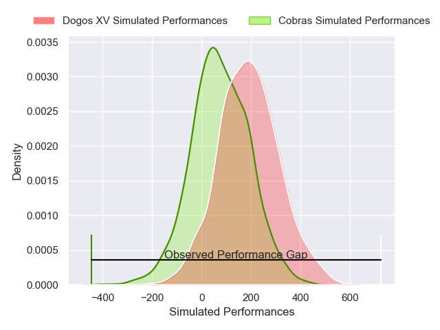
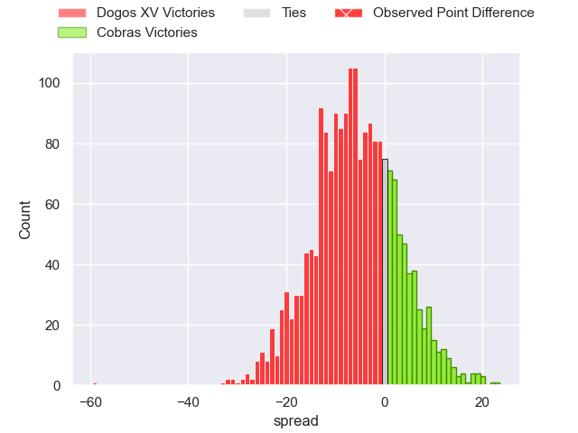

---  
layout: page  
title: Dogos XV at Cobras; 74-15  
date: 2025-04-26 18:00:00 -0500  
categories: "Super Rugby Americas 2025" match review  
---
# Dogos XV at Cobras; 74-15

# Club Level Predictions

The first set of predictions treats a club as the smallest object, as the club develops its members, organizes a gameplan, and deploys its players as needed for each match. This club model has a prediction of 0.13, which translates to predicting Dogos XV to win by 17.2.

Our Over/Under is 57.5 - and combined with the spread above, we have a predicted scoreline of 37 to 20

Each club has a rating and a rating deviation (similar to a Glicko rating), and expected performances can be generated. This allows for simulated matches and spreads like the ones below.
## Projected Performances - Club Model

## Projected Spreads - Club Model

## Projected Results - Club Model

# Player Level Predictions

Treating teams instead as an entity made up of the currently active players, I have ratings for each player in an altogether different system. These can be combined to form team ratings once teamsheets are announced, weighting starters a bit higher than the reserves. After the match is played, players can be weighted by their minutes on the field, allowing for an accurate measure of the team's composition. With these compiled team ratings, we can make predictions, measure inaccuracy, and update the individual player ratings.
## Prediction without Player Minutes: Dogos XV by 6.3

Dogos XV by 8.8 on a neutral pitch

## Projected Performances - Player Model

## Projected Spreads - Player Model

## Projected Results - Player Model

|   Away Minutes | Away Player               |   Away Percentile |   Number |   Home Percentile | Home Player              |   Home Minutes |
|---------------:|:--------------------------|------------------:|---------:|------------------:|:-------------------------|---------------:|
|              0 | Boris Wenger              |             83.96 |        1 |             25.74 | Vicente Galvao           |             80 |
|             80 | Leonel Oviedo             |             84.79 |        2 |              6.82 | Endy Willian             |             80 |
|             80 | Octavio Filippa           |             87.33 |        3 |             43.79 | Javier Angel Coronel     |             66 |
|             80 | Ignacio Jose Gandini      |             71.31 |        4 |              5.29 | Cleber Dias              |             80 |
|             40 | Federico Albrisi          |             59.05 |        5 |             27.95 | Helder Brian Souza Lucio |             36 |
|             41 | Aitor Bildosola           |             65.36 |        6 |             55.89 | Manuel Todaro            |             80 |
|             30 | Valentin Cabral           |             71.48 |        7 |              4.88 | Matheus Claudio          |             56 |
|             39 | Gennaro Fissore           |             40.76 |        8 |              2.1  | Andre Arruda             |             80 |
|             39 | Juan Lovell               |             51.19 |        9 |             27.65 | Rodrigo Santos           |             80 |
|             80 | Juan Baronio              |             65.85 |       10 |             38.75 | Thiago Oviedo            |              0 |
|             69 | Lautaro Cipriani          |             73.33 |       11 |             39.87 | Lyan Aquino              |             14 |
|             61 | Faustino Sánchez Valarolo |             91.93 |       12 |              5.21 | Robert Tenorio           |             47 |
|             23 | Felipe Mallia             |             73.54 |       13 |             20.84 | Fernando Dario Luna      |             47 |
|             23 | Mateo Soler               |             81.93 |       14 |             36.71 | Andrei Santana           |             30 |
|             68 | Mateo Sanchez             |             32.78 |       15 |             60.82 | Joao Amaral              |             24 |
|             50 | Ernesto Giudice           |             77.53 |       16 |            nan    | Lisandro Urrejola        |             44 |
|             20 | Juan Cruz Caballero       |             43.28 |       17 |            nan    | Gustavo Goberti          |             30 |
|             57 | Gaston Revol              |            nan    |       18 |             50.33 | Adrio Melo               |             20 |
|             60 | Nicolas Revol             |             65.28 |       19 |            nan    | Renato Santos            |             76 |
|             45 | Pedro Delgado             |             69.05 |       20 |             35.08 | Rodolfo Martins          |             50 |
|             73 | Conrado Iglesias Quintana |            nan    |       21 |            nan    | Joao Arraez              |             56 |
|             80 | Agustin Moyano            |             84.81 |       22 |            nan    | Tiago Gonçalves          |             60 |
|             57 | Nicanor Rins              |            nan    |       23 |            nan    | nan                      |            nan |

