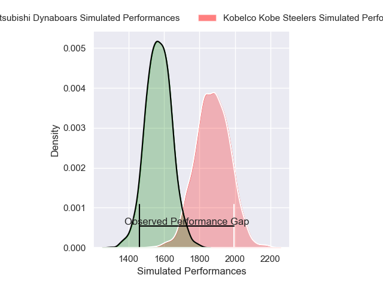
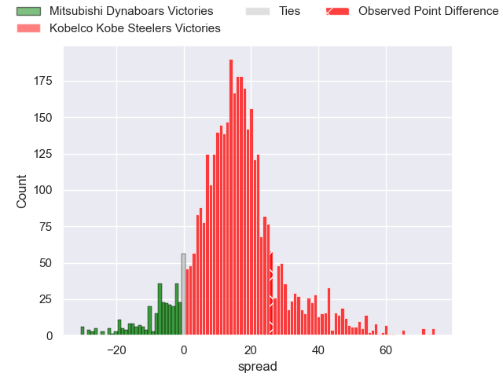
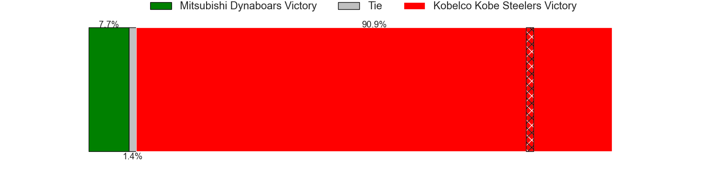
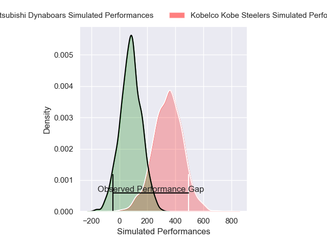
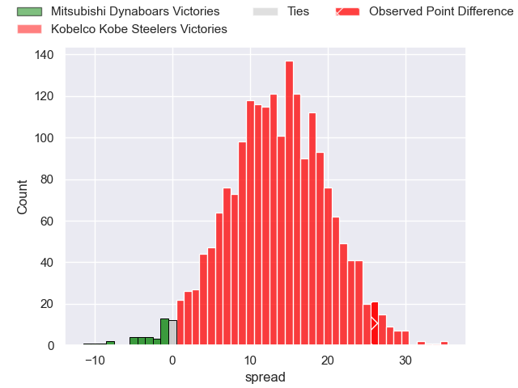
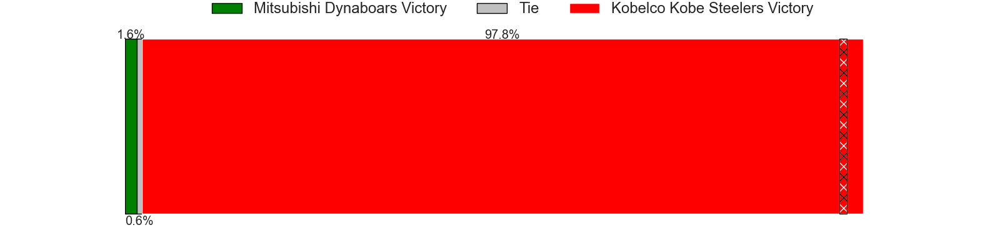

---  
layout: page  
title: Mitsubishi Dynaboars at Kobelco Kobe Steelers; 33-59  
date: 2025-04-26 18:00:00 -0500  
categories: "Japan Rugby League One 24/25" match review  
---
# Mitsubishi Dynaboars at Kobelco Kobe Steelers; 33-59

# Club Level Predictions

The first set of predictions treats a club as the smallest object, as the club develops its members, organizes a gameplan, and deploys its players as needed for each match. This club model has a prediction of 0.846, which translates to predicting Kobelco Kobe Steelers to win by 15.2.

Our Over/Under is 76.5 - and combined with the spread above, we have a predicted scoreline of 31 to 46

Each club has a rating and a rating deviation (similar to a Glicko rating), and expected performances can be generated. This allows for simulated matches and spreads like the ones below.
## Projected Performances - Club Model

## Projected Spreads - Club Model

## Projected Results - Club Model

# Player Level Predictions

Treating teams instead as an entity made up of the currently active players, I have ratings for each player in an altogether different system. These can be combined to form team ratings once teamsheets are announced, weighting starters a bit higher than the reserves. After the match is played, players can be weighted by their minutes on the field, allowing for an accurate measure of the team's composition. With these compiled team ratings, we can make predictions, measure inaccuracy, and update the individual player ratings.
## Prediction without Player Minutes: Kobelco Kobe Steelers by 15.7

Kobelco Kobe Steelers by 10.9 on a neutral pitch

## Projected Performances - Player Model

## Projected Spreads - Player Model

## Projected Results - Player Model

|   Away Minutes | Away Player               |   Away Percentile |   Number |   Home Percentile | Home Player          |   Home Minutes |
|---------------:|:--------------------------|------------------:|---------:|------------------:|:---------------------|---------------:|
|       56       | Hayato Hosoda             |              8.16 |        1 |             69.83 | Shigure Takao        |             80 |
|       45       | Seung Hyok Lee            |             71.06 |        2 |             69.35 | Kenta Matsuoka       |             49 |
|       22       | Khuthuzani Kingdom Mchunu |             56.47 |        3 |             97.69 | Hiroshi Yamashita    |             31 |
|        6.66667 | Walt Steenkamp            |             79.77 |        4 |             85.59 | Gerard Cowley-Tuioti |             80 |
|       25       | Lewis Chessum             |             25.86 |        5 |            100    | Brodie Retallick     |             35 |
|       80       | Daniel Linde              |              9.91 |        6 |             77.67 | Tiennan Costley      |             24 |
|       26       | Kohki Sato                |             50.63 |        7 |             18.86 | Willie Potgieter     |             22 |
|       24       | Kyo Yoshida               |             76.06 |        8 |             61.23 | Amanaki Saumaki      |             45 |
|       27       | Jack Stratton             |             95.04 |        9 |             92.82 | Atsushi Hiwasa       |             80 |
|       11       | James Grayson             |             58.63 |       10 |             92.72 | Bryn Gatland         |             71 |
|       14       | Honeti Taumoha'apai       |             84.84 |       11 |             58.39 | Kazuma Ueda          |             80 |
|       80       | Charlie Lawrence          |             91.42 |       12 |              5.01 | Seungsin Lee         |             80 |
|       26       | Matt Vaega                |             48.83 |       13 |             79.57 | Michael Little       |             80 |
|       69       | Naco Joape                |             57.94 |       14 |             86.91 | Inoke Burua          |             72 |
|       40       | Satoshi Koizumi           |             65.84 |       15 |             65.63 | Kenta Matsunaga      |             57 |

