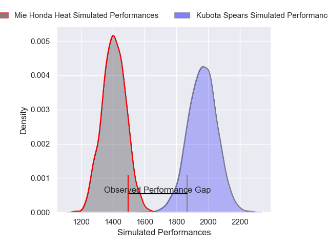
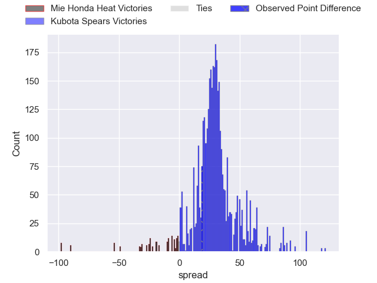
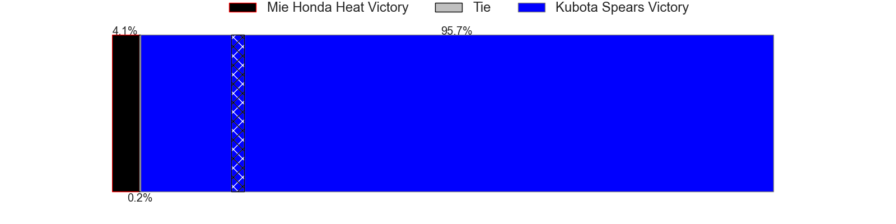
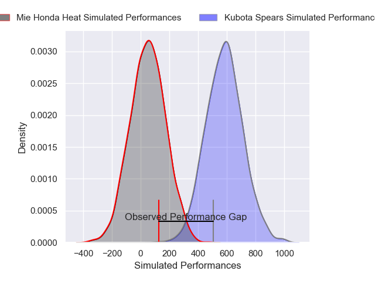
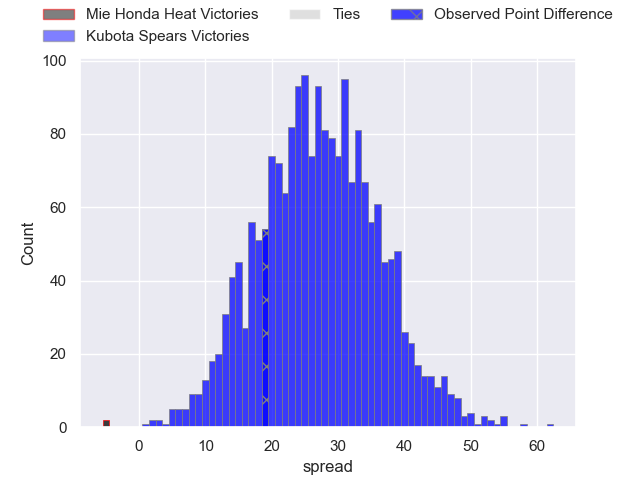
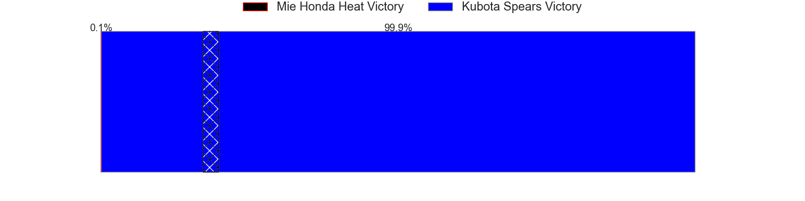

---  
layout: page  
title: Mie Honda Heat at Kubota Spears; 20-39  
date: 2025-04-26 18:00:00 -0500  
categories: "Japan Rugby League One 24/25" match review  
---
# Mie Honda Heat at Kubota Spears; 20-39

# Club Level Predictions

The first set of predictions treats a club as the smallest object, as the club develops its members, organizes a gameplan, and deploys its players as needed for each match. This club model has a prediction of 0.957, which translates to predicting Kubota Spears to win by 27.8.

Our Over/Under is 76.5 - and combined with the spread above, we have a predicted scoreline of 25 to 52

Each club has a rating and a rating deviation (similar to a Glicko rating), and expected performances can be generated. This allows for simulated matches and spreads like the ones below.
## Projected Performances - Club Model

## Projected Spreads - Club Model

## Projected Results - Club Model

# Player Level Predictions

Treating teams instead as an entity made up of the currently active players, I have ratings for each player in an altogether different system. These can be combined to form team ratings once teamsheets are announced, weighting starters a bit higher than the reserves. After the match is played, players can be weighted by their minutes on the field, allowing for an accurate measure of the team's composition. With these compiled team ratings, we can make predictions, measure inaccuracy, and update the individual player ratings.
## Prediction without Player Minutes: Kubota Spears by 26.5

Kubota Spears by 22.4 on a neutral pitch

## Projected Performances - Player Model

## Projected Spreads - Player Model

## Projected Results - Player Model

|   Away Minutes | Away Player          |   Away Percentile |   Number |   Home Percentile | Home Player         |   Home Minutes |
|---------------:|:---------------------|------------------:|---------:|------------------:|:--------------------|---------------:|
|             75 | Tatsuhiko Tsurukawa  |              9.14 |        1 |             83    | Yota Kamimori       |             64 |
|             80 | Koki Hida            |             34.97 |        2 |            100    | Malcolm Marx        |             55 |
|             80 | Matthys Basson       |             20.53 |        3 |             93.34 | Opeti Helu          |             48 |
|             80 | Mark Abbott          |             24.14 |        4 |             58.4  | David Van Zeeland   |             80 |
|             25 | Franco Mostert       |             91.09 |        5 |             90.62 | David Bulbring      |             48 |
|             80 | Ryota Kobayashi      |              2.3  |        6 |             93.97 | Lappies Labuschagne |             80 |
|             39 | Ryo Furuta           |              1.72 |        7 |             92.92 | Takeo Suenaga       |             80 |
|             70 | Tevita Tupou         |             67.86 |        8 |             87.82 | Faulua Makisi       |              5 |
|             80 | Azuma Doei           |             61.26 |        9 |             80.55 | Shinobu Fujiwara    |             59 |
|             52 | Gwangtee Oh          |             22.9  |       10 |             99.8  | Bernard Foley       |             80 |
|             48 | Larry Steven Sulunga |             79.83 |       11 |             92.64 | Koga Nezuka         |             64 |
|             80 | Manu Vunipola        |             61.7  |       12 |             90.09 | Harumichi Tatekawa  |             80 |
|             14 | Dawid Kellerman      |             10.93 |       13 |             66.6  | Rikus Pretorius     |             21 |
|             41 | Kyogo Okano          |             39.2  |       14 |             86.42 | Halatoa Vailea      |             80 |
|             28 | Tom Banks            |             83.09 |       15 |             71.75 | Atsushi Oshikawa    |             80 |
|             80 | Shogo Nezuka         |            nan    |       16 |             86.79 | Finau Tupa          |             80 |
|             80 | Janko Swanepoel      |             88.39 |       17 |             75.89 | Merwe Olivier       |             72 |
|             28 | Connor Wihongi       |             53.39 |       18 |             91.74 | Kota Kaishi         |             80 |
|              0 | Takumi Fuji          |            nan    |       19 |             81.99 | Hayate Era          |             66 |
|             32 | Taiki Yoshioka       |             22.29 |       20 |            nan    | Esi Sword           |             25 |
|              0 | Ikuma Yamada         |             58.22 |       21 |             97.1  | Bryn Hall           |             24 |
|             10 | Haruhiko Uemura      |             10.33 |       22 |             67.72 | Yuya Hirose         |             30 |
|             16 | Waimana Kapa         |             16.75 |       23 |            nan    | Reo Matsushita      |             16 |

