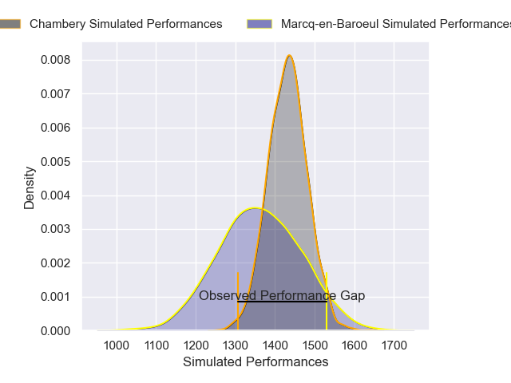
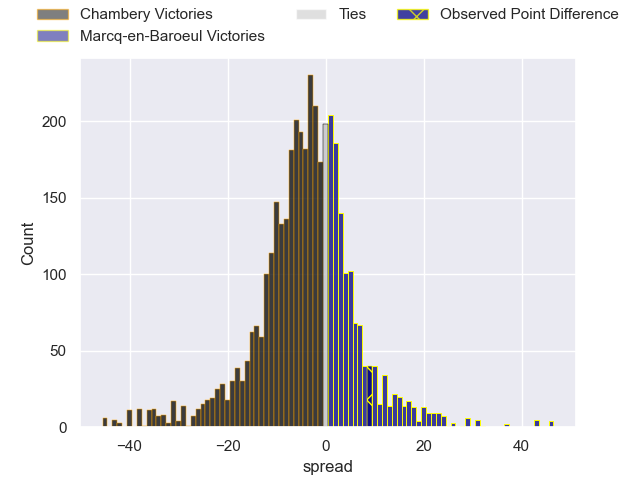
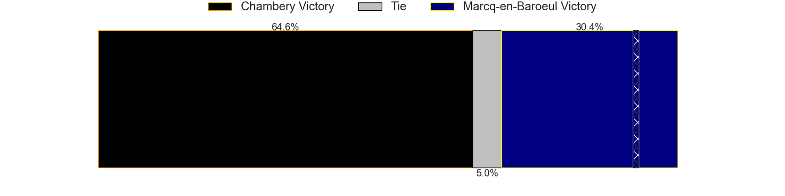
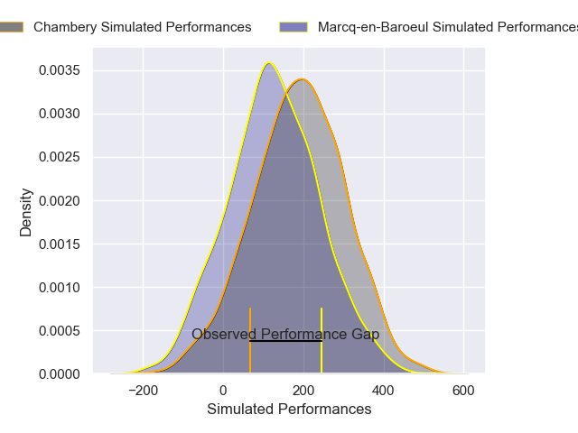
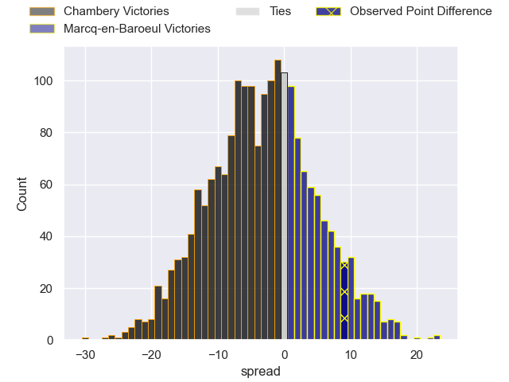
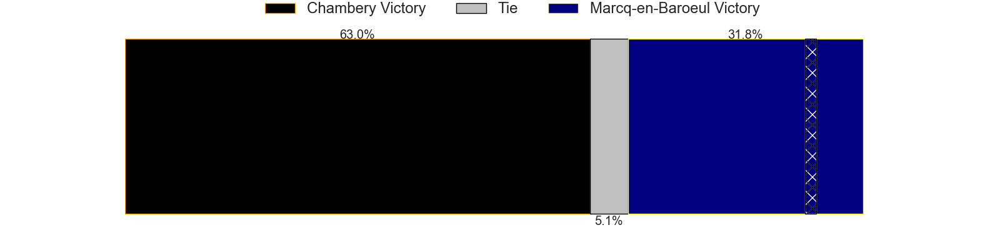

---  
layout: page  
title: Chambery at Marcq-en-Baroeul; 27-36  
date: 2025-04-26 18:00:00 -0500  
categories: "Nationale 24/25" match review  
---
# Chambery at Marcq-en-Baroeul; 27-36

# Club Level Predictions

The first set of predictions treats a club as the smallest object, as the club develops its members, organizes a gameplan, and deploys its players as needed for each match. This club model has a prediction of 0.404, which translates to predicting Chambery to win by 3.4.

Our Over/Under is 53.5 - and combined with the spread above, we have a predicted scoreline of 28 to 25

Each club has a rating and a rating deviation (similar to a Glicko rating), and expected performances can be generated. This allows for simulated matches and spreads like the ones below.
## Projected Performances - Club Model

## Projected Spreads - Club Model

## Projected Results - Club Model

# Player Level Predictions

Treating teams instead as an entity made up of the currently active players, I have ratings for each player in an altogether different system. These can be combined to form team ratings once teamsheets are announced, weighting starters a bit higher than the reserves. After the match is played, players can be weighted by their minutes on the field, allowing for an accurate measure of the team's composition. With these compiled team ratings, we can make predictions, measure inaccuracy, and update the individual player ratings.
## Prediction without Player Minutes: Chambery by 5.0

Chambery by 7.3 on a neutral pitch

## Projected Performances - Player Model

## Projected Spreads - Player Model

## Projected Results - Player Model

|   Away Minutes | Away Player              |   Away Percentile |   Number |   Home Percentile | Home Player              |   Home Minutes |
|---------------:|:-------------------------|------------------:|---------:|------------------:|:-------------------------|---------------:|
|           80   | Gela Murusidze           |             72.09 |        1 |             74.74 | Eli Serra-Miglietti      |             80 |
|           80   | Yan Tabarot              |             58.04 |        2 |             69.93 | Joseph Reynaud           |             80 |
|           50   | Baptiste Collet          |             75.38 |        3 |             37.45 | Victor-Fy Balas Burel    |             31 |
|           57   | Fabien Witz              |             66.67 |        4 |             65.37 | Antoine Delaporte        |             33 |
|           57   | Corentin Astier          |             74.56 |        5 |             58.5  | Jean-Baptiste Rende      |             80 |
|           51   | Antoine Ferreira         |             18.28 |        6 |             78.09 | Joachim Beaumont         |             80 |
|           47   | Marc Essoh               |             35.02 |        7 |             59.62 | Cedric Yonkeu            |             48 |
|           32   | Pierre-Nicolas Dance     |             77.73 |        8 |             74.37 | Maxime Danton            |             80 |
|           25.5 | Mateo Guerret            |             61.6  |        9 |             71.67 | Dylan Nocete             |             29 |
|           18   | Joseph Exshaw            |             55.21 |       10 |             56.24 | Paul Decavel             |             29 |
|           53   | Thomas Hecquet           |             72.08 |       11 |              9.27 | Ervin Muric              |             62 |
|           80   | Mickael Blanc            |             38    |       12 |             52.5  | Mark Erasmus             |             32 |
|           80   | Emmanuel Vaitulukina     |             77.63 |       13 |             18.59 | Hugo Detre               |             80 |
|           21   | Va'aufauese Apelu Maliko |             71.41 |       14 |             22.18 | Dany Antunes             |             43 |
|           27   | Enzo Marzocca            |             56.91 |       15 |             55.46 | Patrick Fleming Dewhirst |              4 |
|           64   | Enzo Segui               |             59.34 |       16 |            nan    | Bruno Vliegen            |             19 |
|           23   | Julien Pierdomenico      |             61.19 |       17 |             31.82 | Mateo Saint-Germain      |             14 |
|           11   | Leonard Reis             |            nan    |       18 |             75.7  | Sive Mazosiwe            |             34 |
|           24   | Ahmed Tidiane Kane       |             78.37 |       19 |             40.2  | Lucio Anconetani         |             55 |
|           11   | Matheo Triki             |             91.39 |       20 |             48.71 | Arthur Bruges            |             51 |
|           80   | Thomas Gaitaz            |            nan    |       21 |             19.02 | Serafin Bordoli          |             29 |
|           51   | Aubin Eymeri             |             35.49 |       22 |             56.6  | Hugues Crespo            |             80 |
|           27   | Louis Salerno            |            nan    |       23 |             52.37 | Nino Maso                |             51 |

