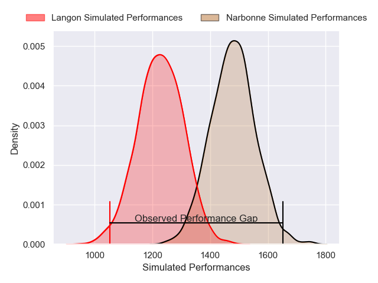
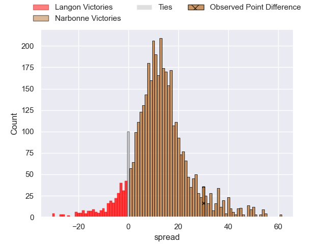
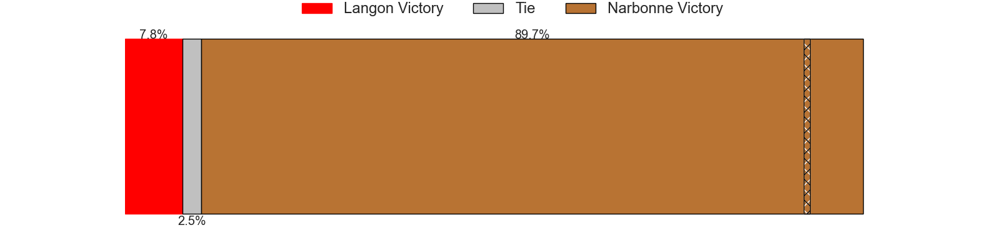
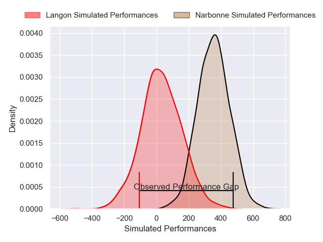
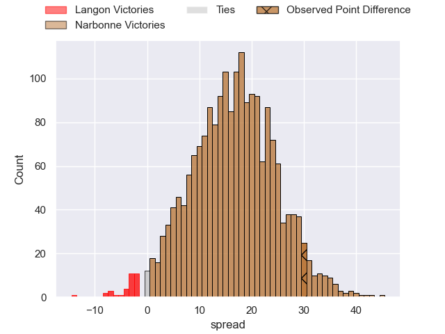
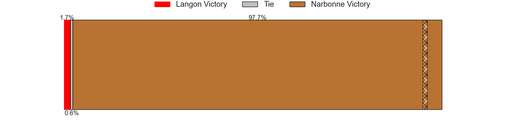

---  
layout: page  
title: Langon at Narbonne; 31-61  
date: 2025-04-26 18:00:00 -0500  
categories: "Nationale 24/25" match review  
---
# Langon at Narbonne; 31-61

# Club Level Predictions

The first set of predictions treats a club as the smallest object, as the club develops its members, organizes a gameplan, and deploys its players as needed for each match. This club model has a prediction of 0.804, which translates to predicting Narbonne to win by 12.6.

Our Over/Under is 46.5 - and combined with the spread above, we have a predicted scoreline of 17 to 29

Each club has a rating and a rating deviation (similar to a Glicko rating), and expected performances can be generated. This allows for simulated matches and spreads like the ones below.
## Projected Performances - Club Model

## Projected Spreads - Club Model

## Projected Results - Club Model

# Player Level Predictions

Treating teams instead as an entity made up of the currently active players, I have ratings for each player in an altogether different system. These can be combined to form team ratings once teamsheets are announced, weighting starters a bit higher than the reserves. After the match is played, players can be weighted by their minutes on the field, allowing for an accurate measure of the team's composition. With these compiled team ratings, we can make predictions, measure inaccuracy, and update the individual player ratings.
## Prediction without Player Minutes: Narbonne by 16.2

Narbonne by 2.9 on a neutral pitch

## Projected Performances - Player Model

## Projected Spreads - Player Model

## Projected Results - Player Model

|   Away Minutes | Away Player               |   Away Percentile |   Number |   Home Percentile | Home Player               |   Home Minutes |
|---------------:|:--------------------------|------------------:|---------:|------------------:|:--------------------------|---------------:|
|             80 | Jose Novak                |             23.58 |        1 |             30.55 | Gregory Fichten           |             41 |
|             80 | Maxime Lancon             |             16.26 |        2 |             16.08 | Clément Esteriola         |             16 |
|             29 | Emiliano Coria Marchetti  |             28.07 |        3 |             76.18 | Jérémy Boyadjis           |             80 |
|             80 | Simon Lobjoit             |             22.75 |        4 |             70.57 | Marius Antonescu          |             16 |
|             29 | Helmi Mimouna             |             22.93 |        5 |             10.96 | Leva Fifita               |             33 |
|             31 | Jules Depoortere          |             62.87 |        6 |             67.66 | Thibault Clauzade         |             33 |
|             80 | Ludovic Sempé             |             16.84 |        7 |              3.25 | Paul Belzons              |             33 |
|             55 | Thomas Mendy              |             23.53 |        8 |              6.3  | Charles Malet             |             33 |
|              3 | Bastien Cazale-Debat      |             57.17 |        9 |              7.85 | Pierrick Nova             |             39 |
|             30 | Vincent Debladis          |              7.16 |       10 |              6.75 | Gilles Bosch              |             68 |
|             51 | Jean-Baptiste Bretagnolle |             18.36 |       11 |             83.94 | Clément Clavières         |             80 |
|             80 | Aurelien Tamagnan         |             23.08 |       12 |             62.61 | Parataiso Silafai-Lea'ana |              8 |
|             32 | Sionasa Vunisa            |             76.71 |       13 |             99.8  | Peter Betham              |             47 |
|             80 | Matthis Lieures           |             38.24 |       14 |             61.85 | Daniel Ikpefan            |             80 |
|             59 | Baptiste Castanier        |             16.29 |       15 |             39.18 | Thibault Santoro          |             80 |
|             51 | Maxime Lartigue           |             38.62 |       16 |             70.14 | Pablo Barbaste            |             31 |
|             51 | Loïc Clave                |             15.8  |       17 |             53.95 | Morgan Maga               |             80 |
|             51 | Clement Renaud            |              9.09 |       18 |             34.88 | Jamie Hagan               |             69 |
|              6 | Vincent Bouet             |            nan    |       19 |             23.72 | Tom Chauvet               |             21 |
|             40 | Nathan Lobjoit            |             38.47 |       20 |             82.39 | Luke Nakobukobua          |             29 |
|             80 | Guillaume Christophe      |             28.91 |       21 |            nan    | Théo Mias                 |             27 |
|             50 | Bastien Darriet           |            nan    |       22 |             77.87 | Théo Castinel             |             29 |
|             73 | Guillaume Marin           |             50.79 |       23 |            nan    | nan                       |            nan |

