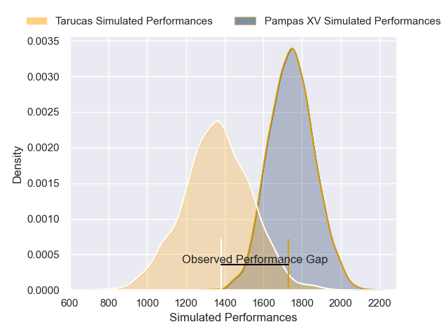
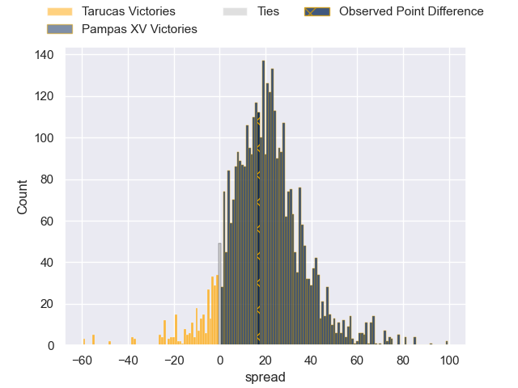
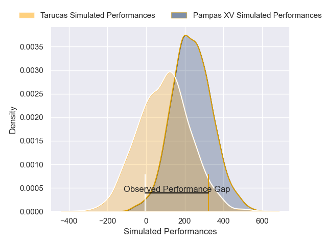
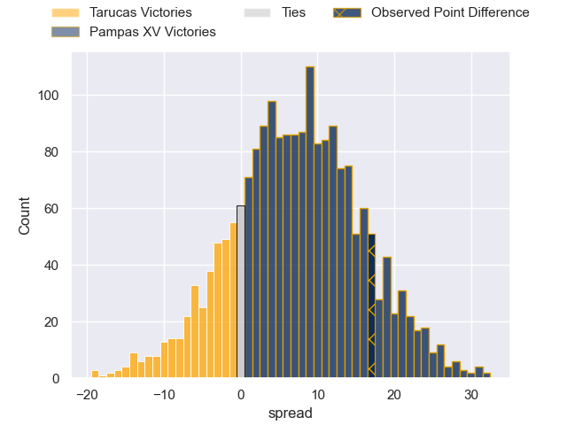

---  
layout: page  
title: Tarucas at Pampas XV; 22-39  
date: 2025-04-26 18:00:00 -0500  
categories: "Super Rugby Americas 2025" match review  
---
# Tarucas at Pampas XV; 22-39

# Club Level Predictions

The first set of predictions treats a club as the smallest object, as the club develops its members, organizes a gameplan, and deploys its players as needed for each match. This club model has a prediction of 0.876, which translates to predicting Pampas XV to win by 19.3.

Our Over/Under is 53.5 - and combined with the spread above, we have a predicted scoreline of 17 to 37

Each club has a rating and a rating deviation (similar to a Glicko rating), and expected performances can be generated. This allows for simulated matches and spreads like the ones below.
## Projected Performances - Club Model

## Projected Spreads - Club Model

## Projected Results - Club Model

# Player Level Predictions

Treating teams instead as an entity made up of the currently active players, I have ratings for each player in an altogether different system. These can be combined to form team ratings once teamsheets are announced, weighting starters a bit higher than the reserves. After the match is played, players can be weighted by their minutes on the field, allowing for an accurate measure of the team's composition. With these compiled team ratings, we can make predictions, measure inaccuracy, and update the individual player ratings.
## Prediction without Player Minutes: Pampas XV by 8.3

Pampas XV by 6.0 on a neutral pitch

## Projected Performances - Player Model

## Projected Spreads - Player Model

## Projected Results - Player Model

|   Away Minutes | Away Player             |   Away Percentile |   Number |   Home Percentile | Home Player               |   Home Minutes |
|---------------:|:------------------------|------------------:|---------:|------------------:|:--------------------------|---------------:|
|             20 | Benjamin Garrido        |             27.35 |        1 |             88.69 | Matias Medrano            |             55 |
|             80 | Tomas Bartolini         |             36.01 |        2 |             92.31 | Ignacio Bottazzini        |             80 |
|             46 | Francisco Moreno        |             54.53 |        3 |             84.44 | Tomas Rapetti             |             57 |
|             26 | Alvaro Garcia Iandolino |             62.77 |        4 |             85.89 | Juan Penoucos             |             13 |
|             60 | Luciano Asevedo         |             27.21 |        5 |             21.91 | Federico Ignacio Lavanini |             37 |
|             80 | Facundo Javier Cardozo  |             35.41 |        6 |             72.82 | Manuel Bernstein          |             23 |
|             80 | Agustin Sarelli         |             28.71 |        7 |             81.05 | Nicolas Damorim           |             54 |
|             67 | Santiago Aguilar        |             23.74 |        8 |             22.06 | Juan Cruz Perez Rachel    |             61 |
|             20 | Simon Benitez Cruz      |             76.62 |        9 |             30.38 | Eliseo Morales Abraham    |             12 |
|             80 | Nicolas Roger           |             17.38 |       10 |             19.63 | Estanislao Renthel        |             15 |
|             16 | Tomas Vanni             |              8.41 |       11 |             50.57 | Nahuel Clausen            |             26 |
|             26 | Tomas Medina            |             64.56 |       12 |             89.99 | Justo Piccardo            |             40 |
|             60 | José Gianotti           |             25.94 |       13 |             72.73 | Bruno Heit                |             55 |
|             68 | Baltazar Garcia         |              8.22 |       14 |             76.29 | Alfonso Latorre           |             19 |
|             54 | Stefano Ferro           |             29.69 |       15 |             20.82 | Jeronimo Solveyra         |             25 |
|             80 | Julian Martin           |            nan    |       16 |             80.59 | Miguel Prince             |              7 |
|             15 | Rodrigo Navarro         |             31.76 |       17 |             87.41 | Bautista Bosch            |             67 |
|             80 | Thiago Sbrocco          |             27.31 |       18 |             22.06 | Francisco Quinn           |             80 |
|             80 | Santiago Romano         |            nan    |       19 |             86.52 | Mateo Albanese            |             13 |
|             80 | Juan Manuel Vivas       |             63.29 |       20 |             75.67 | Franco Carrera            |             80 |
|             68 | Estanislao Pregot       |             32.08 |       21 |             80.25 | Juan Pedro Bernasconi     |             80 |
|             54 | Juan Manuel Molinuevo   |            nan    |       22 |             68.26 | Ignacio Inchauspe         |             40 |
|             73 | Bautista Estofan        |             22.06 |       23 |             75    | Francisco Lusarreta       |             61 |

