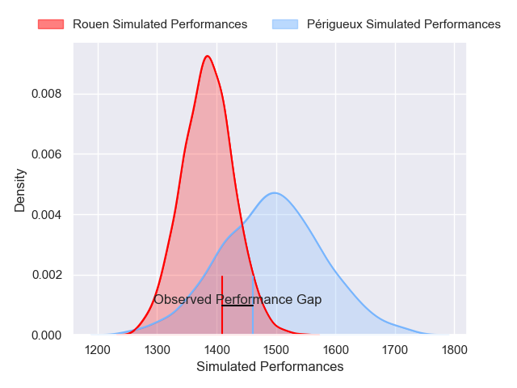
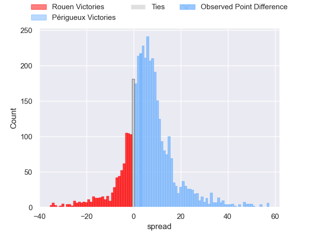
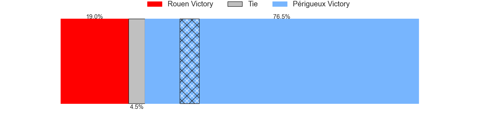
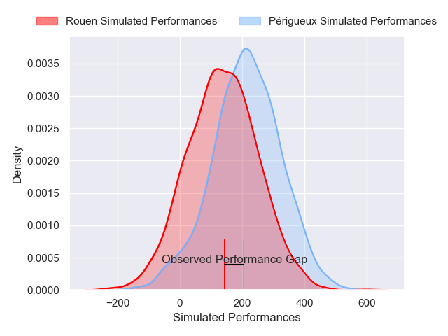
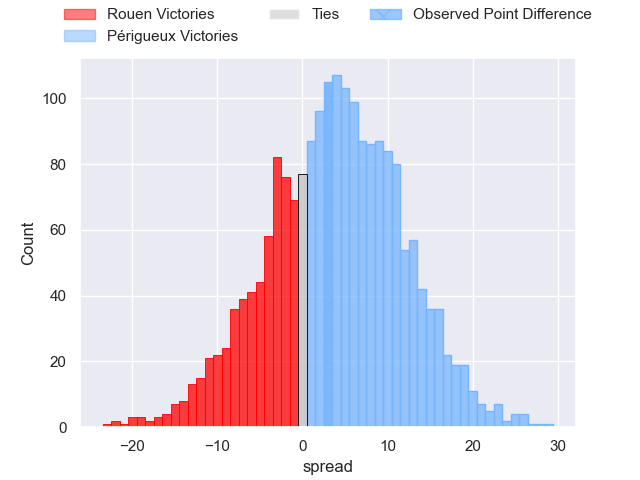

---  
layout: page  
title: Rouen at Perigueux; 25-28  
date: 2025-04-26 18:00:00 -0500  
categories: "Nationale 24/25" match review  
---
# Rouen at Perigueux; 25-28

# Club Level Predictions

The first set of predictions treats a club as the smallest object, as the club develops its members, organizes a gameplan, and deploys its players as needed for each match. This club model has a prediction of 0.651, which translates to predicting Périgueux to win by 5.5.

Our Over/Under is 46.5 - and combined with the spread above, we have a predicted scoreline of 20 to 26

Each club has a rating and a rating deviation (similar to a Glicko rating), and expected performances can be generated. This allows for simulated matches and spreads like the ones below.
## Projected Performances - Club Model

## Projected Spreads - Club Model

## Projected Results - Club Model

# Player Level Predictions

Treating teams instead as an entity made up of the currently active players, I have ratings for each player in an altogether different system. These can be combined to form team ratings once teamsheets are announced, weighting starters a bit higher than the reserves. After the match is played, players can be weighted by their minutes on the field, allowing for an accurate measure of the team's composition. With these compiled team ratings, we can make predictions, measure inaccuracy, and update the individual player ratings.
## Prediction without Player Minutes: Périgueux by 3.9

Périgueux by 0.9 on a neutral pitch

## Projected Performances - Player Model

## Projected Spreads - Player Model

## Projected Results - Player Model

|   Away Minutes | Away Player           |   Away Percentile |   Number |   Home Percentile | Home Player         |   Home Minutes |
|---------------:|:----------------------|------------------:|---------:|------------------:|:--------------------|---------------:|
|             30 | Ewan Clément          |             56.05 |        1 |             72.81 | Emilien Borges      |           69   |
|              6 | Mathieu Bonnot        |             67.13 |        2 |             58.57 | Lucas Marijon       |           40   |
|             41 | Sidi-Mohammed Diallo  |             80.75 |        3 |             59.98 | Kalaveti Tawake     |           69   |
|             21 | Jean Leleu            |             64.81 |        4 |             65.18 | Clement Lanen       |           25.5 |
|             27 | Kelemete Finau        |             48.38 |        5 |             73.91 | Mathieu Pace        |           51   |
|             27 | Willy N'Diaye         |             34.93 |        6 |             62.11 | Karl Lambert        |           37   |
|              9 | Ernest Eudier         |             65.65 |        7 |             74.16 | Masivesi Dakuwaqa   |           37   |
|             27 | Lucas Costa           |             79.62 |        8 |             51.47 | Nahum Merigan       |           33   |
|              9 | Florent Campeggia     |             67.92 |        9 |             33.62 | Max Green           |           80   |
|             18 | Maxime Javaux         |             80.57 |       10 |             71.98 | Greg Hutley         |           11   |
|             48 | Kevin Bly             |             92.26 |       11 |             83.08 | Tim Giresse         |           11   |
|             60 | Marin Boulier         |             61.49 |       12 |             86.72 | Cyril Couturier     |           26   |
|             53 | Opetera Peleseuma     |             18.18 |       13 |             67.01 | Dorian Lavernhe     |           40   |
|             80 | Sakiusa Bureitakiyaca |             76.96 |       14 |             79.45 | Vincent Fouillade   |           43   |
|             51 | Aloïs Chayla          |             62.89 |       15 |             62.06 | Yon Camou           |           80   |
|             26 | Noe Khier             |             75.46 |       16 |             30.23 | Jason Tindiliere    |            0   |
|             80 | Axel Malaret          |             60.99 |       17 |            nan    | Louis Martin        |           60   |
|             80 | Khvicha Tsopurashvili |             61.03 |       18 |            nan    | Martin Augeix       |           43   |
|             57 | Octave Leleu          |             28.88 |       19 |             70.47 | Raphaël Vieilledent |           62   |
|             29 | Abdelkarim Fofana     |             80.88 |       20 |             22.47 | Jaco Willemse       |           68   |
|             80 | Ilan El Khattabi      |             23.72 |       21 |             28.5  | Nicolas Faltrept    |           68   |
|             67 | Theo Dachary          |              8.78 |       22 |             34.93 | Nicolas Piaton      |           80   |
|             80 | Benjamin Descamps     |             82.6  |       23 |             41.1  | Anderson Neisen     |           54   |

