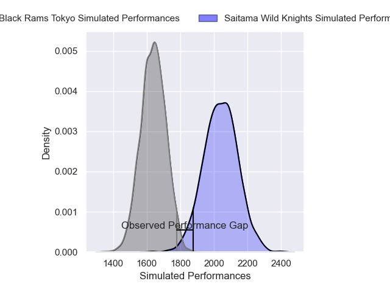
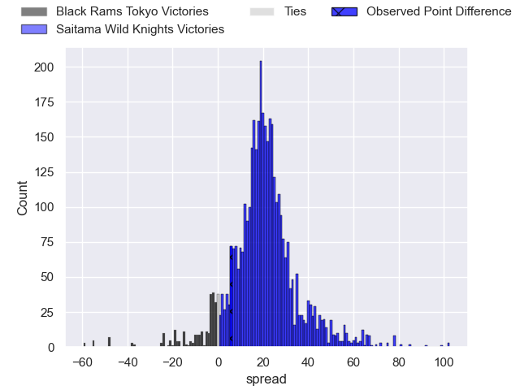
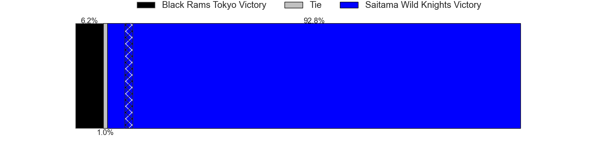
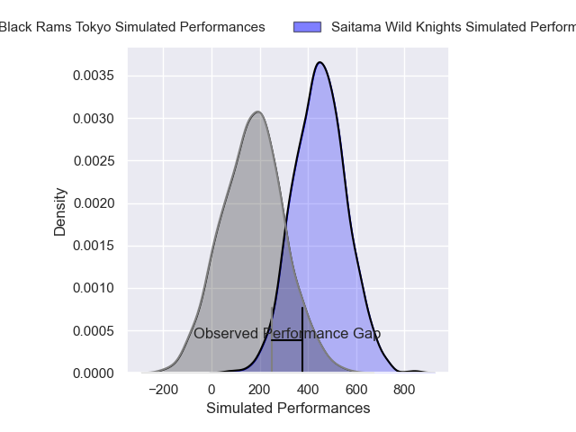
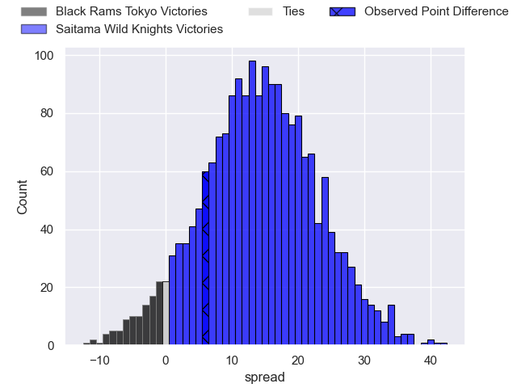

---  
layout: page  
title: Black Rams Tokyo at Saitama Wild Knights; 21-27  
date: 2025-04-26 18:00:00 -0500  
categories: "Japan Rugby League One 24/25" match review  
---
# Black Rams Tokyo at Saitama Wild Knights; 21-27

# Club Level Predictions

The first set of predictions treats a club as the smallest object, as the club develops its members, organizes a gameplan, and deploys its players as needed for each match. This club model has a prediction of 0.905, which translates to predicting Saitama Wild Knights to win by 20.1.

Our Over/Under is 56.5 - and combined with the spread above, we have a predicted scoreline of 18 to 38

Each club has a rating and a rating deviation (similar to a Glicko rating), and expected performances can be generated. This allows for simulated matches and spreads like the ones below.
## Projected Performances - Club Model

## Projected Spreads - Club Model

## Projected Results - Club Model

# Player Level Predictions

Treating teams instead as an entity made up of the currently active players, I have ratings for each player in an altogether different system. These can be combined to form team ratings once teamsheets are announced, weighting starters a bit higher than the reserves. After the match is played, players can be weighted by their minutes on the field, allowing for an accurate measure of the team's composition. With these compiled team ratings, we can make predictions, measure inaccuracy, and update the individual player ratings.
## Prediction without Player Minutes: Saitama Wild Knights by 17.7

Saitama Wild Knights by 13.0 on a neutral pitch

## Projected Performances - Player Model

## Projected Spreads - Player Model

## Projected Results - Player Model

|   Away Minutes | Away Player       |   Away Percentile |   Number |   Home Percentile | Home Player     |   Home Minutes |
|---------------:|:------------------|------------------:|---------:|------------------:|:----------------|---------------:|
|             80 | Taishi Tsumura    |             38.33 |        1 |             97.35 | Keita Inagaki   |             67 |
|             50 | Shin Ouchi        |             59.09 |        2 |             86.36 | Atsushi Sakate  |             62 |
|             18 | Paddy Ryan        |             11.71 |        3 |             48.12 | Lisala Finau    |              9 |
|              7 | Paddy Ryan        |             11.71 |        3 |             48.12 | Lisala Finau    |              9 |
|             15 | Paddy Ryan        |             11.71 |        3 |             48.12 | Lisala Finau    |              9 |
|             62 | Mike Stolberg     |              2.32 |        4 |             79.39 | Liam Mitchell   |             21 |
|             55 | Harrison Fox      |             22.28 |        5 |             61.65 | Esei Ha'angana  |             21 |
|             80 | Brodi McCurran    |             48.8  |        6 |             92.73 | Ben Gunter      |             47 |
|             69 | Shuhei Matsuhashi |             65.26 |        7 |             98.85 | Lachlan Boshier |             29 |
|             43 | Amato Fakatava    |              3.78 |        8 |             96.85 | Jack Cornelsen  |              9 |
|             80 | TJ Perenara       |             96.59 |        9 |             93.69 | Taiki Koyama    |             13 |
|             80 | Kotaro Ito        |             30.06 |       10 |             58.08 | Kyohei Yamasawa |             80 |
|             80 | Semisi Tupou      |             44.55 |       11 |             12.33 | Tomoki Osada    |             30 |
|             80 | Yuki Ikeda        |             44.43 |       12 |             41.98 | Vince Aso       |             13 |
|             80 | Penieli Jr Latu   |             43.72 |       13 |             97.65 | Dylan Riley     |             80 |
|             20 | Taira Main        |             37    |       14 |             95.79 | Koki Takeyama   |             80 |
|             50 | Isaac Lucas       |             71.55 |       15 |             79.18 | Tom Parton      |             80 |
|             55 | Masaaki Onishi    |             63.46 |       16 |             94.96 | Itsuki Onishi   |             18 |
|             80 | Kazuma Nishi      |             47.96 |       17 |            nan    | Hayata Taniyama |             62 |
|             18 | Daigo Sasagawa    |            nan    |       18 |             98.56 | Asaeli Ai Valu  |             80 |
|             79 | Reijiro Yamamoto  |             29.81 |       19 |             97.11 | Ryuji Noguchi   |             57 |
|             25 | Shu Yamamoto      |            nan    |       20 |            nan    | Craig Millar    |             39 |
|            nan | nan               |            nan    |       21 |            nan    | Yuta Takagi     |             20 |
|            nan | nan               |            nan    |       22 |            nan    | Xavier Stowers  |             80 |

