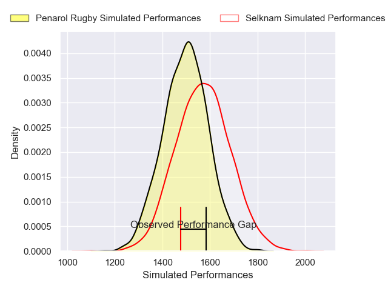
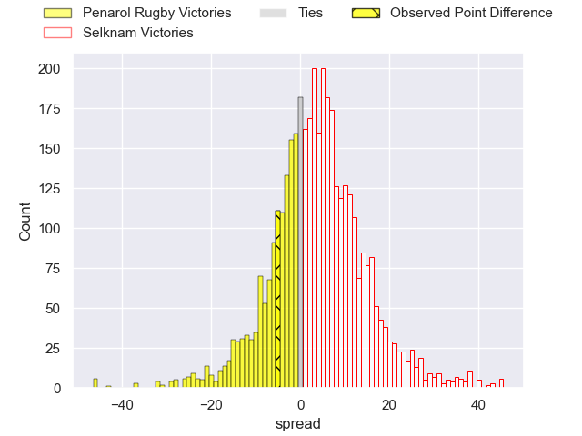
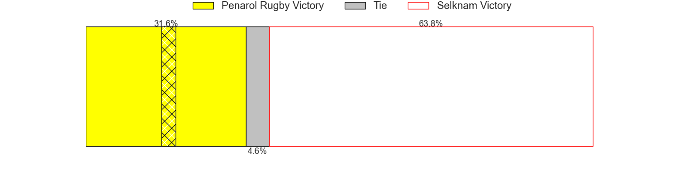
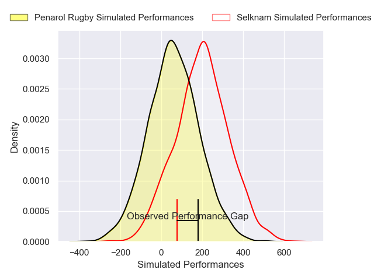
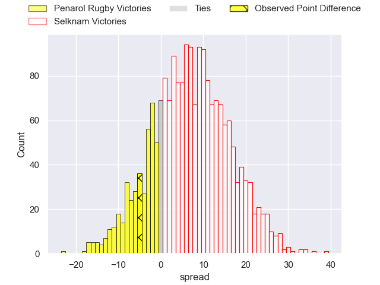
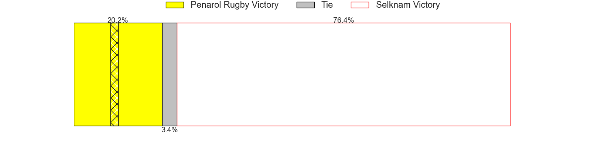

---  
layout: page  
title: Penarol Rugby at Selknam; 22-17  
date: 2025-04-26 18:00:00 -0500  
categories: "Super Rugby Americas 2025" match review  
---
# Penarol Rugby at Selknam; 22-17

# Club Level Predictions

The first set of predictions treats a club as the smallest object, as the club develops its members, organizes a gameplan, and deploys its players as needed for each match. This club model has a prediction of 0.595, which translates to predicting Selknam to win by 3.5.

Our Over/Under is 51.5 - and combined with the spread above, we have a predicted scoreline of 24 to 28

Each club has a rating and a rating deviation (similar to a Glicko rating), and expected performances can be generated. This allows for simulated matches and spreads like the ones below.
## Projected Performances - Club Model

## Projected Spreads - Club Model

## Projected Results - Club Model

# Player Level Predictions

Treating teams instead as an entity made up of the currently active players, I have ratings for each player in an altogether different system. These can be combined to form team ratings once teamsheets are announced, weighting starters a bit higher than the reserves. After the match is played, players can be weighted by their minutes on the field, allowing for an accurate measure of the team's composition. With these compiled team ratings, we can make predictions, measure inaccuracy, and update the individual player ratings.
## Prediction without Player Minutes: Selknam by 8.8

Selknam by 6.1 on a neutral pitch

## Projected Performances - Player Model

## Projected Spreads - Player Model

## Projected Results - Player Model

|   Away Minutes | Away Player                     |   Away Percentile |   Number |   Home Percentile | Home Player                 |   Home Minutes |
|---------------:|:--------------------------------|------------------:|---------:|------------------:|:----------------------------|---------------:|
|             80 | Mateo Sanguinetti               |              6.98 |        1 |             83.8  | Javier Carrasco             |             59 |
|             31 | Sebastian Perez                 |             61.89 |        2 |             14.69 | Augusto Bohme Alemparte     |             59 |
|             31 | Sebastian Perez                 |             61.89 |        2 |             14.69 | Augusto Bohme Alemparte     |             66 |
|             80 | Bautista Vidal                  |             69.69 |        3 |             67.44 | Nahuel Debiassi             |             80 |
|             14 | Felipe Aliaga                   |             62.67 |        4 |             78.46 | Santiago Pedrero Poduje     |             80 |
|             14 | Bautista Viero                  |             59.7  |        5 |             73.72 | Bruno Saez                  |              0 |
|             21 | Lucas Bianchi                   |             68.33 |        6 |             60.48 | Martin Sigren               |             58 |
|             22 | Carlos Deus                     |             57.42 |        7 |             52.44 | Raimundo Martinez Amar      |             24 |
|             55 | Manuel Diana                    |              5.67 |        8 |             82.77 | Joaquin Milesi              |             80 |
|             80 | Tomas Di Biase                  |             81.91 |        9 |              3.41 | Marcelo Torrealba           |             56 |
|             14 | Felipe Etcheverry               |             22.29 |       10 |             70.14 | Juan Cruz Reyes             |             21 |
|              0 | Ignacio Facciolo                |             35.76 |       11 |             31.36 | Matias Garafulic            |             68 |
|             66 | Bautista Farisé                 |             73.85 |       12 |             73.14 | Nicolas Saab                |             12 |
|             80 | Mateo Perillo                   |             60.88 |       13 |             70.79 | Luca Strabucchi             |             80 |
|             80 | Icaro Amarillo                  |             57.65 |       14 |             11.95 | Clemente Armstrong          |             80 |
|             80 | Justo Ferrario                  |             64.95 |       15 |             56.08 | Tomas Salas Walther         |             24 |
|             80 | Santiago Civetta                |             43.35 |       16 |            nan    | Manuel Bustamante           |             80 |
|             80 | Francsico Suarez                |            nan    |       17 |             37.2  | Benjamin Videla             |             12 |
|             59 | Alfonso Perillo Albarracin      |             49.13 |       18 |            nan    | Salvador Lues Soto          |             80 |
|             21 | Juan Francisco Aguirre Gallardo |             51.16 |       19 |             58.46 | Baltazar Gurruchaga         |             11 |
|             80 | Santiago Alvarez                |             58.87 |       20 |             72.32 | Clemente Saavedra Cartajena |             80 |
|             25 | Manuel Rosmarino                |             33.52 |       21 |              1.39 | Agustin Toth                |             49 |
|            nan | nan                             |            nan    |       22 |            nan    | Gonzalo Lara                |             66 |

