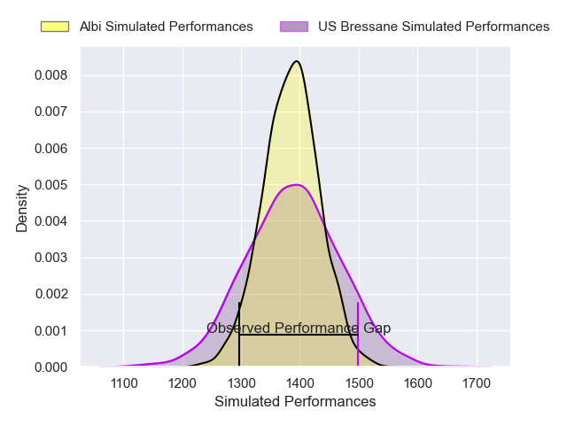
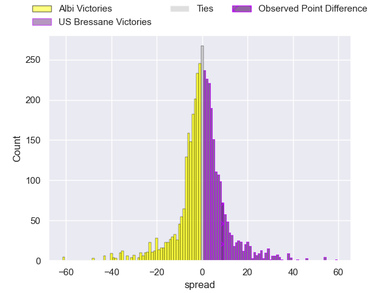
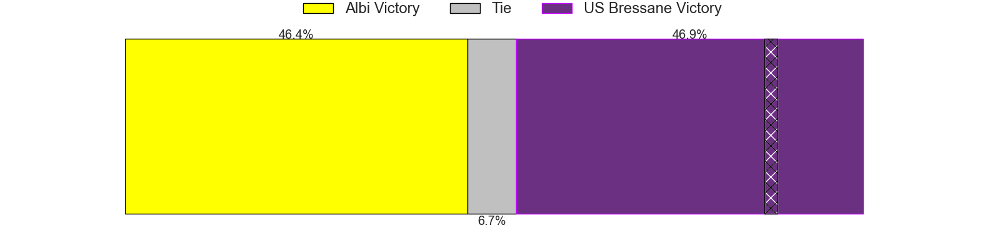
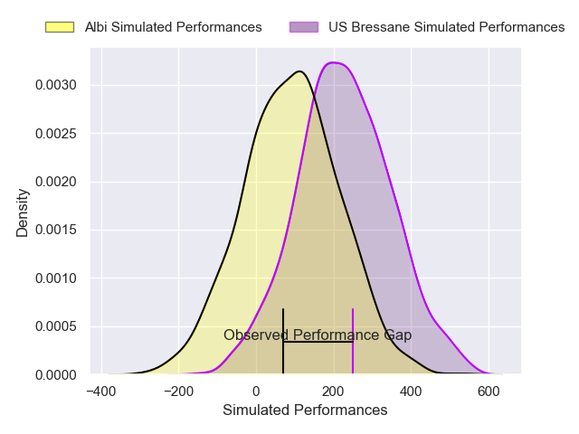
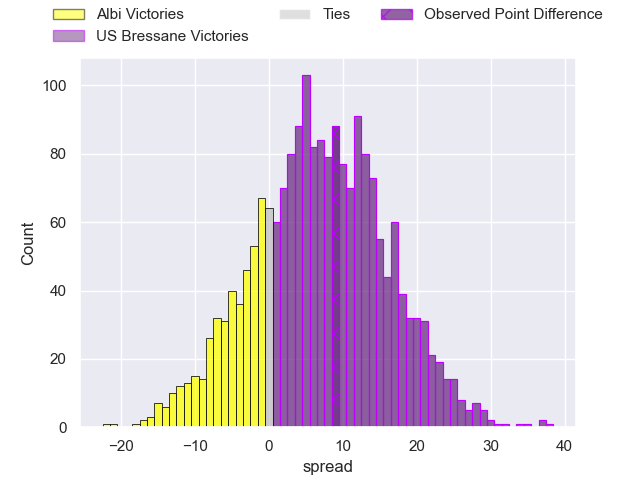
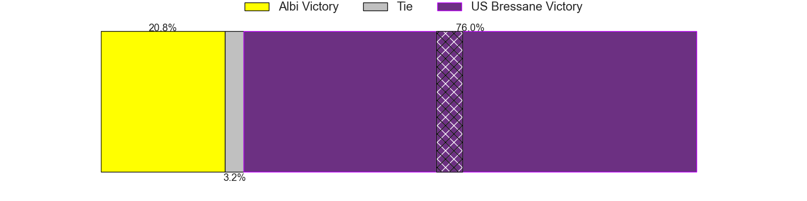

---  
layout: page  
title: Albi at US Bressane; 33-42  
date: 2025-04-26 18:00:00 -0500  
categories: "Nationale 24/25" match review  
---
# Albi at US Bressane; 33-42

# Club Level Predictions

The first set of predictions treats a club as the smallest object, as the club develops its members, organizes a gameplan, and deploys its players as needed for each match. This club model has a prediction of 0.505, which translates to predicting US Bressane to win by 0.2.

Our Over/Under is 36.5 - and combined with the spread above, we have a predicted scoreline of 18 to 18

Each club has a rating and a rating deviation (similar to a Glicko rating), and expected performances can be generated. This allows for simulated matches and spreads like the ones below.
## Projected Performances - Club Model

## Projected Spreads - Club Model

## Projected Results - Club Model

# Player Level Predictions

Treating teams instead as an entity made up of the currently active players, I have ratings for each player in an altogether different system. These can be combined to form team ratings once teamsheets are announced, weighting starters a bit higher than the reserves. After the match is played, players can be weighted by their minutes on the field, allowing for an accurate measure of the team's composition. With these compiled team ratings, we can make predictions, measure inaccuracy, and update the individual player ratings.
## Prediction without Player Minutes: US Bressane by 5.7

US Bressane by 0.2 on a neutral pitch

## Projected Performances - Player Model

## Projected Spreads - Player Model

## Projected Results - Player Model

|   Away Minutes | Away Player       |   Away Percentile |   Number |   Home Percentile | Home Player          |   Home Minutes |
|---------------:|:------------------|------------------:|---------:|------------------:|:---------------------|---------------:|
|             80 | Kevin Tougne      |             18.63 |        1 |             59.85 | Teo Bordenave        |             60 |
|             13 | Reinach Venter    |             17.64 |        2 |             16.44 | Arnaud Feltrin       |             80 |
|             76 | Thomas Cretu      |             16.49 |        3 |             46.33 | Vazha Kapanadze      |             80 |
|             63 | Theo Mercadier    |             40.55 |        4 |             14.12 | Quentin Witt         |             47 |
|             80 | Vincent Mutel     |             72.14 |        5 |              4.96 | Victor Fromenteze    |             64 |
|             17 | Robin Dione       |             54.19 |        6 |             88.16 | Lucas Lyons          |             70 |
|             57 | Guillem Calmon    |             29.55 |        7 |             76.13 | Nail Ait Naceur      |             80 |
|             48 | Camille Jarreau   |             29.87 |        8 |             81.36 | Wael May             |             53 |
|             25 | Ruben Courties    |             55.56 |        9 |             58.63 | Jeremie Martin       |             50 |
|             25 | Théo Vidal        |             81.91 |       10 |             25.36 | Nathan Azais         |             80 |
|             80 | Simeon Soenen     |             55.42 |       11 |             26.62 | Élie De Fleurian     |             73 |
|             67 | Leo Treilles      |             11.95 |       12 |             48.11 | Benjamin Doy         |             34 |
|             55 | Gabriel Aviragnet |             54.95 |       13 |             54.65 | Joe Margetts         |             80 |
|             80 | Simon Hartmann    |             75.18 |       14 |             28.7  | Alexandre Badet      |             80 |
|             80 | Matis Pacchiana   |             50.93 |       15 |             79.5  | Florent Massip       |             80 |
|             55 | Dimitri Chauvet   |             32.36 |       16 |             52.35 | Erich de Jager       |             34 |
|             50 | Antoine Soave     |             54.16 |       17 |             84.93 | Clement Jullien      |             34 |
|             80 | Esteban Talalua   |             44.02 |       18 |             15    | Atonio Ulutuipalelei |             46 |
|             15 | Antoine Frambourg |            nan    |       19 |             61.5  | Thomas Déliance      |              0 |
|             48 | Elio Yves         |             46.61 |       20 |             86.86 | Loic Baradel         |             30 |
|             30 | Gilen Queheille   |             64.96 |       21 |             70.13 | Pierre Reynaud       |             30 |
|             30 | Victor Pisano     |             23.91 |       22 |             86.28 | Fred Zeilinga        |             60 |
|             13 | Victorien Jacomme |             40.45 |       23 |             68.95 | Dimitri Doucet       |              7 |

