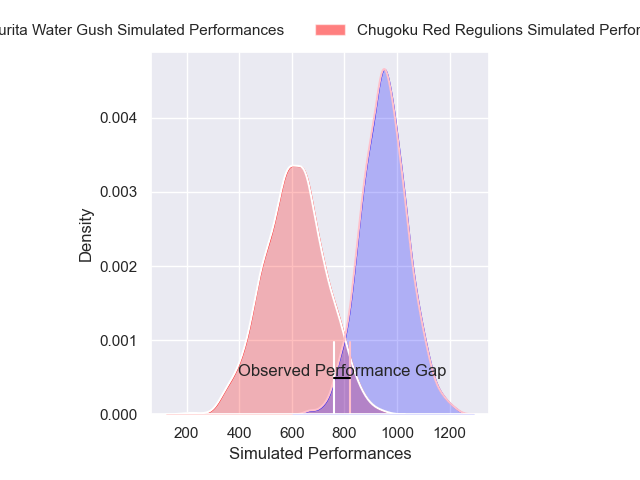
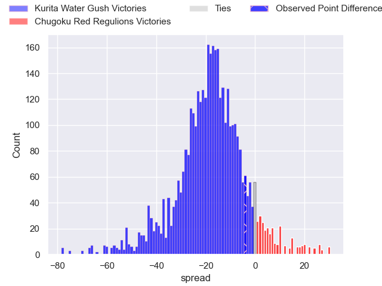
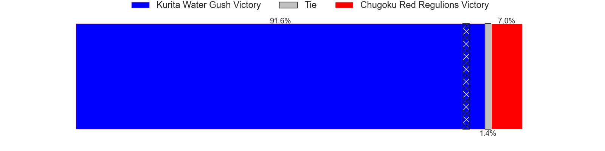
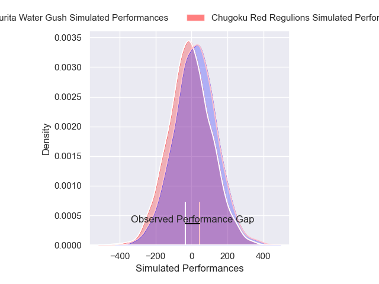
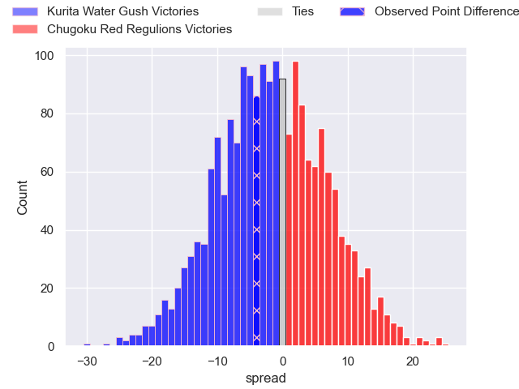
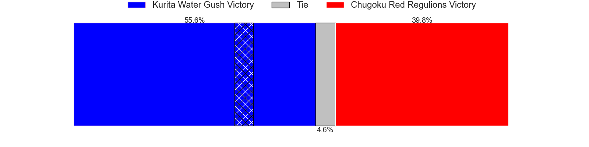

---  
layout: page  
title: Kurita Water Gush at Chugoku Red Regulions; 38-34  
date: 2025-04-27 18:00:00 -0500  
categories: "Japan Rugby League One D3 24/25" match review  
---
# Kurita Water Gush at Chugoku Red Regulions; 38-34

# Club Level Predictions

The first set of predictions treats a club as the smallest object, as the club develops its members, organizes a gameplan, and deploys its players as needed for each match. This club model has a prediction of 0.129, which translates to predicting Kurita Water Gush to win by 17.3.

Our Over/Under is 68.5 - and combined with the spread above, we have a predicted scoreline of 43 to 26

Each club has a rating and a rating deviation (similar to a Glicko rating), and expected performances can be generated. This allows for simulated matches and spreads like the ones below.
## Projected Performances - Club Model

## Projected Spreads - Club Model

## Projected Results - Club Model

# Player Level Predictions

Treating teams instead as an entity made up of the currently active players, I have ratings for each player in an altogether different system. These can be combined to form team ratings once teamsheets are announced, weighting starters a bit higher than the reserves. After the match is played, players can be weighted by their minutes on the field, allowing for an accurate measure of the team's composition. With these compiled team ratings, we can make predictions, measure inaccuracy, and update the individual player ratings.
## Prediction without Player Minutes: Kurita Water Gush by 5.6

Kurita Water Gush by 8.5 on a neutral pitch

## Projected Performances - Player Model

## Projected Spreads - Player Model

## Projected Results - Player Model

|   Away Minutes | Away Player          |   Away Percentile |   Number |   Home Percentile | Home Player          |   Home Minutes |
|---------------:|:---------------------|------------------:|---------:|------------------:|:---------------------|---------------:|
|             14 | Kei Takusagawa       |             64.47 |        1 |             53.41 | Haruki Miyata        |             35 |
|             70 | Kota Hojo            |             77.62 |        2 |              2.97 | Kentaro Iwanaga      |             80 |
|             15 | Rui Kuriyama         |             42.42 |        3 |             24.22 | Kento Miyata         |             80 |
|             20 | Kota Nakamura        |              4.18 |        4 |              0.37 | Taro Nishikawa       |             72 |
|             20 | Daymon Leasuasu      |              1.67 |        5 |             17.08 | Tomonari Aoki        |             30 |
|             30 | Yoji Shiina          |             73.78 |        6 |             19.33 | Kota Moriyama        |             35 |
|             80 | Taisei Nakao         |             47.75 |        7 |              1.15 | Kohei Matsunaga      |             58 |
|             17 | Teariki Ben-Nicholas |             51.68 |        8 |              6.93 | Shintaro Matsuda     |             10 |
|              0 | Kakeru Sugihara      |             53.07 |        9 |              6.83 | Rintaro Kawashima    |             25 |
|             56 | Piers Francis        |              7.98 |       10 |              4.29 | Hashizo Yoshida      |             24 |
|             33 | Keigo Hamazoe        |              7.93 |       11 |              1.63 | Masahiro Nakano      |             80 |
|             29 | Leo Gordon           |             76.92 |       12 |             10.01 | Shinya Hirayama      |             20 |
|             80 | Daiki Yokota         |             60.06 |       13 |             53.42 | Syougo Azuma         |             80 |
|             60 | Kai Yamamoto         |             50.29 |       14 |             12.05 | Kentaro Fujii        |             80 |
|             45 | Yuta Sugiyama        |             69.28 |       15 |              4.33 | Yuto Matsuoka        |             27 |
|             80 | Kengo Nakamura       |              6.41 |       16 |            nan    | Hirofumi Higashikawa |             80 |
|             64 | Kentaro Sugimori     |              3.44 |       17 |             63.06 | Hayato Moriyama      |             65 |
|             71 | Aki Kajiwara         |            nan    |       18 |             51.75 | Sebastian Sialau     |             80 |
|             66 | Ryutaro Iguchi       |            nan    |       19 |            nan    | Connor Anderson      |             40 |
|             80 | Shohei Tsujimura     |             73.86 |       20 |             14.68 | Kojiro Arito         |             20 |
|             67 | Shinpei Suganuma     |              8.59 |       21 |            nan    | Motoki Arai          |             80 |
|             53 | Hiroki Kawase        |            nan    |       22 |            nan    | Yuta Nishihama       |             57 |
|             72 | Ryo Omasa            |            nan    |       23 |            nan    | Riku Iwai            |             47 |

