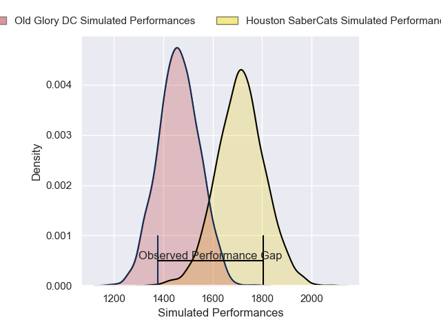
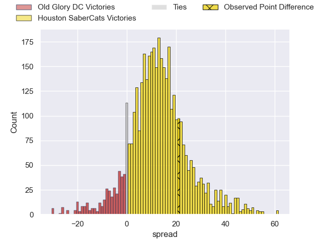
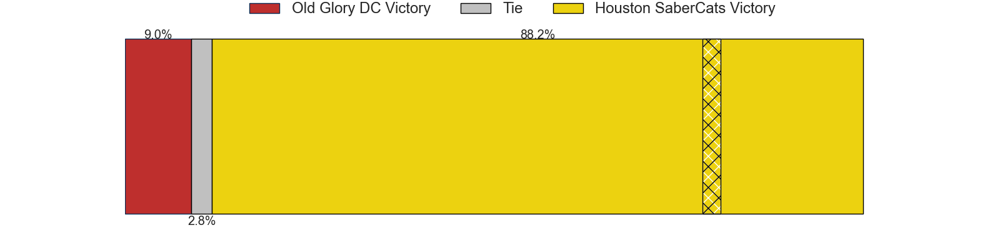
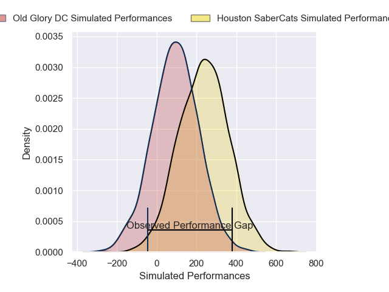
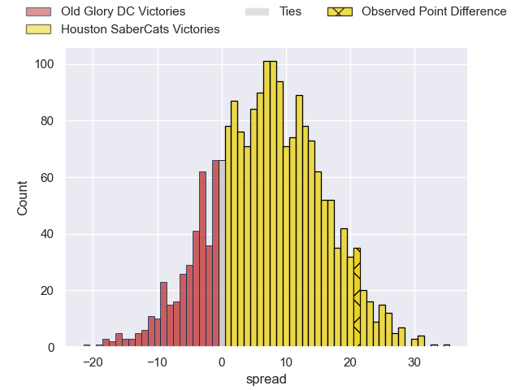
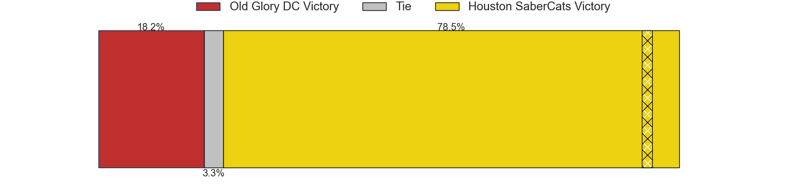

---  
layout: page  
title: Old Glory DC at Houston SaberCats; 27-48  
date: 2025-04-27 18:00:00 -0500  
categories: "Major League Rugby 2025" match review  
---
# Old Glory DC at Houston SaberCats; 27-48

# Club Level Predictions

The first set of predictions treats a club as the smallest object, as the club develops its members, organizes a gameplan, and deploys its players as needed for each match. This club model has a prediction of 0.801, which translates to predicting Houston SaberCats to win by 12.5.

Our Over/Under is 55.5 - and combined with the spread above, we have a predicted scoreline of 21 to 34

Each club has a rating and a rating deviation (similar to a Glicko rating), and expected performances can be generated. This allows for simulated matches and spreads like the ones below.
## Projected Performances - Club Model

## Projected Spreads - Club Model

## Projected Results - Club Model

# Player Level Predictions

Treating teams instead as an entity made up of the currently active players, I have ratings for each player in an altogether different system. These can be combined to form team ratings once teamsheets are announced, weighting starters a bit higher than the reserves. After the match is played, players can be weighted by their minutes on the field, allowing for an accurate measure of the team's composition. With these compiled team ratings, we can make predictions, measure inaccuracy, and update the individual player ratings.
## Prediction without Player Minutes: Houston SaberCats by 8.4

Houston SaberCats by 4.9 on a neutral pitch

## Projected Performances - Player Model

## Projected Spreads - Player Model

## Projected Results - Player Model

|   Away Minutes | Away Player              |   Away Percentile |   Number |   Home Percentile | Home Player            |   Home Minutes |
|---------------:|:-------------------------|------------------:|---------:|------------------:|:-----------------------|---------------:|
|             80 | Jack Iscaro              |              8.5  |        1 |             72.17 | Ezekiel Lindenmuth     |             49 |
|             54 | Martin Vaca              |             63.11 |        2 |             94.93 | Pita Anae Ah-Sue       |             72 |
|             80 | Joe Rees                 |              3.61 |        3 |             62.71 | Michael Scott          |             80 |
|             63 | Rob Harley               |             89.97 |        4 |             94.8  | Justin Basson          |             67 |
|             55 | Tevita Naqali            |             13.74 |        5 |             51.62 | Nathan Den Hoedt       |             63 |
|             80 | Jamason Fa'anana-Schultz |             20.1  |        6 |             73.97 | Emmanuel Albert        |             67 |
|             65 | Cory Daniel              |             12.54 |        7 |              4.4  | Johan Momsen           |             55 |
|             80 | Lautaro Bavaro           |             97.9  |        8 |             83.4  | Sam Tuifua             |             80 |
|             80 | Ethan McVeigh            |             76.96 |        9 |              1.71 | Jay Renton             |             55 |
|             31 | Jason Emery              |              3.07 |       10 |             76.07 | AJ Alatimu             |             67 |
|             13 | John Rizzo               |             57.93 |       11 |             70.27 | Jeremy Misailegalu     |             80 |
|              7 | Tommaso Boni             |              0.41 |       12 |             34.01 | Louritz van der Schyff |             56 |
|              6 | Steffan Hughes           |             80.08 |       13 |             67.52 | Tautalatasi Tasi       |             59 |
|             13 | Perry Humphreys          |             19.22 |       14 |             60.42 | Rufus McLean           |             20 |
|             31 | Owen Sheehy              |              5.57 |       15 |             42.89 | Max Schumacher         |              4 |
|             40 | John Powers              |             79.16 |       16 |             84.68 | Dominic Akina          |             32 |
|             13 | Calixto Martinez         |             11.39 |       17 |             83.16 | Marno Redelinghuys     |             23 |
|             31 | Facundo Gattas           |             74.13 |       18 |             49.48 | Seth Smith             |             32 |
|             40 | Connor Buckley           |             58.53 |       19 |            nan    | Nelson Rebolo          |             13 |
|             17 | Sam Davies               |             87.53 |       20 |             26.54 | Valdermar Lee-Lo       |             74 |
|             60 | Ignacio Dotti Uria       |             10.58 |       21 |              5.05 | Pono Davis             |             80 |
|             20 | Declan O'Loughlin        |            nan    |       22 |             87.08 | Keni Nasoqeqe          |             80 |
|             80 | Logan Weidner            |            nan    |       23 |             80.72 | Juan-Dee Oliver        |             80 |

